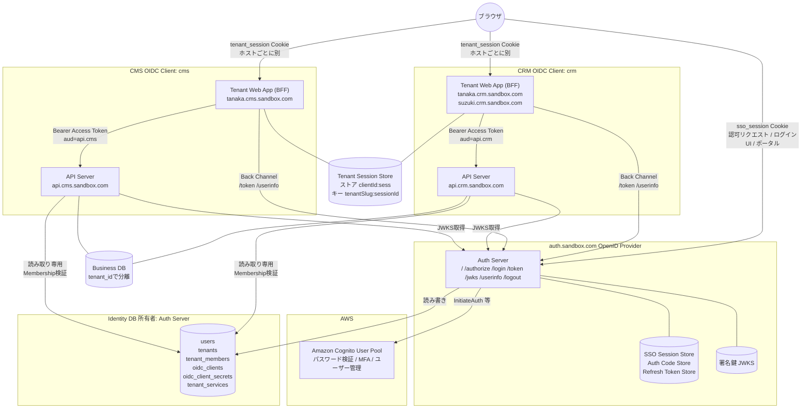
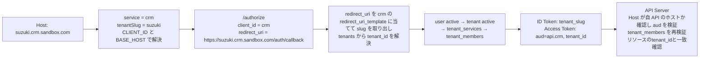

# システム構成図

## 結論

auth.sandbox.com を独立した OpenID Provider として構築し、Cognito はその内部の認証バックエンドに限定する。
OIDC Client はサービス単位で登録する。サンドボックスのサービスは CRM と CMS の2つで、client_id はそれぞれ `crm` と `cms`。
テナントは顧客企業であり、サービス横断で共有する。サンドボックスのテナントは `tanaka` と `suzuki` で、tanaka は CRM と CMS を、suzuki は CRM のみを契約している。
Tenant Web Application は `<tenant>.<service>.sandbox.com` の Host でサービスとテナントを解決する BFF であり、サーバー側セッションを持つ。
API Server は Resource Server であり、Host から導いた aud と Identity DB の Membership で認可する。

## 全体構成

サンドボックスではサービスごとに Tenant Web Application と API Server を 1 プロセスずつ持つ。crm-web / crm-api / cms-web / cms-api の 4 プロセスで、各 web は自サービスの全テナントの Host を受ける。実装は `packages/web-core` と `packages/api-core` で共有し、環境変数でサービスを決める。各 app の `main.ts` は `startWebCore` か `startApiCore` を呼ぶだけで、環境変数のスキーマは `packages/web-core/src/config.ts` と `packages/api-core/src/config.ts` にある。サービスを別ドメインに分けても構成は変わらない。判断事項D14。

## サービスとテナント

| 概念 | 実体 | サンドボックスの値 |
| --- | --- | --- |
| サービス | Auth Server を使うプロダクト。OIDC Client と1対1 | `crm` CRM、`cms` CMS |
| テナント | 顧客企業。サービス横断で共有する | `tanaka` Tanaka Inc.、`suzuki` Suzuki Ltd. |
| 契約 | テナントがサービスを利用できるか。tenant_services | tanaka→crm、tanaka→cms、suzuki→crm。suzuki は cms を契約していない |
| Membership | ユーザーのテナント所属と role。tenant_members | alice は tanaka の owner かつ suzuki の viewer。bob は suzuki の admin。carol は所属なし |

## ホスト一覧

| 役割 | アプリ | 本番の形 | ローカル |
| --- | --- | --- | --- |
| Auth Server | auth-api | auth.sandbox.com | auth.localhost:3000 |
| CRM の Tenant Web Application | crm-web | `<tenant>.crm.sandbox.com`。tanaka.crm.sandbox.com、suzuki.crm.sandbox.com | tanaka.crm.localhost:3001、suzuki.crm.localhost:3001 |
| CRM の API Server | crm-api | api.crm.sandbox.com | api.crm.localhost:3002 |
| CMS の Tenant Web Application | cms-web | `<tenant>.cms.sandbox.com`。tanaka.cms.sandbox.com | tanaka.cms.localhost:3003、suzuki.cms.localhost:3003 |
| CMS の API Server | cms-api | api.cms.sandbox.com | api.cms.localhost:3004 |

サービスは独立したドメインに置いてもよい。tanaka.crm.com と tanaka.cms.com のようにドメインが異なっても、SSO は auth.sandbox.com の SSO Session で成立し Cookie の Domain に依存しない。
suzuki.cms.localhost:3003 は redirect_uri が cms のテンプレートに一致し suzuki も既知のテナントだが、契約がないため `/authorize` が `access_denied` を返す。

## レイヤーと責務

| レイヤー | ホスト | 責務 | 持つ状態 |
| --- | --- | --- | --- |
| 認証 | Cognito | パスワード検証、MFA、ユーザー管理、Cognito Token発行 | Cognitoユーザー |
| SSO / 認可 | auth.sandbox.com | OpenID Provider。SSOセッション、Client管理、契約とMembershipによるアクセス可否判定、Token発行、ポータル | SSO Session、Auth Code、Refresh Token、Identity DB、署名鍵 |
| アプリケーション | `<tenant>.<service>.sandbox.com` | UI、テナントセッション、OIDC Client、APIへのサーバー間呼び出し | Tenant Session、Access / Refresh Tokenのサーバー側保持 |
| API | `api.<service>.sandbox.com` | 業務API、Token検証、Membership認可、Tenant Isolation | Business DB |

責務の混在を禁止する。

- Tenant Web Application は Cognito API を呼ばない。Cognito Token を受け取らない
- API Server はログインを扱わない。Token検証と認可のみ行う
- Auth Server は業務データを持たない。Identity DB は識別、所属、契約のみ
- ブラウザはいかなる Token も保持しない。Cookie のみ

## 通信経路の分類

| 経路 | 種別 | 通るもの | 保護 |
| --- | --- | --- | --- |
| ブラウザ → `<tenant>.<service>.sandbox.com` | Front Channel | 画面、tenant_session Cookie | TLS、Cookie属性、CSRFトークン |
| ブラウザ → auth.sandbox.com | Front Channel | 認可リクエスト、ログインUI、ポータル、sso_session Cookie、code、state | TLS、Cookie属性、CSRFトークン |
| Tenant Web App → auth.sandbox.com | Back Channel | code交換、Refresh、UserInfo | TLS、client_secret_basic、PKCE |
| Tenant Web App → `api.<service>.sandbox.com` | Back Channel | Bearer Access Token | TLS、JWT署名検証、aud検証 |
| auth.sandbox.com → Tenant Web App | Back Channel | Back-Channel Logout の logout_token | TLS、JWT署名検証 |
| auth.sandbox.com → Cognito | Back Channel | InitiateAuth 等 | TLS、App Client Secret |
| `api.<service>.sandbox.com` → Identity DB | 内部 | Membership読み取り | 読み取り専用DBロール |

Front Channel を通る認証関連の値は Authorization Code と state のみ。

## テナントコンテキストの流れ

Host からサービスとテナントを特定するが、認可の根拠には使わない。

- Host はテナント slug の解決と redirect_uri の組み立てにのみ使う。サービスはプロセスの環境変数で固定される
- 認可リクエストのテナントは Auth Server が client_id と redirect_uri の組から解決する。redirect_uri をサービスの `redirect_uri_template` に当てて slug を取り出し、tenants を slug で引く。テンプレートに一致しないか slug が未知なら `invalid_redirect_uri` でリダイレクトしない。Tenant Web Application が申告した値は使わない
- すべての認可はテナントに紐付く。ID Token と Access Token には必ず `tenant_id` と `tenant_slug` が載る
- テナントへのアクセス可否は Auth Server が `/authorize` と refresh_token grant で判定する。順序は user → tenant → 契約 → Membership
- Tenant Web Application は ID Token の `tenant_slug` が Host から得たテナントと一致することを検証する
- API Server は Host が `API_BASE_URL` のホストと一致することを確認し、`API_BASE_URL` を aud として Token と照合し、Token の `tenant_id` で Identity DB の Membership を毎回再検証する

## Auth Server エンドポイント一覧

| エンドポイント | メソッド | 用途 | 呼び出し元 |
| --- | --- | --- | --- |
| `/.well-known/openid-configuration` | GET | OIDC Discovery | Client、API Server |
| `/jwks` | GET | ID Token / Access Token検証用公開鍵 | Client、API Server |
| `/` | GET | ポータル。SSO Session があれば所属テナントごとに role と契約サービスの入口を表示。なければ `/login` へ | ブラウザ |
| `/authorize` | GET | 認可エンドポイント。redirect_uri をテンプレートに当ててテナント解決、SSOセッション判定、契約とMembership判定、code発行 | ブラウザ |
| `/login` | GET | ログインフォーム。rid なしはポータル用ログインで、成功後に `/` へ戻る | ブラウザ |
| `/login` | POST | Cognito InitiateAuth による認証 | ブラウザ |
| `/login/challenge` | POST | MFA等のチャレンジ応答。フェーズ2 | ブラウザ |
| `/token` | POST | code交換、refresh_token grant | Client。Back Channel |
| `/userinfo` | GET | claims提供 | Client。Back Channel |
| `/revoke` | POST | Refresh Token失効。RFC 7009 | Client。Back Channel |
| `/logout` | GET/POST | Global Logout。`client_id` と `tenant` を受け取り、確認画面を経て完了後に元のサービスへ戻るリンクを表示。リンクは `redirect_uri_template` を `tenant` で展開して導く | ブラウザ |
| `/healthz` | GET | 死活監視 | 監視 |

ポータルの表示例。alice でログインした場合、「Tanaka Inc. (tanaka / owner): CRM, CMS」「Suzuki Ltd. (suzuki / viewer): CRM」を表示する。各リンクは `https://<tenant>.<service>.sandbox.com/auth/login` で、サービスの `redirect_uri_template` をテナント slug で展開した origin から導く。Third-Party Initiated Login として通常の認可フローに合流する。

## Tenant Web Application エンドポイント一覧

| エンドポイント | メソッド | 用途 |
| --- | --- | --- |
| `/auth/login` | GET | Host からテナントを解決し、認可リクエストを生成してリダイレクト |
| `/auth/callback` | GET | code受領、Back Channelで交換、ID Token の tenant_slug 検証、Tenant Session作成 |
| `/auth/logout` | POST | Tenant Logout |
| `/auth/backchannel-logout` | POST | Back-Channel Logout受信。aud が自サービスの client_id であることを確認し、sid に紐付く全テナントのセッションを削除 |
| `/api/*` 相当の画面処理 | 任意 | サーバー側でAccess Tokenを付与しサービスの API を呼ぶ |

`/auth/backchannel-logout` はテナントに依存しないため、サービスのベースホストで受ける。CRM は `https://crm.sandbox.com/auth/backchannel-logout`、CMS は `https://cms.sandbox.com/auth/backchannel-logout`。

## API Server エンドポイント規約

| 項目 | 規約 |
| --- | --- |
| 認証 | `Authorization: Bearer <access_token>` 必須 |
| aud | `API_BASE_URL` をそのまま aud とし、Token の aud と照合する。Host が `API_BASE_URL` のホストと異なれば 404。CRM の Token を api.cms に出すと 401 |
| テナント指定 | パスにtenant slugやIDを含めない。Tokenの `tenant_id` を唯一のテナントコンテキストとする |
| 例 | `GET /v1/projects` はTokenのtenant_idに属するprojectsのみ返す |
| 管理API | 複数テナントを扱う管理操作は別のaudとscopeを持つTokenを要求する。フェーズ2 |

## 環境変数

| アプリ | 変数 | 内容 |
| --- | --- | --- |
| crm-web / cms-web | `CLIENT_ID` `CLIENT_SECRET` `SERVICE_NAME` | このプロセスが担当するサービス。`crm` / `crm-secret` / `CRM` のように oidc_clients と oidc_client_secrets の登録値と一致させる。`CLIENT_SECRET` は active な secret のいずれか |
| crm-web / cms-web | `BASE_HOST` `API_BASE_URL` | テナント slug を除いたホストと、呼び出す API の公開 URL。crm は `crm.localhost:3001` と `http://api.crm.localhost:3002`、cms は `cms.localhost:3003` と `http://api.cms.localhost:3004`。Host `<tenant>.<BASE_HOST>` からテナントを解決する |
| crm-web / cms-web | `PORT` `PUBLIC_SCHEME` `ISSUER` `AUTH_BACKCHANNEL_URL` `COOKIE_SECURE` `REDIS_URL` | 待ち受けポート、redirect_uri の scheme、Auth Server の issuer、サーバー間通信先、Cookie の Secure 属性、Session Store。`REDIS_URL` 未設定はインメモリ |
| auth-api | `ISSUER` `DATABASE_URL` `COGNITO_ADAPTER` 等 | Client やテナントの設定は持たず、Identity DB から読む |
| crm-api / cms-api | `API_BASE_URL` | この API の公開 URL。`http://api.crm.localhost:3002` / `http://api.cms.localhost:3004`。この値がそのまま aud になり、Host が URL のホストと異なるリクエストは 404 |
| crm-api / cms-api | `PORT` `ISSUER` `AUTH_BACKCHANNEL_URL` `DATABASE_URL` | aud は `API_BASE_URL` と同じ値。provision が oidc_clients.audience に書く `apiBaseUrl` と一致させる。`PUBLIC_SCHEME` は持たない |
| provision | `SERVICES` `PUBLIC_SCHEME` | 全サービスの `clientId` `clientSecret` `name` `baseHost` `apiBaseUrl` の JSON 配列。oidc_clients、redirect_uri_template、oidc_client_secrets、backchannel_logout_uri の投入に使う。`redirect_uri_template` は `<PUBLIC_SCHEME>://{tenant}.<baseHost>/auth/callback` |

client_secret はローカルでは `crm-secret` と `cms-secret` の固定値。本番は 32 バイト以上の乱数を Secret Store から各 web の `CLIENT_SECRET` と provision の `SERVICES` に注入する。provision はサービスごとに active な secret を 1 行 upsert し、それ以外の active な secret を revoked にする。
環境変数の検証は `packages/shared` の `parseEnv` で行い、不足があれば起動を失敗させる。

## サービス追加手順

| 追加対象 | 手順 | 既存への影響 |
| --- | --- | --- |
| 新テナント | tenants にレコード追加。契約するサービスごとに tenant_services を登録 | なし。redirect_uri の登録、Client 登録、Secret 配布は不要 |
| 既存テナントの契約追加 | tenant_services を追加 | なし |
| 新サービス | oidc_clients に client_id、audience、`https://{tenant}.<service>.sandbox.com/auth/callback` の redirect_uri_template、backchannel_logout_uri を登録。oidc_client_secrets に active な secret を登録。契約テナント分の tenant_services を登録。`apps/<service>-web` と `apps/<service>-api` を追加し、`packages/web-core` と `packages/api-core` を環境変数で起動する。provision の `SERVICES` に追加 | なし |
| client_secret のローテーション | oidc_client_secrets に新 secret を active で追加 → サービスの `CLIENT_SECRET` を差し替え → 旧行を revoked に更新 | なし。切替中は新旧どちらでも `/token` が通る |
| 管理画面 | 専用clientを登録し、管理用scopeを付与 | なし |

## 技術スタック

本サンドボックスの検証実装に用いる。他プロジェクト適用時は読み替える。

| 項目 | 採用 | 理由 |
| --- | --- | --- |
| 言語 | TypeScript | リポジトリ標準 |
| HTTPフレームワーク | Hono | 軽量。BFF / Auth / API を同一スタックで書ける |
| モノレポ | pnpm workspace | 雛形標準 |
| JWT / JWKS | jose | 標準準拠 |
| Cognito連携 | アダプタで抽象化 | ローカルはモック、本番は @aws-sdk/client-cognito-identity-provider |
| Session / Code Store | インターフェースで抽象化 | ローカルはインメモリ、本番はRedis |
| Identity DB | PostgreSQL想定 | RLSによるTenant Isolation二重化が可能 |
| テスト | Vitest | 雛形標準 |
