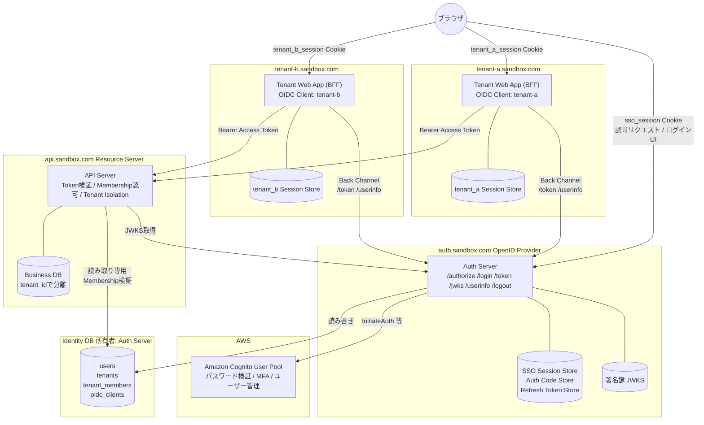
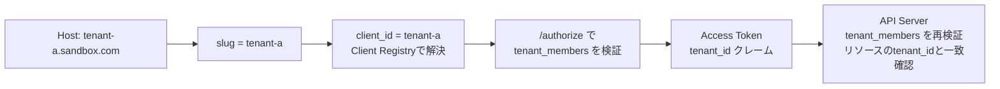

# システム構成図

## 結論

auth.sandbox.com を独立した OpenID Provider として構築し、Cognito はその内部の認証バックエンドに限定する。
Tenant Web Application はテナントごとに登録された Confidential Client であり、BFF としてサーバー側セッションを持つ。
api.sandbox.com は Resource Server であり、Auth Server 発行の Access Token と Identity DB の Membership で認可する。

## 全体構成

## レイヤーと責務

| レイヤー | ホスト | 責務 | 持つ状態 |
| --- | --- | --- | --- |
| 認証 | Cognito | パスワード検証、MFA、ユーザー管理、Cognito Token発行 | Cognitoユーザー |
| SSO / 認可 | auth.sandbox.com | OpenID Provider。SSOセッション、Client管理、テナントアクセス可否判定、Token発行 | SSO Session、Auth Code、Refresh Token、Identity DB、署名鍵 |
| アプリケーション | tenant-*.sandbox.com | UI、テナントセッション、OIDC Client、APIへのサーバー間呼び出し | Tenant Session、Access / Refresh Tokenのサーバー側保持 |
| API | api.sandbox.com | 業務API、Token検証、Membership認可、Tenant Isolation | Business DB |

責務の混在を禁止する。

- Tenant Web Application は Cognito API を呼ばない。Cognito Token を受け取らない
- API Server はログインを扱わない。Token検証と認可のみ行う
- Auth Server は業務データを持たない。Identity DB は識別と所属のみ
- ブラウザはいかなる Token も保持しない。Cookie のみ

## 通信経路の分類

| 経路 | 種別 | 通るもの | 保護 |
| --- | --- | --- | --- |
| ブラウザ → tenant-*.sandbox.com | Front Channel | 画面、tenant_*_session Cookie | TLS、Cookie属性、CSRFトークン |
| ブラウザ → auth.sandbox.com | Front Channel | 認可リクエスト、ログインUI、sso_session Cookie、code、state | TLS、Cookie属性、CSRFトークン |
| tenant-* → auth.sandbox.com | Back Channel | code交換、Refresh、UserInfo | TLS、client_secret_basic、PKCE |
| tenant-* → api.sandbox.com | Back Channel | Bearer Access Token | TLS、JWT署名検証 |
| auth.sandbox.com → Cognito | Back Channel | InitiateAuth 等 | TLS、App Client Secret |
| api.sandbox.com → Identity DB | 内部 | Membership読み取り | 読み取り専用DBロール |

Front Channel を通る認証関連の値は Authorization Code と state のみ。

## テナントコンテキストの流れ

サブドメインからテナントを特定するが、認可の根拠には使わない。

- サブドメインはClient選択にのみ使う
- テナントへのアクセス可否は Auth Server が `/authorize` で判定する
- API Server は Token の `tenant_id` を受け取った上で Identity DB の Membership を毎回再検証する

## Auth Server エンドポイント一覧

| エンドポイント | メソッド | 用途 | 呼び出し元 |
| --- | --- | --- | --- |
| `/.well-known/openid-configuration` | GET | OIDC Discovery | Client、API Server |
| `/jwks` | GET | ID Token / Access Token検証用公開鍵 | Client、API Server |
| `/` | GET | ポータル。SSO Session があれば所属テナント一覧、なければ `/login` へ | ブラウザ |
| `/authorize` | GET | 認可エンドポイント。SSOセッション判定、Membership判定、code発行 | ブラウザ |
| `/login` | GET | ログインフォーム。rid なしはポータル用ログインで、成功後に `/` へ戻る | ブラウザ |
| `/login` | POST | Cognito InitiateAuth による認証 | ブラウザ |
| `/login/challenge` | POST | MFA等のチャレンジ応答。フェーズ2 | ブラウザ |
| `/token` | POST | code交換、refresh_token grant | Client。Back Channel |
| `/userinfo` | GET | claims提供 | Client。Back Channel |
| `/revoke` | POST | Refresh Token失効。RFC 7009 | Client。Back Channel |
| `/logout` | GET/POST | Global Logout。確認画面付き。完了後は Client の origin かポータルへ | ブラウザ |
| `/healthz` | GET | 死活監視 | 監視 |

## Tenant Web Application エンドポイント一覧

| エンドポイント | メソッド | 用途 |
| --- | --- | --- |
| `/auth/login` | GET | 認可リクエストの生成とリダイレクト |
| `/auth/callback` | GET | code受領、Back Channelで交換、Tenant Session作成 |
| `/auth/logout` | POST | Tenant Logout |
| `/auth/backchannel-logout` | POST | Back-Channel Logout受信。aud で Client を解決し sid のセッションを削除 |
| `/api/*` 相当の画面処理 | 任意 | サーバー側でAccess Tokenを付与しapi.sandbox.comを呼ぶ |

## API Server エンドポイント規約

| 項目 | 規約 |
| --- | --- |
| 認証 | `Authorization: Bearer <access_token>` 必須 |
| テナント指定 | パスにtenant slugやIDを含めない。Tokenの `tenant_id` を唯一のテナントコンテキストとする |
| 例 | `GET /v1/projects` はTokenのtenant_idに属するprojectsのみ返す |
| 管理API | 複数テナントを扱う管理操作は別のaudとscopeを持つTokenを要求する。フェーズ2 |

## サービス追加手順

| 追加対象 | 手順 | 既存への影響 |
| --- | --- | --- |
| 新テナント | tenants にレコード追加。oidc_clients に client_id=slug と redirect_uri を自動登録。client_secret を Secret Store に保存 | なし |
| 別ドメインのサービス | oidc_clients に手動登録。サービス側にOIDC Client共通モジュールを導入 | なし |
| 管理画面 | 専用clientを登録し、管理用scopeを付与 | なし |

## 技術スタック

本サンドボックスの検証実装に用いる。他プロジェクト適用時は読み替える。

| 項目 | 採用 | 理由 |
| --- | --- | --- |
| 言語 | TypeScript | リポジトリ標準 |
| HTTPフレームワーク | Hono | 軽量。BFF / Auth / API を同一スタックで書ける |
| モノレポ | pnpm workspace | 雛形標準 |
| JWT / JWKS | jose | 標準準拠 |
| Cognito連携 | アダプタで抽象化 | ローカルはモック、本番は @aws-sdk/client-cognito-identity-provider |
| Session / Code Store | インターフェースで抽象化 | ローカルはインメモリ、本番はRedis |
| Identity DB | PostgreSQL想定 | RLSによるTenant Isolation二重化が可能 |
| テスト | Vitest | 雛形標準 |
