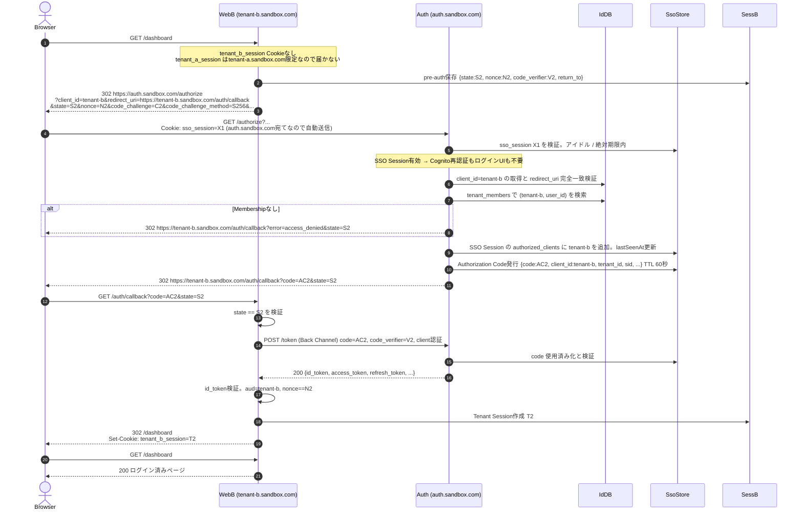
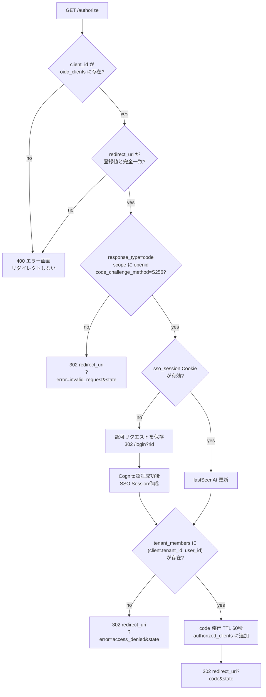
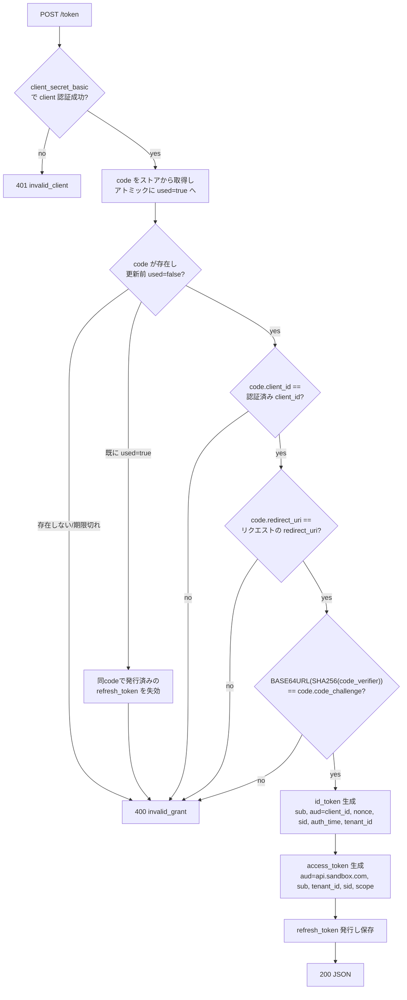
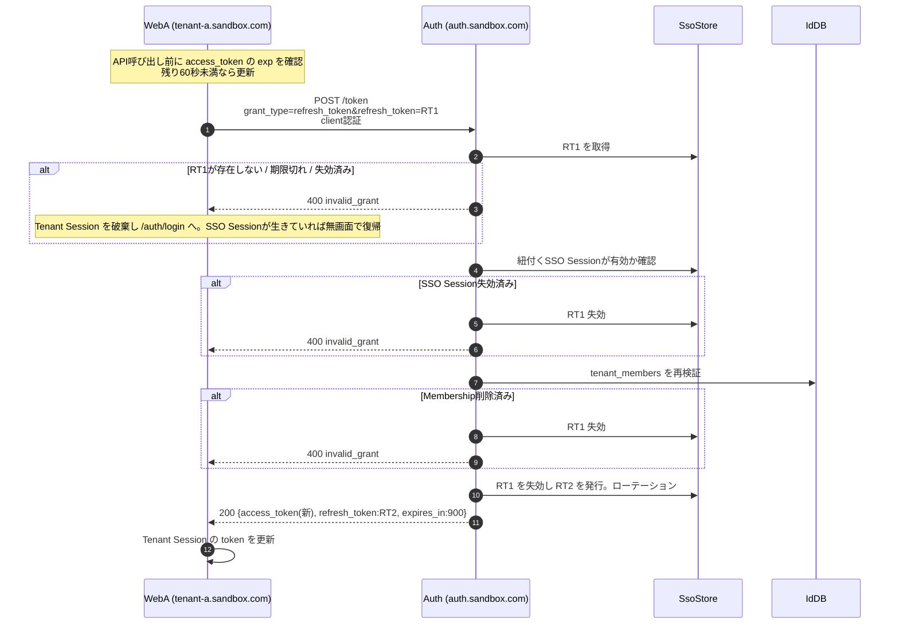
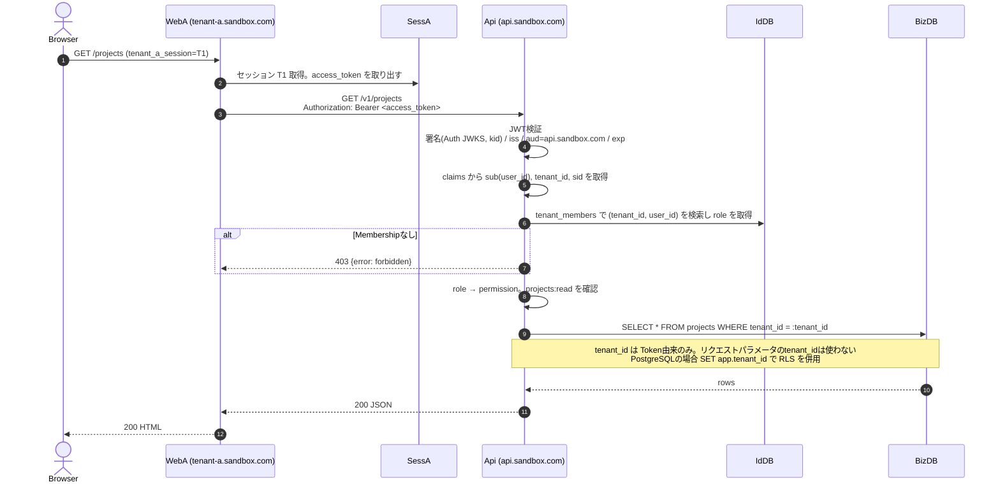
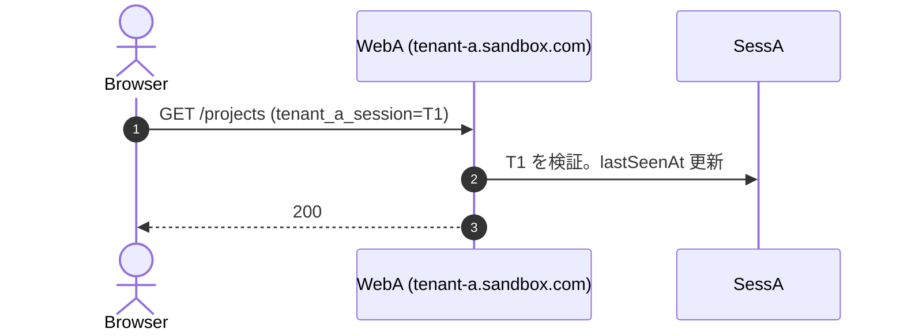
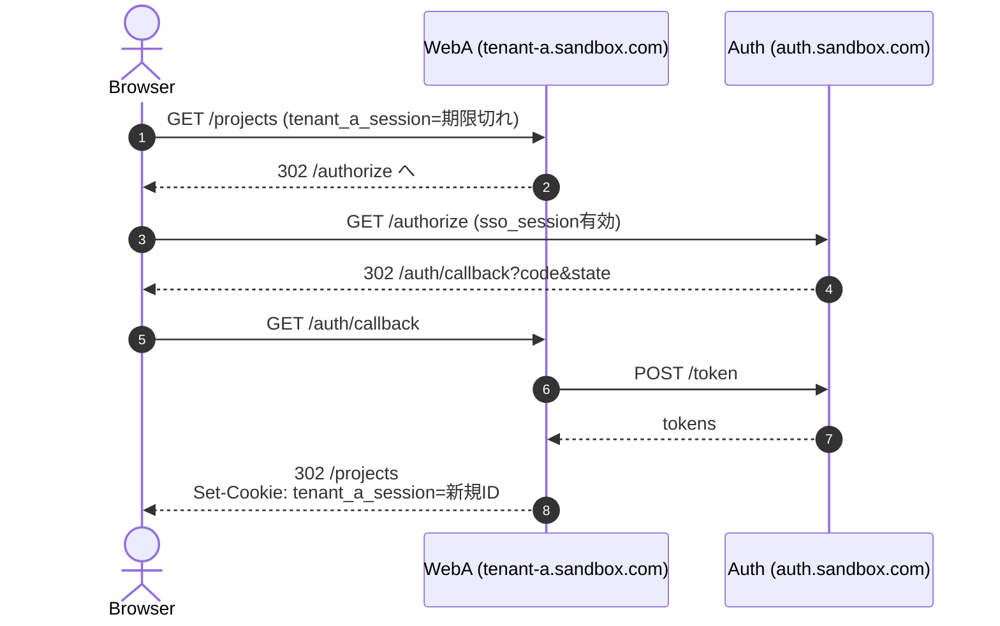
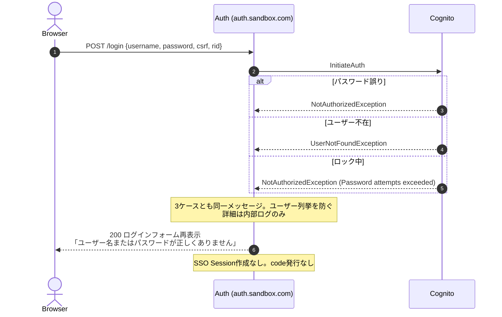
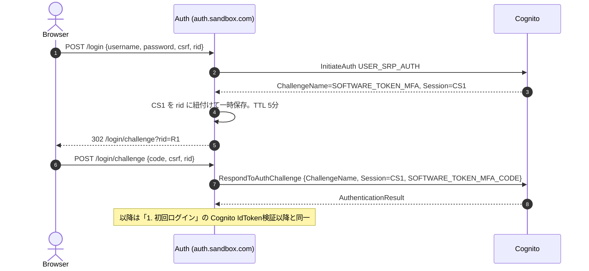
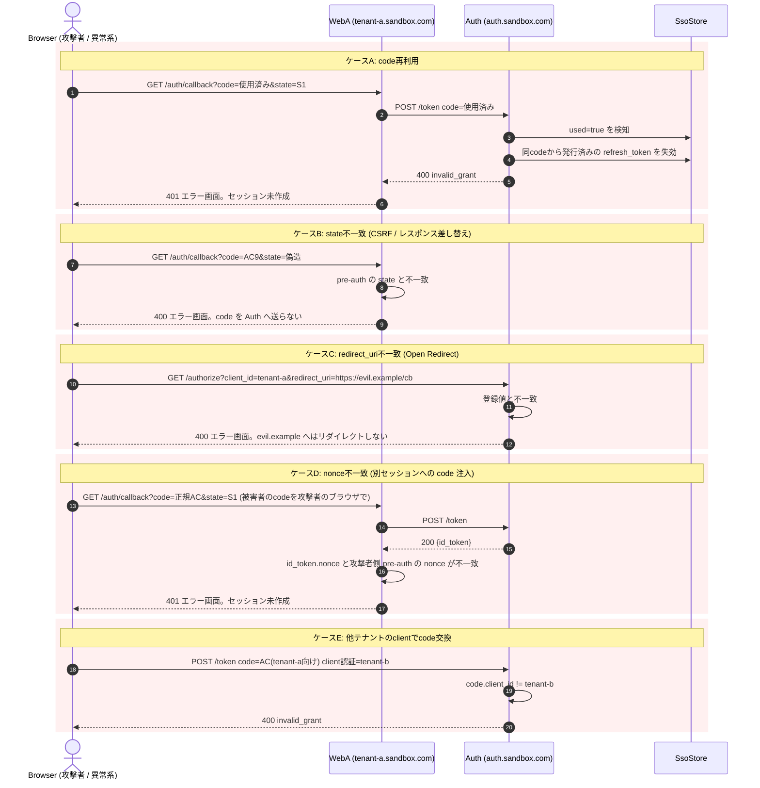

# 認証シーケンス図

## 結論

全フローは OIDC Authorization Code Flow + PKCE に準拠する。
Front Channel を通るのは code と state のみ。Cognito Token、ID Token、Access Token、Refresh Token はすべて Back Channel かサーバー内部に閉じる。
テナントへのアクセス可否は `/authorize` で判定し、API Server が毎リクエスト再検証する。

登場人物。

| 表記 | 実体 |
| --- | --- |
| Browser | ユーザーのブラウザ |
| WebA | tenant-a.sandbox.com。Tenant Web Application。BFF |
| WebB | tenant-b.sandbox.com |
| Auth | auth.sandbox.com。Auth Server |
| Cognito | Amazon Cognito User Pool |
| IdDB | Identity DB。users / tenants / tenant_members / oidc_clients |
| SsoStore | SSO Session Store、Auth Code Store、Refresh Token Store |
| SessA | tenant-a の Session Store |
| Api | api.sandbox.com |

## 1. 初回ログイン。tenant-a.sandbox.com へ未ログイン状態でアクセス

SSO Session も Tenant Session もない状態からの完全なフロー。仕様書23章の成果物2。

```mermaid
sequenceDiagram
    autonumber
    actor Browser
    participant WebA as WebA (tenant-a.sandbox.com)
    participant Auth as Auth (auth.sandbox.com)
    participant Cognito
    participant IdDB
    participant SsoStore
    participant SessA

    Browser->>WebA: GET /projects
    Note over WebA: tenant_a_session Cookieなし → 未ログイン<br/>Hostから slug=tenant-a を解決
    WebA->>WebA: state, nonce, code_verifier を生成<br/>code_challenge = BASE64URL(SHA256(code_verifier))
    WebA->>SessA: pre-auth保存<br/>{state, nonce, code_verifier, return_to:"/projects"} TTL 10分
    WebA-->>Browser: 302 https://auth.sandbox.com/authorize<br/>?response_type=code&client_id=tenant-a<br/>&redirect_uri=https://tenant-a.sandbox.com/auth/callback<br/>&scope=openid profile email<br/>&state=S1&nonce=N1<br/>&code_challenge=C1&code_challenge_method=S256<br/>Set-Cookie: tenant_a_pre_auth=P1; HttpOnly; Secure; SameSite=Lax; Path=/auth

    Browser->>Auth: GET /authorize?...
    Note over Auth: sso_session Cookieなし
    Auth->>IdDB: oidc_clients から client_id=tenant-a を取得
    Auth->>Auth: redirect_uri 完全一致検証<br/>response_type=code / scope / PKCE必須 を検証
    Auth->>SsoStore: 認可リクエスト保存<br/>{rid, client_id, redirect_uri, scope, state, nonce, code_challenge} TTL 10分
    Auth-->>Browser: 302 /login?rid=R1

    Browser->>Auth: GET /login?rid=R1
    Auth-->>Browser: 200 ログインフォーム<br/>CSRFトークン埋め込み。Set-Cookie: auth_csrf
    Browser->>Auth: POST /login {username, password, csrf, rid}
    Auth->>Auth: CSRFトークン検証、rid の存在確認
    Auth->>Cognito: InitiateAuth AuthFlow=USER_SRP_AUTH<br/>SECRET_HASH付き。SRPハンドシェイク
    Cognito-->>Auth: AuthenticationResult<br/>{AccessToken, IdToken, RefreshToken}
    Auth->>Auth: Cognito IdToken 検証<br/>署名(Cognito JWKS) / iss / aud / exp / token_use
    Auth->>IdDB: users を cognito_sub で検索。なければJIT作成
    Auth->>IdDB: tenant_members で (tenant_id of tenant-a, user_id) を検索
    alt Membershipなし
        Auth->>SsoStore: SSO Session作成。ログイン自体は成功
        Auth-->>Browser: 302 https://tenant-a.sandbox.com/auth/callback<br/>?error=access_denied&state=S1<br/>Set-Cookie: sso_session=...
        Note over Browser,WebA: WebAが「アクセス権がありません」を表示。以降は省略
    end
    Auth->>SsoStore: SSO Session作成<br/>{sso_session_id, sid, user_id, cognito_sub,<br/>cognito_tokens(暗号化), auth_time, authorized_clients:[tenant-a]}
    Note over Auth: Cognito Tokenはここから外に出さない
    Auth->>SsoStore: Authorization Code発行<br/>{code, client_id, redirect_uri, scope, nonce,<br/>code_challenge, user_id, tenant_id, sid, auth_time} TTL 60秒
    Auth-->>Browser: 302 https://tenant-a.sandbox.com/auth/callback?code=AC1&state=S1<br/>Set-Cookie: sso_session=X1; HttpOnly; Secure; SameSite=Lax; Path=/<br/>Domain属性なし。auth.sandbox.comのみに限定

    Browser->>WebA: GET /auth/callback?code=AC1&state=S1<br/>Cookie: tenant_a_pre_auth=P1
    WebA->>SessA: pre-auth P1 を取得
    WebA->>WebA: state == S1 を検証
    WebA->>Auth: POST /token (Back Channel)<br/>Authorization: Basic base64(tenant-a:secret)<br/>grant_type=authorization_code&code=AC1<br/>&redirect_uri=https://tenant-a.sandbox.com/auth/callback<br/>&code_verifier=V1
    Auth->>IdDB: client認証。client_secret ハッシュ照合
    Auth->>SsoStore: code AC1 を取得し used=true に更新。アトミック
    Auth->>Auth: 未使用 / 期限内 / client_id一致 / redirect_uri一致<br/>BASE64URL(SHA256(V1)) == code_challenge
    Auth->>SsoStore: Refresh Token発行。{rt, user_id, tenant_id, sid, client_id}
    Auth-->>WebA: 200 {id_token, access_token, refresh_token,<br/>token_type:Bearer, expires_in:900}
    Note over Auth,WebA: id_token / access_token は Auth が署名したJWT。Cognito Tokenではない

    WebA->>WebA: id_token検証<br/>署名(Auth JWKS) / iss / aud=tenant-a / exp / nonce==N1
    WebA->>SessA: Tenant Session作成。新規ID T1<br/>{user_id=sub, tenant_id, sid, role, access_token, refresh_token, expires_at}
    WebA->>SessA: pre-auth P1 削除
    WebA-->>Browser: 302 /projects<br/>Set-Cookie: tenant_a_session=T1; HttpOnly; Secure; SameSite=Lax; Path=/<br/>Set-Cookie: tenant_a_pre_auth=; Max-Age=0
    Browser->>WebA: GET /projects (tenant_a_session=T1)
    WebA-->>Browser: 200 ログイン済みページ
```

要点。

- code は60秒、一回限り。使用済み化を先に行ってから検証結果を返す
- Membership 検証は Cognito 認証成功後、code 発行前に行う。所属していないテナントには code を発行しない
- 認証は成功しているため SSO Session は作成する。所属テナントへ移動すればログイン画面なしで入れる
- ブラウザに渡るのは Cookie のみ。access_token / refresh_token は WebA のサーバー側セッションに保存する

## 2. 別テナントへのSSO。tenant-b.sandbox.com へ初回アクセス

Tenant A ログイン済みの状態。パスワード入力もログイン画面も出ない。仕様書23章の成果物3。



結果。

```text
tenant-a.sandbox.com → ログイン済み (tenant_a_session)
tenant-b.sandbox.com → ログイン済み (tenant_b_session)
auth.sandbox.com     → SSO Session 1つ。authorized_clients = [tenant-a, tenant-b]
```

同一ユーザーが tenant-a では admin、tenant-b では viewer というように、テナントごとに異なる role を持てる。role は tenant_members から解決し Access Token に載せない。

## 3. Authorization Code Flow の詳細

`/authorize` と `/token` の内部処理を成果物4として切り出す。

### 3.1 /authorize の判定フロー



### 3.2 /token の判定フロー。grant_type=authorization_code



### 3.3 /token の判定フロー。grant_type=refresh_token



Refresh Token の再利用を検知した場合は、同一系列のすべての Refresh Token を失効させる。

## 4. API呼び出し。BFFからapi.sandbox.comへ



ブラウザは api.sandbox.com と直接通信しない。CORS設定は不要になる。

## 5. ログイン済みテナントへの再訪

Tenant Session が有効な間は Auth Server との通信は発生しない。



## 6. Tenant Session期限切れ。SSO Sessionは有効

「2. 別テナントへのSSO」と同じフローで無画面復帰する。



## 7. SSO Session期限切れ

`/authorize` が SSO Session を無効と判定してログイン画面へ誘導する。以降は「1. 初回ログイン」と同一。すべての Tenant Session はそれぞれの期限まで有効なまま残る。

## 8. 認証失敗



## 9. MFAチャレンジ。フェーズ2



初期実装では ChallengeName が返った場合、ログインフォームに「この認証方式は未対応です」を表示して終了する。

## 10. Tenant Logout

```mermaid
sequenceDiagram
    autonumber
    actor Browser
    participant WebA as WebA (tenant-a.sandbox.com)
    participant SessA
    participant Auth as Auth (auth.sandbox.com)

    Browser->>WebA: POST /auth/logout (tenant_a_session=T1, csrf)
    WebA->>WebA: CSRFトークン検証
    WebA->>SessA: T1 を取得し refresh_token を取り出す
    WebA->>Auth: POST /revoke token=RT1 (Back Channel, client認証)
    Auth-->>WebA: 200
    WebA->>SessA: T1 削除
    WebA-->>Browser: 302 /<br/>Set-Cookie: tenant_a_session=; Max-Age=0
    Note over Browser: sso_session と tenant_b_session は残る<br/>tenant-a → ログアウト<br/>tenant-b → ログイン済み
```

SSO Session が残るため、tenant-a で再度 `/auth/login` を踏むとパスワードなしで再ログインされる。これは仕様書19.1が定める挙動である。

## 11. Global Logout。フェーズ2

```mermaid
sequenceDiagram
    autonumber
    actor Browser
    participant Auth as Auth (auth.sandbox.com)
    participant SsoStore
    participant Cognito
    participant WebA as WebA (tenant-a.sandbox.com)
    participant WebB as WebB (tenant-b.sandbox.com)

    Browser->>Auth: POST /logout (sso_session=X1, csrf)
    Auth->>SsoStore: X1 取得。authorized_clients=[tenant-a, tenant-b] と sid を特定
    Auth->>SsoStore: sid に紐付く Refresh Token を全失効
    Auth->>Cognito: RevokeToken(Cognito RefreshToken)
    Auth->>SsoStore: X1 削除
    par Back-Channel Logout
        Auth->>WebA: POST /auth/backchannel-logout<br/>logout_token (JWT: iss, aud=tenant-a, sid, events)
        WebA->>WebA: logout_token 検証。sid に紐付く Tenant Session を全削除
        WebA-->>Auth: 200
    and
        Auth->>WebB: POST /auth/backchannel-logout logout_token
        WebB->>WebB: sid に紐付く Tenant Session を全削除
        WebB-->>Auth: 200
    end
    Auth-->>Browser: 200 ログアウト完了ページ<br/>Set-Cookie: sso_session=; Max-Age=0
```

通知に失敗したテナントの Tenant Session は、Access Token 期限切れ後の Refresh で `invalid_grant` となり自然に失効する。最大遅延は Access Token 寿命の15分。

## 12. 異常系。認可レスポンスの改ざんと再利用



エラー時の共通原則。

- 不正な redirect_uri へは一切リダイレクトしない。Auth Server 側でエラー画面を表示する
- code / Refresh Token の再利用検知時は同系列の Token を失効させる
- エラー詳細は内部ログのみ。ユーザーには汎用メッセージ
- 全ケースは [09-error-cases.md](./09-error-cases.md) を参照
