# 認証シーケンス図

## 結論

全フローは OIDC Authorization Code Flow + PKCE に準拠する。
Front Channel を通るのは code と state のみ。Cognito Token、ID Token、Access Token、Refresh Token はすべて Back Channel かサーバー内部に閉じる。
テナントへのアクセス可否は `/authorize` で user → tenant → 契約 → Membership の順に判定し、API Server が毎リクエスト Membership を再検証する。

登場人物。

| 表記 | 実体 |
| --- | --- |
| Browser | ユーザーのブラウザ |
| TanakaCrm | tanaka.crm.sandbox.com。CRM の Tenant Web Application。BFF |
| SuzukiCrm | suzuki.crm.sandbox.com。CRM の別テナント |
| TanakaCms | tanaka.cms.sandbox.com。CMS の Tenant Web Application |
| SuzukiCms | suzuki.cms.sandbox.com。契約がないテナント × サービス |
| Auth | auth.sandbox.com。Auth Server |
| Cognito | Amazon Cognito User Pool |
| IdDB | Identity DB。users / tenants / tenant_members / oidc_clients / oidc_client_redirect_uris / tenant_services |
| SsoStore | SSO Session Store、Auth Code Store、Refresh Token Store |
| Sess | Tenant Session Store。キーは `<clientId>:<tenantSlug>:<sessionId>` |
| ApiCrm | api.crm.sandbox.com |

ユーザーは alice。tanaka の owner かつ suzuki の viewer。

## 1. 初回ログイン。tanaka.crm.sandbox.com へ未ログイン状態でアクセス

SSO Session も Tenant Session もない状態からの完全なフロー。仕様書23章の成果物2。

```mermaid
sequenceDiagram
    autonumber
    actor Browser
    participant TanakaCrm as TanakaCrm (tanaka.crm.sandbox.com)
    participant Auth as Auth (auth.sandbox.com)
    participant Cognito
    participant IdDB
    participant SsoStore
    participant Sess

    Browser->>TanakaCrm: GET /projects
    Note over TanakaCrm: tenant_session Cookieなし → 未ログイン<br/>Host から service=crm, tenantSlug=tanaka を解決
    TanakaCrm->>TanakaCrm: state, nonce, code_verifier を生成<br/>code_challenge = BASE64URL(SHA256(code_verifier))
    TanakaCrm->>Sess: pre-auth保存<br/>{state, nonce, code_verifier, return_to:"/projects"} TTL 30分
    TanakaCrm-->>Browser: 302 https://auth.sandbox.com/authorize<br/>?response_type=code&client_id=crm<br/>&redirect_uri=https://tanaka.crm.sandbox.com/auth/callback<br/>&scope=openid profile email<br/>&state=S1&nonce=N1<br/>&code_challenge=C1&code_challenge_method=S256<br/>Set-Cookie: tenant_pre_auth=P1; HttpOnly; Secure; SameSite=Lax; Path=/auth

    Browser->>Auth: GET /authorize?...
    Note over Auth: sso_session Cookieなし
    Auth->>IdDB: oidc_clients から client_id=crm を取得
    Auth->>IdDB: oidc_client_redirect_uris で (crm, redirect_uri) を完全一致検索<br/>tenant_id → tenants から tanaka を解決
    Auth->>Auth: response_type=code / scope / PKCE必須 を検証
    Auth->>SsoStore: 認可リクエスト保存<br/>{rid, client_id, redirect_uri, tenant_id, scope, state, nonce, code_challenge} TTL 30分
    Auth-->>Browser: 302 /login?rid=R1

    Browser->>Auth: GET /login?rid=R1
    Auth-->>Browser: 200 ログインフォーム<br/>CSRFトークン埋め込み。Set-Cookie: auth_csrf
    Browser->>Auth: POST /login {username, password, csrf, rid}
    Auth->>Auth: CSRFトークン検証、rid の存在確認
    Auth->>Cognito: InitiateAuth AuthFlow=USER_SRP_AUTH<br/>SECRET_HASH付き。SRPハンドシェイク
    Cognito-->>Auth: AuthenticationResult<br/>{AccessToken, IdToken, RefreshToken}
    Auth->>Auth: Cognito IdToken 検証<br/>署名(Cognito JWKS) / iss / aud / exp / token_use
    Auth->>IdDB: users を cognito_sub で検索。なければJIT作成
    Auth->>SsoStore: SSO Session作成<br/>{sso_session_id, sid, user_id, cognito_sub,<br/>cognito_tokens(暗号化), auth_time, authorized_clients:[]}
    Note over Auth: Cognito Tokenはここから外に出さない
    Auth->>IdDB: アクセス判定。users.status → tenants.status<br/>→ tenant_services (tanaka, crm) → tenant_members (tanaka, user_id)
    alt 判定失敗
        Auth-->>Browser: 302 https://tanaka.crm.sandbox.com/auth/callback<br/>?error=access_denied&error_description=no_membership&state=S1<br/>Set-Cookie: sso_session=X1
        Note over Browser,TanakaCrm: TanakaCrm が理由に応じた 403 画面を表示。SSO Session は残る。以降は省略
    end
    Auth->>SsoStore: Authorization Code発行<br/>{code, client_id:crm, redirect_uri, scope, nonce,<br/>code_challenge, user_id, tenant_id, sid, auth_time} TTL 60秒
    Auth->>SsoStore: SSO Session の authorized_clients に crm を追加
    Auth-->>Browser: 302 https://tanaka.crm.sandbox.com/auth/callback?code=AC1&state=S1<br/>Set-Cookie: sso_session=X1; HttpOnly; Secure; SameSite=Lax; Path=/<br/>Domain属性なし。auth.sandbox.comのみに限定

    Browser->>TanakaCrm: GET /auth/callback?code=AC1&state=S1<br/>Cookie: tenant_pre_auth=P1
    TanakaCrm->>Sess: pre-auth P1 を取得
    TanakaCrm->>TanakaCrm: state == S1 を検証
    TanakaCrm->>Auth: POST /token (Back Channel)<br/>Authorization: Basic base64(crm:crm-secret)<br/>grant_type=authorization_code&code=AC1<br/>&redirect_uri=https://tanaka.crm.sandbox.com/auth/callback<br/>&code_verifier=V1
    Auth->>IdDB: client認証。client_secret ハッシュ照合
    Auth->>SsoStore: code AC1 を取得し used=true に更新。アトミック
    Auth->>Auth: 未使用 / 期限内 / client_id一致 / redirect_uri一致<br/>BASE64URL(SHA256(V1)) == code_challenge
    Auth->>SsoStore: Refresh Token発行。{rt, user_id, tenant_id, sid, client_id:crm}
    Auth-->>TanakaCrm: 200 {id_token, access_token, refresh_token,<br/>token_type:Bearer, expires_in:900}
    Note over Auth,TanakaCrm: id_token / access_token は Auth が署名したJWT。Cognito Tokenではない

    TanakaCrm->>TanakaCrm: id_token検証<br/>署名(Auth JWKS) / iss / aud=crm / exp / nonce==N1<br/>tenant_slug == tanaka (Host 由来)
    TanakaCrm->>Sess: Tenant Session作成。キー crm:tanaka:T1<br/>{user_id=sub, tenant_id, tenant_slug, sid, access_token, refresh_token, expires_at}
    TanakaCrm->>Sess: sid 逆引き crm:sid:<sid> に T1 を追加
    TanakaCrm->>Sess: pre-auth P1 削除
    TanakaCrm-->>Browser: 302 /projects<br/>Set-Cookie: tenant_session=T1; HttpOnly; Secure; SameSite=Lax; Path=/<br/>Set-Cookie: tenant_pre_auth=; Max-Age=0
    Browser->>TanakaCrm: GET /projects (tenant_session=T1)
    TanakaCrm-->>Browser: 200 ログイン済みページ。Tanaka Project 1, Tanaka Project 2
```

要点。

- code は60秒、一回限り。使用済み化を先に行ってから検証結果を返す
- 認可リクエストのテナントは client_id と redirect_uri の組から Auth Server が解決する。Tenant Web Application はテナントを申告しない
- アクセス判定は Cognito 認証成功後、code 発行前に行う。契約がないサービス、所属していないテナントには code を発行しない
- 認証は成功しているため SSO Session は作成する。アクセスできるテナントへ移動すればログイン画面なしで入れる
- ブラウザに渡るのは Cookie のみ。access_token / refresh_token は TanakaCrm のサーバー側セッションに保存する

## 2. 別テナント・別サービスへのSSO

tanaka.crm でログイン済みの状態。パスワード入力もログイン画面も出ない。仕様書23章の成果物3。

### 2.1 別テナント。suzuki.crm.sandbox.com へ初回アクセス

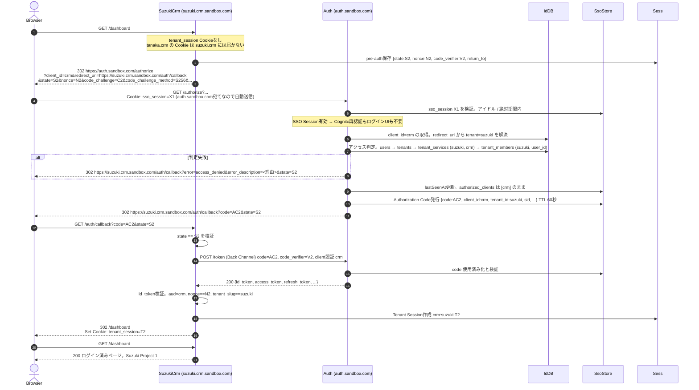

同一ユーザーが tanaka では owner、suzuki では viewer というように、テナントごとに異なる role を持てる。role は tenant_members から解決し Access Token に載せない。

### 2.2 別サービス。tanaka.cms.sandbox.com へ初回アクセス

client_id が `cms` になる点と、Access Token の aud が api.cms になる点以外は 2.1 と同じ。

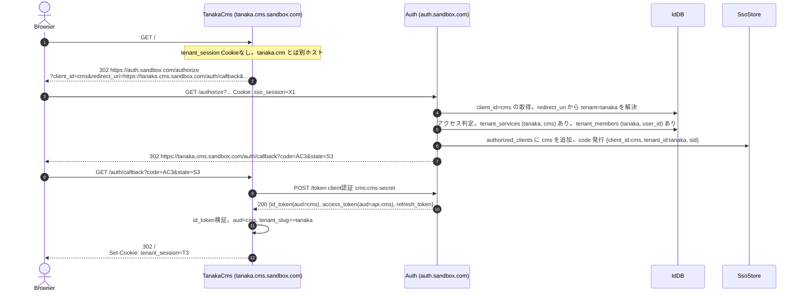

### 2.3 契約のないサービス。suzuki.cms.sandbox.com へアクセス

redirect_uri は登録済みだが suzuki は cms を契約していない。

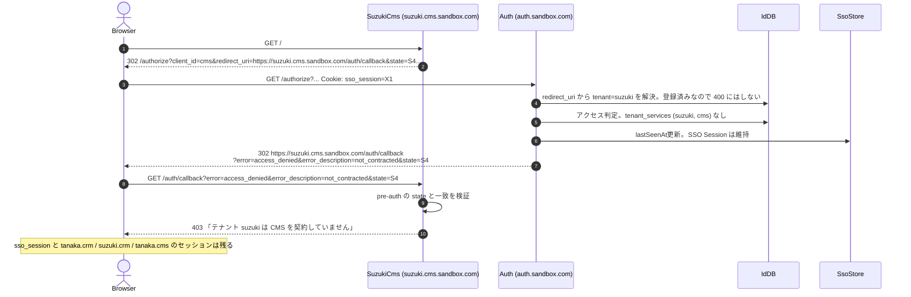

結果。

```text
tanaka.crm.sandbox.com → ログイン済み (tenant_session。キー crm:tanaka:T1)
suzuki.crm.sandbox.com → ログイン済み (tenant_session。キー crm:suzuki:T2)
tanaka.cms.sandbox.com → ログイン済み (tenant_session。キー cms:tanaka:T3)
suzuki.cms.sandbox.com → 403 not_contracted。セッションなし
auth.sandbox.com       → SSO Session 1つ。authorized_clients = [crm, cms]
```

## 3. Authorization Code Flow の詳細

`/authorize` と `/token` の内部処理を成果物4として切り出す。

### 3.1 /authorize の判定フロー

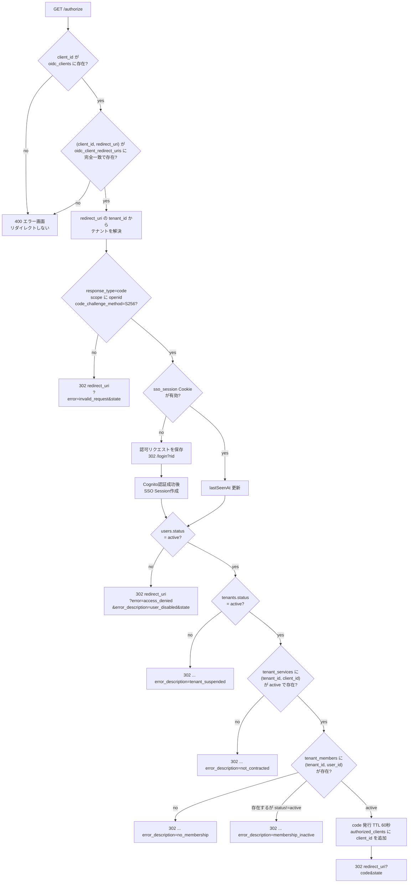

redirect_uri に tenant_id がない場合はテナントに紐付かない戻り先であり、users.status の確認だけで許可する。Access Token に tenant_id は載らない。

### 3.2 /token の判定フロー。grant_type=authorization_code

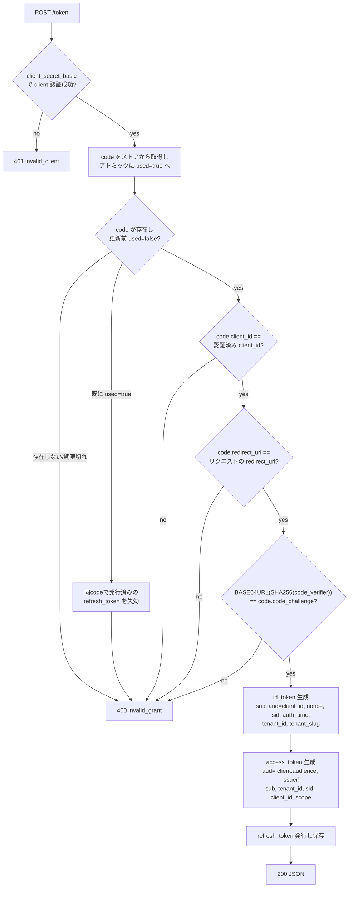

client.audience は oidc_clients に登録したサービスの API origin。crm なら `https://api.crm.sandbox.com`。

### 3.3 /token の判定フロー。grant_type=refresh_token

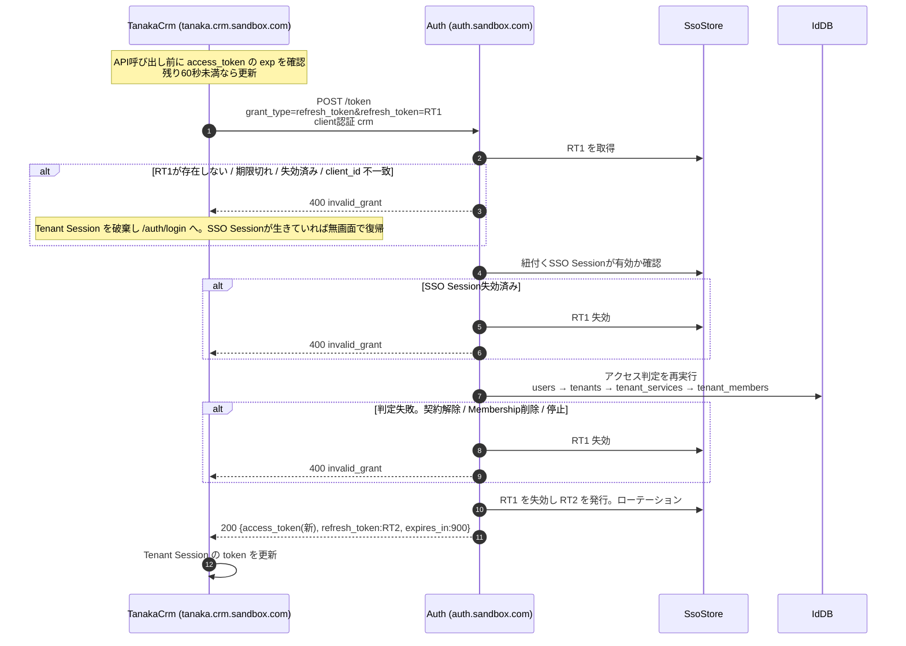

Refresh Token の再利用を検知した場合は、同一系列のすべての Refresh Token を失効させる。

## 4. API呼び出し。BFFからapi.crm.sandbox.comへ

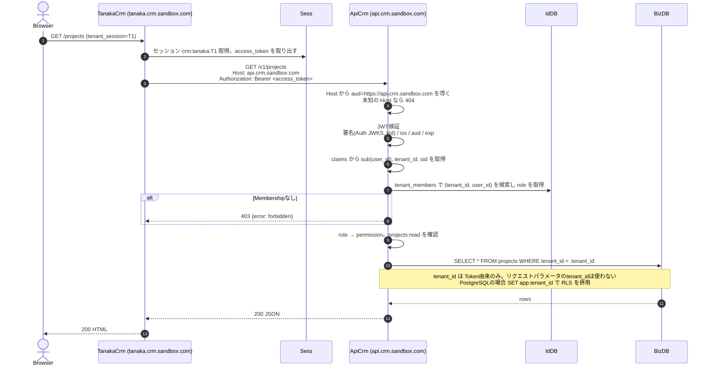

ブラウザは API Server と直接通信しない。CORS設定は不要になる。CRM の Access Token を api.cms.sandbox.com に出すと aud 不一致で 401 になる。

## 5. ログイン済みテナントへの再訪

Tenant Session が有効な間は Auth Server との通信は発生しない。

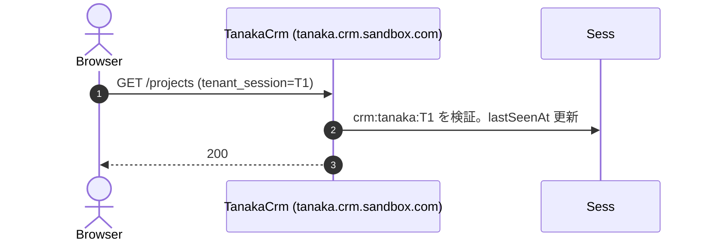

## 6. Tenant Session期限切れ。SSO Sessionは有効

「2. 別テナント・別サービスへのSSO」と同じフローで無画面復帰する。

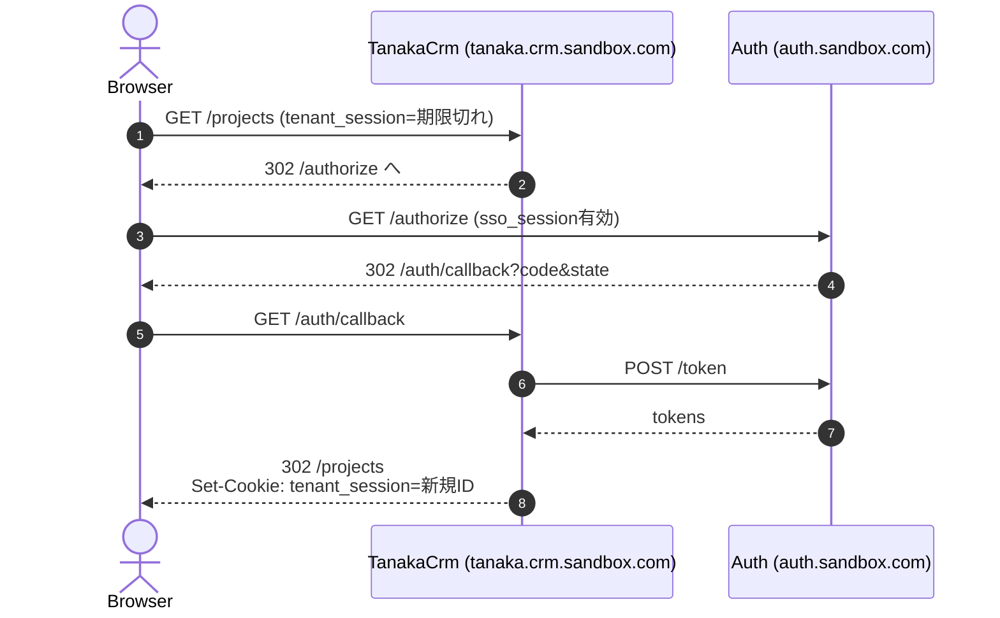

## 7. SSO Session期限切れ

`/authorize` が SSO Session を無効と判定してログイン画面へ誘導する。以降は「1. 初回ログイン」と同一。すべての Tenant Session はそれぞれの期限まで有効なまま残る。

## 8. 認証失敗

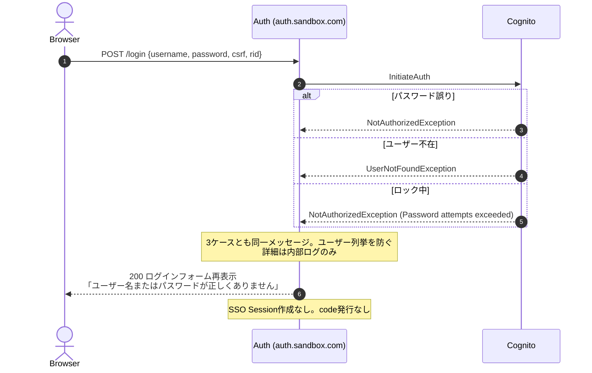

## 9. MFAチャレンジ。フェーズ2

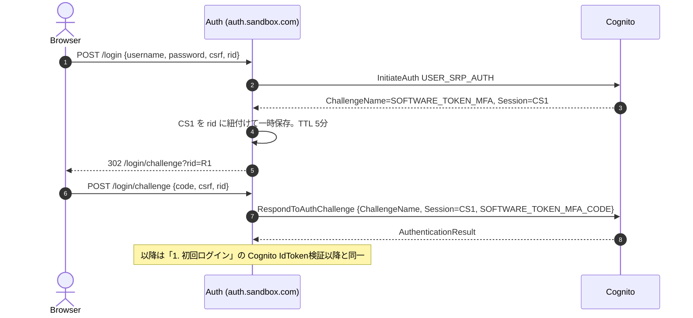

初期実装では ChallengeName が返った場合、ログインフォームに「この認証方式は未対応です」を表示して終了する。

## 10. Tenant Logout

```mermaid
sequenceDiagram
    autonumber
    actor Browser
    participant TanakaCrm as TanakaCrm (tanaka.crm.sandbox.com)
    participant Sess
    participant Auth as Auth (auth.sandbox.com)

    Browser->>TanakaCrm: POST /auth/logout (tenant_session=T1, csrf)
    TanakaCrm->>TanakaCrm: CSRFトークン検証
    TanakaCrm->>Sess: crm:tanaka:T1 を取得し refresh_token を取り出す
    TanakaCrm->>Auth: POST /revoke token=RT1 (Back Channel, client認証 crm)
    Auth-->>TanakaCrm: 200
    TanakaCrm->>Sess: crm:tanaka:T1 削除
    TanakaCrm-->>Browser: 302 /<br/>Set-Cookie: tenant_session=; Max-Age=0
    Note over Browser: sso_session と他ホストのセッションは残る<br/>tanaka.crm → ログアウト<br/>suzuki.crm → ログイン済み<br/>tanaka.cms → ログイン済み
```

SSO Session が残るため、tanaka.crm で再度 `/auth/login` を踏むとパスワードなしで再ログインされる。これは仕様書19.1が定める挙動である。

## 11. Global Logout

tanaka.crm のログアウト完了画面から `https://auth.sandbox.com/logout?client_id=crm&tenant=tanaka` へ誘導する。

```mermaid
sequenceDiagram
    autonumber
    actor Browser
    participant Auth as Auth (auth.sandbox.com)
    participant SsoStore
    participant Cognito
    participant WebCrm as WebCrm (crm.sandbox.com)
    participant WebCms as WebCms (cms.sandbox.com)

    Browser->>Auth: GET /logout?client_id=crm&tenant=tanaka (sso_session=X1)
    Auth-->>Browser: 200 確認画面。CSRFトークンと client_id / tenant を hidden で埋め込む
    Browser->>Auth: POST /logout {csrf, client_id=crm, tenant=tanaka}
    Auth->>SsoStore: X1 取得。authorized_clients=[crm, cms] と sid を特定
    Auth->>SsoStore: sid に紐付く Refresh Token を全失効
    Auth->>Cognito: RevokeToken(Cognito RefreshToken)
    Auth->>SsoStore: X1 削除
    par Back-Channel Logout。サービスごとに1通
        Auth->>WebCrm: POST /auth/backchannel-logout<br/>logout_token (JWT: iss, aud=crm, sid, events)
        WebCrm->>WebCrm: logout_token 検証。crm:sid:<sid> から<br/>tanaka / suzuki の Tenant Session を全削除
        WebCrm-->>Auth: 200
    and
        Auth->>WebCms: POST /auth/backchannel-logout logout_token (aud=cms)
        WebCms->>WebCms: cms:sid:<sid> から tanaka の Tenant Session を削除
        WebCms-->>Auth: 200
    end
    Auth-->>Browser: 200 ログアウト完了ページ<br/>「CRM (tanaka) に戻る」→ https://tanaka.crm.sandbox.com/<br/>Set-Cookie: sso_session=; Max-Age=0
```

通知先は SSO Session の authorized_clients に含まれるサービス。サービスは logout_token の sid で、テナントを問わず自サービスの全セッションを削除する。
通知に失敗したサービスの Tenant Session は、Access Token 期限切れ後の Refresh で `invalid_grant` となり自然に失効する。最大遅延は Access Token 寿命の15分。

## 12. 異常系。認可レスポンスの改ざんと再利用

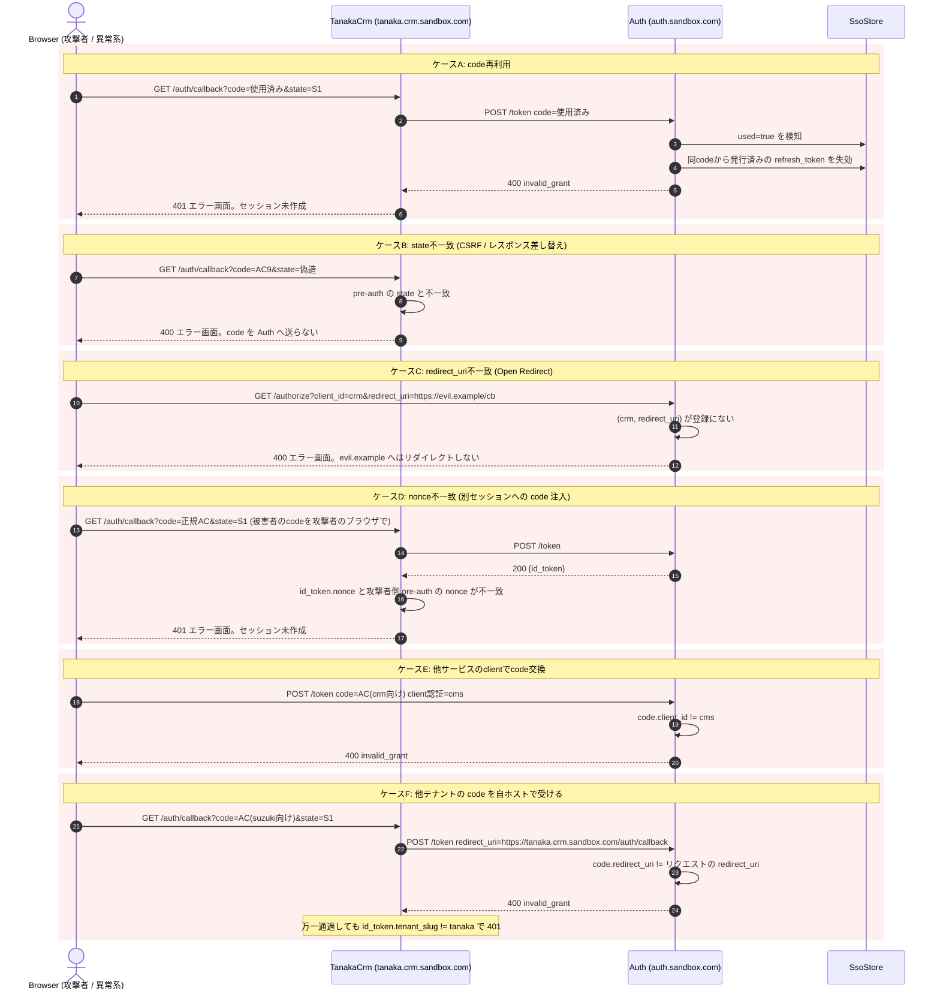

エラー時の共通原則。

- 不正な redirect_uri へは一切リダイレクトしない。Auth Server 側でエラー画面を表示する
- code / Refresh Token の再利用検知時は同系列の Token を失効させる
- エラー詳細は内部ログのみ。ユーザーには汎用メッセージ
- 全ケースは [09-error-cases.md](./09-error-cases.md) を参照
