# 認証シーケンス図

## 結論

全フローは OIDC Authorization Code Flow + PKCE に準拠する。
Front Channel を通るのは code と state のみ。Cognito Token、ID Token、Access Token、Refresh Token はすべて Back Channel かサーバー内部に閉じる。
テナントへのアクセス可否は `/authorize` と refresh_token grant で user → tenant → 契約 → サービスへの割り当て の順に判定する。API Server は Identity DB を見ず、役割と権限を自サービスの DB から毎リクエスト読む。Token には役割も権限も載せない。
招待はサービスの画面から行い、サービスの API が Auth Server の管理 API で「入れる」を登録してから自 DB に役割付きの member 行を作る。Identity DB にいない人はメールで事前作成し、初回ログイン時に Cognito の sub を紐付ける。

登場人物。

| 表記 | 実体 |
| --- | --- |
| Browser | ユーザーのブラウザ |
| TanakaCrm | tanaka.crm.sandbox.com。CRM の Tenant Web Application。BFF |
| SuzukiCrm | suzuki.crm.sandbox.com。CRM の別テナント |
| TanakaCms | tanaka.cms.sandbox.com。CMS の Tenant Web Application |
| SuzukiCms | suzuki.cms.sandbox.com。契約がないテナント × サービス |
| Auth | auth.sandbox.com。Auth Server |
| Cognito | Amazon Cognito User Pool |
| IdDB | Identity DB。users / tenants / tenant_members / oidc_clients / oidc_client_secrets / tenant_services / tenant_service_members |
| SsoStore | SSO Session Store、Auth Code Store、Refresh Token Store |
| Sess | Tenant Session Store。サービスごとに `<clientId>:sess` のプレフィックスで作り、キーは `<tenantSlug>:<sessionId>`。図中の `crm:tanaka:T1` や `crm:sid:<sid>` はプレフィックスとキーを続けて書いた略記 |
| ApiCrm | api.crm.sandbox.com |
| CrmDB | CRM DB。members / permission_overrides / end_users。crm-api だけが接続する |

ユーザーは alice。identity では tanaka の crm と cms、suzuki の crm に入れる。CRM DB の members では tanaka で owner、suzuki で viewer。suzuki では `end_users:unmask` を allow されている。CMS DB の members では tanaka で owner で、`posts:create` を deny されている。

## 1. 初回ログイン。tanaka.crm.sandbox.com へ未ログイン状態でアクセス

SSO Session も Tenant Session もない状態からの完全なフロー。仕様書23章の成果物2。

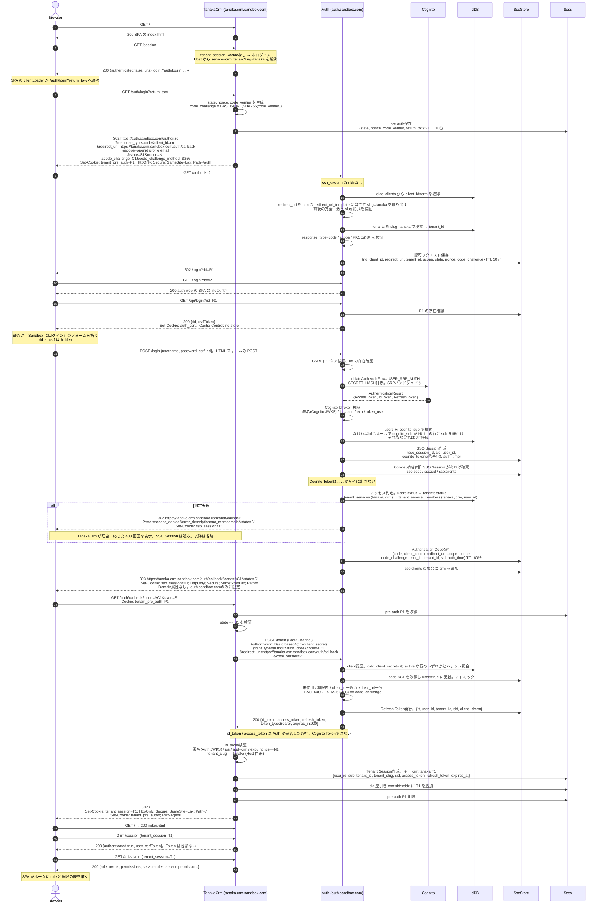

要点。

- code は60秒、一回限り。使用済み化を先に行ってから検証結果を返す
- users の解決は cognito_sub → 同じメールで cognito_sub が NULL の行 → JIT 作成の順。2 番目は招待で事前作成された人で、ここで sub が紐付く。同じメールが別の sub に既に紐付いていればログインを拒否し、既存行を書き換えない
- 認可リクエストのテナントは client_id と redirect_uri の組から Auth Server が解決する。redirect_uri をサービスの redirect_uri_template に当てて slug を取り出し、tenants を引く。Tenant Web Application はテナントを申告しない
- アクセス判定は Cognito 認証成功後、code 発行前に行う。契約がないサービス、そのテナントのそのサービスに割り当てのないユーザーには code を発行しない
- 認証は成功しているため SSO Session は作成する。アクセスできるテナントへ移動すればログイン画面なしで入れる
- ブラウザに渡るのは Cookie のみ。access_token / refresh_token は TanakaCrm のサーバー側セッションに保存する。SPA は `/session` でログイン状態と CSRF トークンだけを受け取り、API は `/api/*` 経由で呼ぶ
- ログイン成功時に Cookie が指す旧 SSO Session があれば破棄する。Cookie の上書きだけでは旧セッションが期限まで残る
- ログイン画面は auth-web の SPA が描く。SPA は `/api/login` で rid と CSRF を受け取ってフォームを描くだけで、資格情報は HTML フォームの POST で `/login` へ送る。パスワードを fetch で送らない。判断事項D19

## 2. 別テナント・別サービスへのSSO

tanaka.crm でログイン済みの状態。パスワード入力もログイン画面も出ない。仕様書23章の成果物3。

### 2.1 別テナント。suzuki.crm.sandbox.com へ初回アクセス

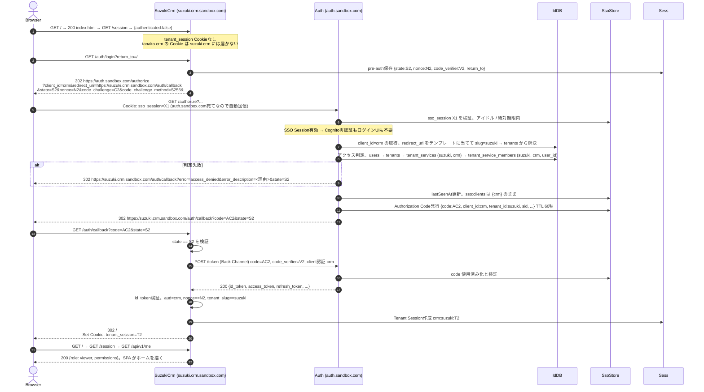

同一ユーザーが tanaka の crm では owner、suzuki の crm では viewer というように、テナント × サービスごとに異なる role を持てる。role は CRM DB の members から crm-api が解決し、Access Token には載せない。Auth Server は「入れるか」だけを見る。

### 2.2 別サービス。tanaka.cms.sandbox.com へ初回アクセス

client_id が `cms` になる点と、Access Token の aud が api.cms になる点以外は 2.1 と同じ。

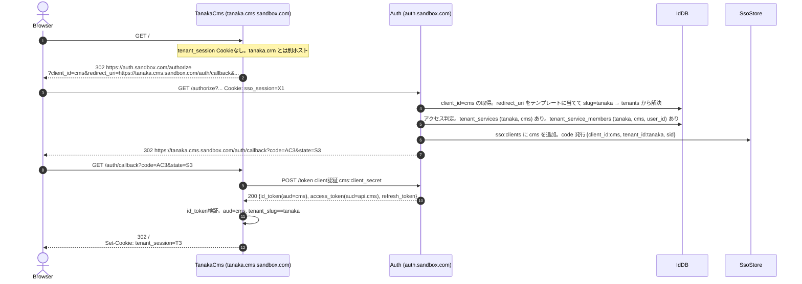

### 2.3 契約のないサービス。suzuki.cms.sandbox.com へアクセス

redirect_uri は cms のテンプレートに一致し suzuki も tenants にあるが、suzuki は cms を契約していない。

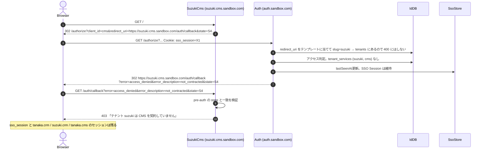

結果。

```text
tanaka.crm.sandbox.com → ログイン済み (tenant_session。キー crm:tanaka:T1)
suzuki.crm.sandbox.com → ログイン済み (tenant_session。キー crm:suzuki:T2)
tanaka.cms.sandbox.com → ログイン済み (tenant_session。キー cms:tanaka:T3)
suzuki.cms.sandbox.com → 403 not_contracted。セッションなし
auth.sandbox.com       → SSO Session 1つ。sso:clients = {crm, cms}
```

## 3. Authorization Code Flow の詳細

`/authorize` と `/token` の内部処理を成果物4として切り出す。

### 3.1 /authorize の判定フロー

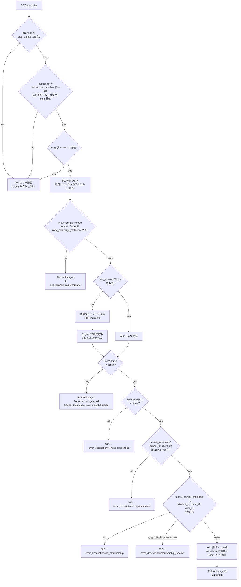

テンプレートに一致しない redirect_uri と、一致しても slug が tenants にない redirect_uri はどちらも `invalid_redirect_uri` で、E1 のとおりリダイレクトしない。テナントに紐付かない戻り先は存在せず、すべての認可はテナントに紐付く。user → tenant → 契約 → サービスへの割り当て の判定は、user・契約・割り当てを並列に取得したうえでこの順に評価する。割り当てはこのサービスのものだけを見るため、別サービスの割り当てでは通らない。

### 3.2 /token の判定フロー。grant_type=authorization_code

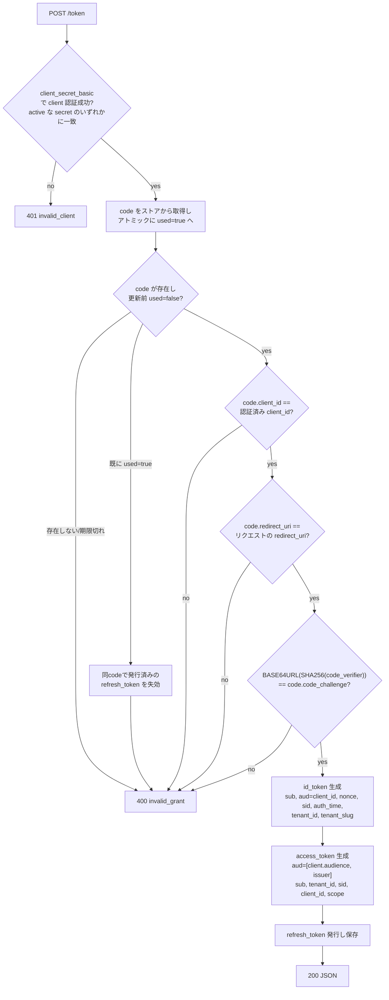

client.audience は oidc_clients に登録したサービスの API origin。crm なら `https://api.crm.sandbox.com`。

### 3.3 /token の判定フロー。grant_type=refresh_token

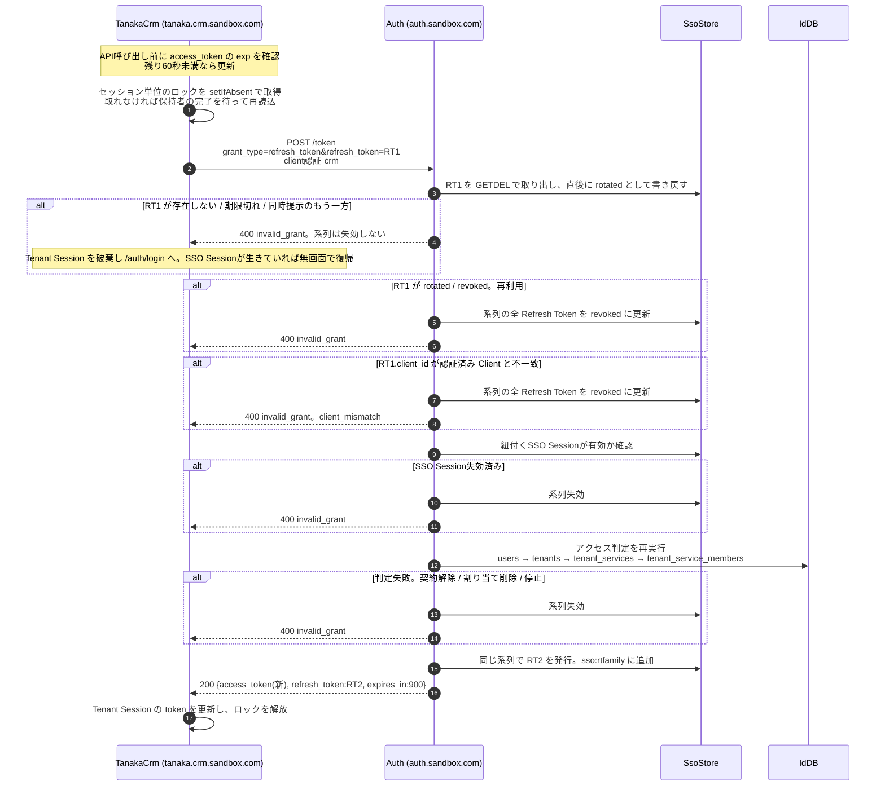

消費を先に行う。同じ RT1 を同時に 2 回提示されても GETDEL で取り出せるのは 1 回だけで、もう一方は存在しない値として `invalid_grant` になる。このとき系列は失効させない。正規の Client の偶発的な二重送信で全セッションを落とさないためで、系列を失効させるのは `rotated` / `revoked` の値が提示された再利用と、別 Client からの提示に限る。
Tenant 側は同じセッションで Refresh を 1 回にまとめる。`ensureFreshAccessToken` がセッション単位のロックを取り、取れなかったリクエストは 100 ミリ秒間隔で最大 30 回セッションを読み直して、Refresh 済みの Token で続行する。

## 4. API呼び出し。BFFからapi.crm.sandbox.comへ

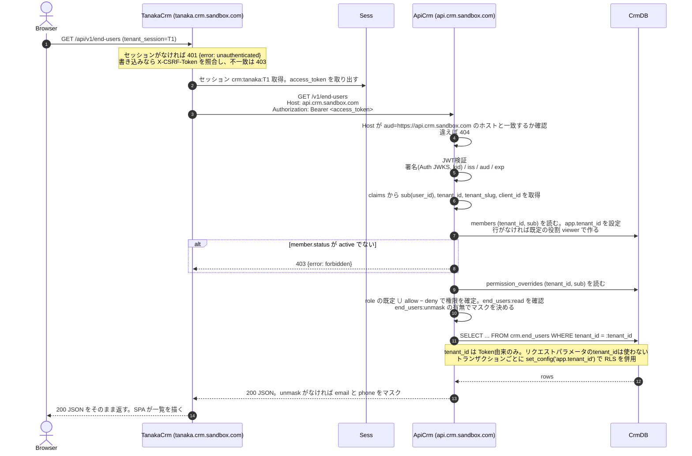

ブラウザは API Server と直接通信しない。BFF の `/api/*` が同一オリジンで中継するため CORS設定は不要になる。API がセッション切れを返したら BFF は 401 にし、SPA が `/auth/login` へ遷移して再ログインする。CRM の Access Token を api.cms.sandbox.com に出すと aud 不一致で 401 になる。
役割も権限も Token には載っていない。API Server は Identity DB を見ず、役割と権限の上書きを自サービスの DB から毎回読む。「入れるか」は Auth Server が Token 発行時と Refresh 時に判定済みで、割り当てを外された人は Refresh で `invalid_grant` になり最大 15 分で API を呼べなくなる。alice が tanaka.cms で `POST /v1/posts` を呼ぶと、owner の既定に cms 側の `posts:create` の deny が重なり 403 になる。

## 4.1 招待と初回ログインでの紐付け

tanaka の crm の owner である alice が、Identity DB にいない dave を招待する。

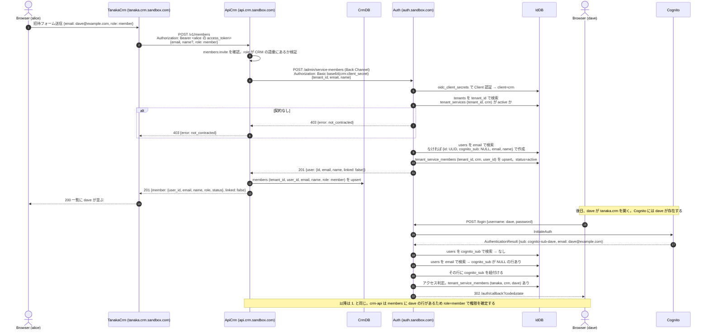

要点。

- 「入れるか」は Auth Server、役割はサービスの DB。招待は両方に書き、順序は Auth Server が先。Auth Server が拒否すればサービスの DB には何も残らない
- Auth Server は Client 自身のサービスへの割り当てだけを操作させる。crm の secret で cms への割り当ては作れない
- 招待時に user_id が確定するため、サービスは初回ログイン前から役割と上書きを持てる
- `GET /admin/service-members` と `GET /v1/members` の `linked` で初回ログイン済みかが分かる
- 削除は逆で、`DELETE /v1/members/:userId` が Auth Server の割り当てを消してから自 DB の行を消す。Auth Server 側に割り当てがなくても自 DB の行は消す。自分自身は消せない

## 5. ログイン済みテナントへの再訪

Tenant Session が有効な間は Auth Server との通信は発生しない。

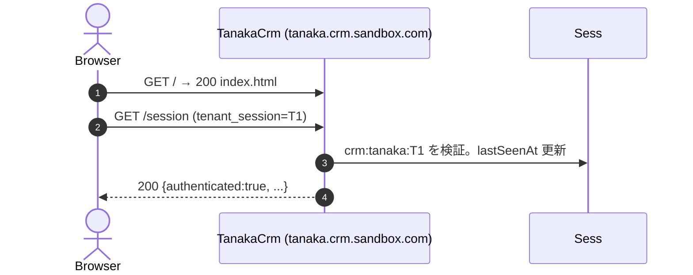

## 6. Tenant Session期限切れ。SSO Sessionは有効

「2. 別テナント・別サービスへのSSO」と同じフローで無画面復帰する。

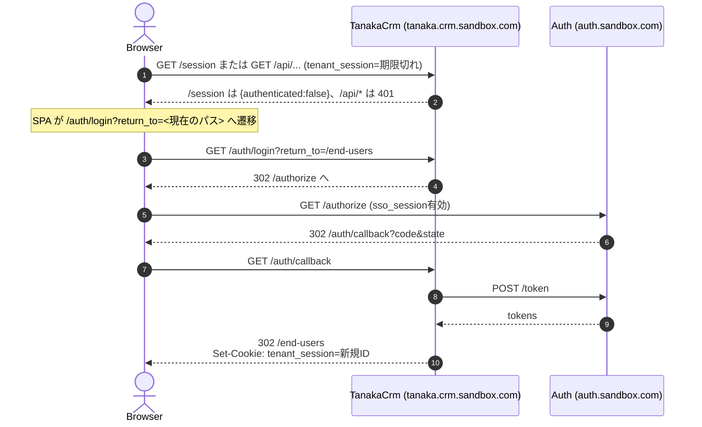

## 7. SSO Session期限切れ

`/authorize` が SSO Session を無効と判定してログイン画面へ誘導する。以降は「1. 初回ログイン」と同一。すべての Tenant Session はそれぞれの期限まで有効なまま残る。

## 8. 認証失敗

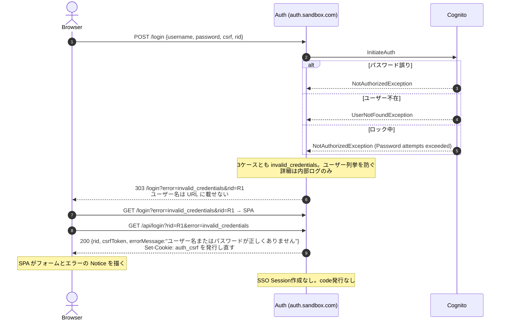

失敗の種類は `invalid_credentials` `user_disabled` `user_not_confirmed` `password_reset_required` `challenge_required` `unavailable`。クエリには種類だけを載せ、文言は `/api/login` が返す。`invalid_credentials` と `user_disabled` は同一文言。

## 9. MFAチャレンジ。フェーズ2

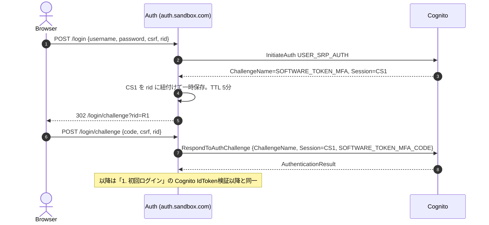

初期実装では ChallengeName が返った場合、`/login?error=challenge_required&rid=` へ戻し、SPA が `/api/login` から受け取った「この認証方式は現在未対応です」を表示して終了する。

## 10. Tenant Logout

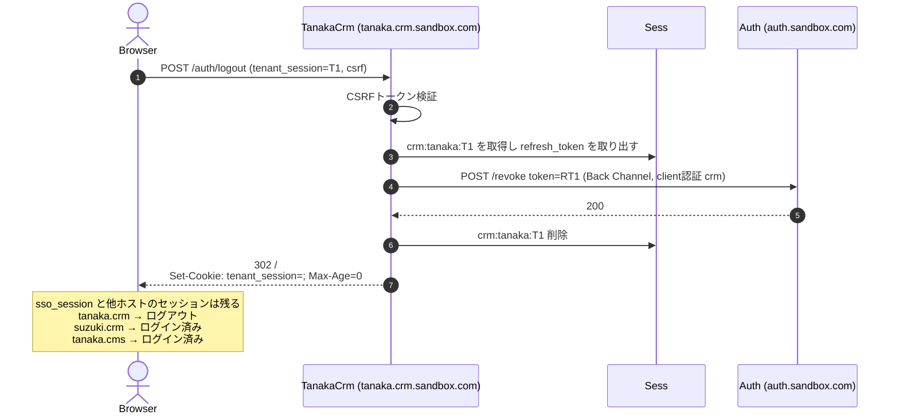

SSO Session が残るため、tanaka.crm で再度 `/auth/login` を踏むとパスワードなしで再ログインされる。これは仕様書19.1が定める挙動である。

## 11. Global Logout

tanaka.crm のログアウト完了画面から `https://auth.sandbox.com/logout?client_id=crm&tenant=tanaka` へ誘導する。

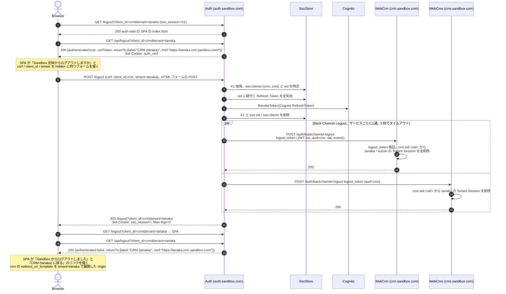

通知先は `sso:clients` の集合に含まれるサービスのうち、`oidc_clients.status` が `active` で `backchannel_logout_uri` を持つもの。サービスは logout_token の sid で、テナントを問わず自サービスの全セッションを削除する。
戻り先のリンクは `client_id` の `redirect_uri_template` を `tenant` で展開した URL の origin から `/api/logout` の `returnTo` として導く。`tenant` は SPA が描くフォームの hidden フィールドで POST まで引き継ぎ、POST 後の 303 で `/logout` のクエリに戻す。確認画面と完了画面は同じ `/logout` を SPA が `authenticated` で出し分ける。判断事項D19。
各通知は `AbortSignal.timeout(5000)` を付けて送り、応答しないサービスがあっても 5 秒で打ち切る。通知に失敗したサービスの Tenant Session は、Access Token 期限切れ後の Refresh で `invalid_grant` となり自然に失効する。最大遅延は Access Token 寿命の15分。

## 12. 異常系。認可レスポンスの改ざんと再利用

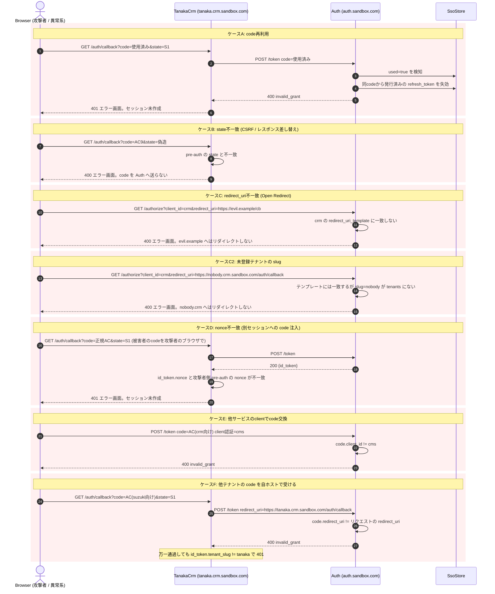

エラー時の共通原則。

- 不正な redirect_uri へは一切リダイレクトしない。Auth Server 側でエラー画面を表示する
- code / Refresh Token の再利用検知時は同系列の Token を失効させる
- エラー詳細は内部ログのみ。ユーザーには汎用メッセージ
- 全ケースは [09-error-cases.md](./09-error-cases.md) を参照
