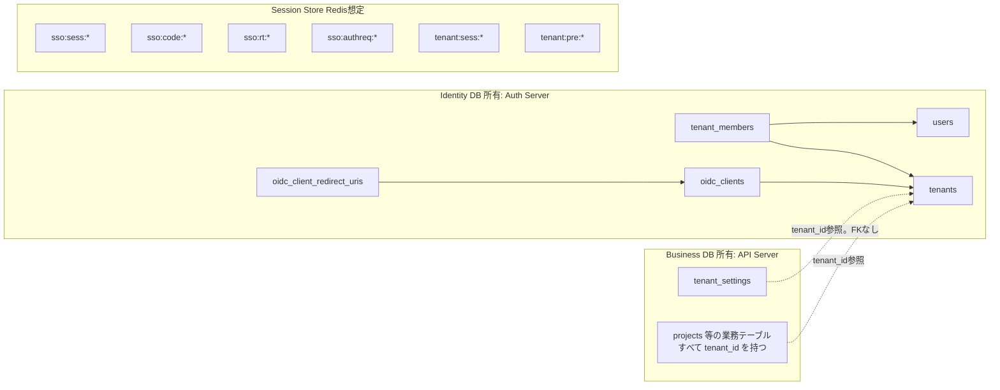

# User / Tenant / Membership DB設計とSession設計

## 結論

永続データは Identity DB と Business DB に分け、揮発データは Session Store に置く。
Identity DB は Auth Server が所有し、API Server は読み取り専用で参照する。判断事項D3。
ユーザーとテナントは別概念とし、tenant_members が多対多を表す。認可は必ず tenant_members を根拠にする。

## 全体像



Identity DB と Business DB は物理的に同一インスタンスでもよいが、スキーマを分け、API Server の Identity スキーマへの権限は SELECT のみにする。

## Identity DB

### users

```sql
CREATE TABLE users (
  id            TEXT PRIMARY KEY,            -- ULID。ID Token の sub として外部へ出す
  cognito_sub   TEXT NOT NULL UNIQUE,        -- 正規識別子。Cognito User Pool の sub
  email         TEXT NOT NULL,
  name          TEXT,
  status        TEXT NOT NULL DEFAULT 'active', -- active / disabled
  created_at    TIMESTAMPTZ NOT NULL DEFAULT now(),
  updated_at    TIMESTAMPTZ NOT NULL DEFAULT now()
);
CREATE UNIQUE INDEX users_cognito_sub_idx ON users (cognito_sub);
```

- 正規識別子は cognito_sub。仕様書14章
- id は内部代理キー。Client へ露出するのはこちら。Cognito固有値を境界の外へ出さないため
- email は表示用キャッシュ。突合キーにしない。Cognito 側で変更され得る
- JIT作成。Cognito 認証成功時に cognito_sub で検索し、なければ作成。判断事項D9

### tenants

```sql
CREATE TABLE tenants (
  id            TEXT PRIMARY KEY,            -- ULID
  slug          TEXT NOT NULL UNIQUE,        -- サブドメイン。^[a-z0-9](?:[a-z0-9-]{0,61}[a-z0-9])?$
  name          TEXT NOT NULL,
  status        TEXT NOT NULL DEFAULT 'active', -- active / suspended
  created_at    TIMESTAMPTZ NOT NULL DEFAULT now(),
  updated_at    TIMESTAMPTZ NOT NULL DEFAULT now()
);
```

- slug は予約語を禁止する。auth / api / www / admin 等
- status=suspended のテナントには `/authorize` で access_denied を返す

### tenant_members

```sql
CREATE TABLE tenant_members (
  tenant_id     TEXT NOT NULL REFERENCES tenants (id) ON DELETE CASCADE,
  user_id       TEXT NOT NULL REFERENCES users (id) ON DELETE CASCADE,
  role          TEXT NOT NULL CHECK (role IN ('owner', 'admin', 'member', 'viewer')),
  status        TEXT NOT NULL DEFAULT 'active', -- active / invited / disabled
  created_at    TIMESTAMPTZ NOT NULL DEFAULT now(),
  updated_at    TIMESTAMPTZ NOT NULL DEFAULT now(),
  PRIMARY KEY (tenant_id, user_id)
);
CREATE INDEX tenant_members_user_id_idx ON tenant_members (user_id);
```

- 1ユーザーが複数テナントに所属できる。テナントごとに role が異なる
- status=active のみをアクセス可とする
- role は固定enum。判断事項D8。細粒度権限は API Server の Role→Permission 表で解決する

### oidc_clients

```sql
CREATE TABLE oidc_clients (
  client_id            TEXT PRIMARY KEY,     -- テナント用は slug と同値。外部サービスは任意
  client_secret_hash   TEXT NOT NULL,        -- argon2id
  tenant_id            TEXT REFERENCES tenants (id) ON DELETE CASCADE, -- NULL なら非テナントClient
  name                 TEXT NOT NULL,
  allowed_scopes       TEXT[] NOT NULL DEFAULT ARRAY['openid','profile','email'],
  backchannel_logout_uri TEXT,               -- フェーズ2
  status               TEXT NOT NULL DEFAULT 'active',
  created_at           TIMESTAMPTZ NOT NULL DEFAULT now(),
  updated_at           TIMESTAMPTZ NOT NULL DEFAULT now()
);

CREATE TABLE oidc_client_redirect_uris (
  client_id     TEXT NOT NULL REFERENCES oidc_clients (client_id) ON DELETE CASCADE,
  redirect_uri  TEXT NOT NULL,               -- 完全一致比較。正規化しない
  PRIMARY KEY (client_id, redirect_uri)
);
```

- テナント作成時に `client_id = slug`、`redirect_uri = https://<slug>.sandbox.com/auth/callback` を自動登録する。判断事項D2
- tenant_id が NULL の Client は別ドメインのサービスや管理画面用。tenant_id を持たないため `/authorize` の Membership 判定をスキップし、Access Token に tenant_id を載せない。管理系の認可は別途 scope で扱う
- client_secret は生成時に一度だけ表示し、Secret Store に保存する。DB にはハッシュのみ

### 初期データ例

| tenants.slug | oidc_clients.client_id | redirect_uri |
| --- | --- | --- |
| tenant-a | tenant-a | https://tenant-a.sandbox.com/auth/callback |
| tenant-b | tenant-b | https://tenant-b.sandbox.com/auth/callback |

## Business DB

API Server が所有する。すべての業務テーブルに tenant_id を持たせる。

```sql
CREATE TABLE projects (
  id          TEXT PRIMARY KEY,
  tenant_id   TEXT NOT NULL,   -- Identity DB の tenants.id。スキーマをまたぐため FK は張らない
  name        TEXT NOT NULL,
  created_by  TEXT NOT NULL,   -- users.id
  created_at  TIMESTAMPTZ NOT NULL DEFAULT now()
);
CREATE INDEX projects_tenant_id_idx ON projects (tenant_id);
```

Row Level Security を併用する場合。判断事項D11。

```sql
ALTER TABLE projects ENABLE ROW LEVEL SECURITY;
ALTER TABLE projects FORCE ROW LEVEL SECURITY;
CREATE POLICY projects_tenant_isolation ON projects
  USING (tenant_id = current_setting('app.tenant_id', true))
  WITH CHECK (tenant_id = current_setting('app.tenant_id', true));
```

API Server はトランザクション開始時に `SET LOCAL app.tenant_id = :tenant_id` を Token 由来の値で実行する。詳細は [07-api-auth-design.md](./07-api-auth-design.md)。

## Session Store

Redis 想定。すべて TTL 付き。ローカル検証はインメモリ Map。

### SSO Session

キー `sso:sess:<sso_session_id>`。TTL は絶対期限。

```typescript
type SsoSession = {
  id: string;                 // 256bit random。Cookie値
  sid: string;                // ID Token に載せる公開識別子
  userId: string;             // users.id
  cognitoSub: string;
  cognitoTokens: {
    accessToken: string;      // 暗号化済み
    refreshToken: string;     // 暗号化済み
    expiresAt: number;
  };
  authTime: number;
  createdAt: number;
  lastSeenAt: number;         // アイドル判定。/authorize ごとに更新
  authorizedClients: string[]; // Global Logout の通知先
};
```

逆引き `sso:sid:<sid> → sso_session_id` を持ち、Back-Channel Logout と Refresh Token 失効に使う。

### 認可リクエスト

キー `sso:authreq:<rid>`。TTL 10分。ログイン画面を挟む間の保持用。

```typescript
type AuthorizationRequest = {
  rid: string;
  clientId: string;
  redirectUri: string;
  scope: string;
  state: string;
  nonce: string;
  codeChallenge: string;
  createdAt: number;
};
```

### Authorization Code

キー `sso:code:<code>`。TTL 60秒。

```typescript
type AuthorizationCode = {
  code: string;
  clientId: string;
  redirectUri: string;
  scope: string;
  nonce: string;
  codeChallenge: string;
  userId: string;
  tenantId: string | null;
  sid: string;
  ssoSessionId: string;
  authTime: number;
  used: boolean;
  createdAt: number;
};
```

`used` の更新は `GETDEL` または Lua スクリプトで取得と削除を同時に行い、二重交換を排除する。

### Refresh Token

キー `sso:rt:<token>`。TTL 12時間。

```typescript
type RefreshToken = {
  token: string;
  familyId: string;           // ローテーション系列。再利用検知時に系列全体を失効
  clientId: string;
  userId: string;
  tenantId: string | null;
  sid: string;
  ssoSessionId: string;
  scope: string;
  createdAt: number;
  revokedAt?: number;
};
```

逆引き `sso:rtfamily:<familyId> → token[]` と `sso:sidrt:<sid> → familyId[]` を持つ。

### Tenant Session

キー `tenant:<slug>:sess:<session_id>`。TTL は絶対期限。

```typescript
type TenantSession = {
  id: string;                 // Cookie値
  userId: string;             // ID Token の sub
  tenantId: string;
  sid: string;
  accessToken: string;        // API 呼び出し用
  accessTokenExpiresAt: number;
  refreshToken: string;
  email: string;
  name?: string;
  createdAt: number;
  lastSeenAt: number;
};
```

逆引き `tenant:<slug>:sid:<sid> → session_id[]` を持つ。Back-Channel Logout 用。role は保存しない。表示用に必要なら API から都度取得する。

### pre-auth

キー `tenant:<slug>:pre:<id>`。TTL 10分。

```typescript
type PreAuthState = {
  id: string;                 // Cookie値
  state: string;
  nonce: string;
  codeVerifier: string;
  returnTo: string;           // 自ドメイン内パスのみ
  createdAt: number;
};
```

## 抽象化インターフェース

```typescript
interface KeyValueStore<T> {
  get(key: string): Promise<T | undefined>;
  set(key: string, value: T, ttlSeconds: number): Promise<void>;
  delete(key: string): Promise<void>;
  getAndDelete(key: string): Promise<T | undefined>; // code の一回限り消費用
}
```

| 環境 | 実装 |
| --- | --- |
| ローカル検証 | インメモリ Map + 期限管理 |
| 本番 | Redis。getAndDelete は GETDEL |

## 障害時の考慮

| 障害 | 影響 | 対処 |
| --- | --- | --- |
| Session Store 停止 | 新規ログインと Refresh が失敗。既存 Tenant Session も参照できない | Redis の冗長化。Auth Code は揮発を許容 |
| Identity DB 停止 | `/authorize` の Membership 判定と API 認可が失敗 | API Server は Membership を短時間キャッシュしてよいが、キャッシュ期間は Access Token 寿命以下 |
| Cognito 停止 | 新規認証のみ失敗。SSO Session 有効中のユーザーは影響なし | Cognito Token の更新失敗は SSO Session 失効として扱う |
