# User / Tenant / Membership DB設計とSession設計

## 結論

永続データは Identity DB とサービスごとの DB に分け、揮発データは Session Store に置く。
Identity DB は Auth Server が所有し、Auth Server だけが接続する。API Server は接続しない。判断事項D3、D17。
ユーザーとテナントは別概念とし、サービスへのログイン可否は tenant_service_members がテナント × サービス × ユーザーの単位で表す。この表は役割を持たない。tenant_members は会社横断の役割にだけ使い、ログイン可否には使わない。判断事項D16。
サービスとテナントも別概念とし、tenant_services が契約を表す。OIDC Client はサービスと1対1で、テナントには紐付かない。判断事項D13。
役割と権限は Identity DB にも Token にも置かず、各サービスの DB の members が役割を、permission_overrides が役割の既定に対する allow / deny を持つ。役割の語彙はサービスごとに違う。判断事項D17。
主キーはすべてサロゲート ID とし、client_id や slug は UNIQUE 制約で守る公開識別子にする。redirect_uri はサービスごとの `redirect_uri_template` で登録し、client_secret は oidc_client_secrets に複数行持てる。判断事項D15。
ブラウザから作られた SSO Session の記録と監査イベントは Identity DB の auth_sessions、auth_session_clients、audit_events に残す。揮発ストアのキーは Cookie の値、Refresh Token、認可コード、rid、CSRF の参照 ID、MFA の保留 ID の SHA-256 で、値の中にも生の秘密値を持たない。判断事項D21。MFA の保留状態は `sso:mfa` に 5 分だけ置き、登録済みの方式は `user_mfa_methods` に残す。判断事項D22。

## 全体像

```mermaid
flowchart LR
    subgraph IdentityDB ["Identity DB  接続: Auth Server のみ"]
        users
        tenants
        tenant_members["tenant_members<br/>会社横断の役割"]
        oidc_clients
        oidc_client_secrets
        tenant_services["tenant_services<br/>契約"]
        tenant_service_members["tenant_service_members<br/>サービスごとの割り当て。役割なし"]
        auth_sessions["auth_sessions<br/>SSO Session の記録。IP / UA"]
        auth_session_clients["auth_session_clients<br/>code を発行したサービスとテナント"]
        audit_events["audit_events<br/>監査イベント"]
        user_mfa_methods["user_mfa_methods<br/>登録済み MFA 方式"]
    end
    subgraph CrmDB ["CRM DB  接続: crm-api のみ"]
        crm_members["crm.members<br/>役割 owner / admin / member / viewer"]
        crm_overrides["crm.permission_overrides<br/>allow / deny"]
        crm_end_users["crm.end_users<br/>顧客データ"]
    end
    subgraph CmsDB ["CMS DB  接続: cms-api のみ"]
        cms_members["cms.members<br/>役割 owner / editor / viewer"]
        cms_overrides["cms.permission_overrides<br/>allow / deny"]
        cms_posts["cms.posts<br/>投稿"]
    end
    subgraph SessionStore ["Session Store  Redis想定"]
        sso["sso:sess:*"]
        ssosid["sso:sid:*"]
        authreq["sso:authreq:*"]
        code["sso:code:*"]
        rt["sso:rt:*"]
        rtfamily["sso:rtfamily:*  集合"]
        sidrt["sso:sidrt:*  集合"]
        csrf["sso:csrf:*"]
        ratelimit["sso:ratelimit:*  カウンタ"]
        tsess["clientId:sess:tenantSlug:*"]
        tsid["clientId:sid:sid:*  集合"]
        tpre["clientId:pre:tenantSlug:*"]
        tlock["clientId:lock:tenantSlug:*"]
        tratelimit["clientId:ratelimit:*  カウンタ"]
    end
    tenant_members --> users
    tenant_members --> tenants
    tenant_services --> tenants
    tenant_services --> oidc_clients
    tenant_service_members --> tenant_services
    tenant_service_members --> users
    oidc_client_secrets --> oidc_clients
    auth_sessions --> users
    auth_session_clients --> auth_sessions
    auth_session_clients --> oidc_clients
    auth_session_clients --> tenants
    user_mfa_methods --> users
    crm_overrides --> crm_members
    cms_overrides --> cms_members
    crm_members -. "tenant_id / user_id の値だけ共有。FKなし" .-> tenant_service_members
    cms_members -. "tenant_id / user_id の値だけ共有。FKなし" .-> tenant_service_members
```



DB はサービスごとに分ける。ローカルは docker compose の `db-identity` 5432、`db-crm` 5433、`db-cms` 5434 の 3 コンテナで、初期化 SQL は `db/identity/init` `db/crm/init` `db/cms/init`。DB 間の外部キーや JOIN はなく、共有するのは user_id と tenant_id の値だけ。サービスの DB の整合はアプリが保つ。

| DB | データベース | スキーマ | アプリのロール | 表の所有者 | 接続するアプリ |
| --- | --- | --- | --- | --- | --- |
| identity | `identity` | `identity` | `sandbox_auth`。スキーマの所有者 | `sandbox_auth` | auth-api |
| crm | `crm` | `crm` | `crm_app`。NOBYPASSRLS | `postgres` | crm-api |
| cms | `cms` | `cms` | `cms_app`。NOBYPASSRLS | `postgres` | cms-api |

サービスの DB では表の所有者とアプリのロールを分ける。FORCE ROW LEVEL SECURITY は所有者には効かないため、表は postgres が所有し、アプリのロールには SELECT / INSERT / UPDATE / DELETE だけを与える。

外部キーはすべてサロゲート ID を参照する。`oidc_clients.client_id` を参照する外部キーは持たない。`updated_at` を持つ表はトリガー `touch_updated_at()` で更新時刻を自動更新する。

## Identity DB

### users

```sql
CREATE TABLE users (
  id            TEXT PRIMARY KEY,            -- ULID。ID Token の sub として外部へ出す
  cognito_sub   TEXT UNIQUE,                 -- 正規識別子。Cognito User Pool の sub。招待直後は NULL
  email         TEXT NOT NULL UNIQUE,        -- 招待の突合キー
  name          TEXT,
  status        TEXT NOT NULL DEFAULT 'active', -- active / disabled
  created_at    TIMESTAMPTZ NOT NULL DEFAULT now(),
  updated_at    TIMESTAMPTZ NOT NULL DEFAULT now()
);
```

- 正規識別子は cognito_sub。仕様書14章。招待で事前作成した行は初回ログインまで NULL
- id は内部代理キー。Client へ露出するのはこちら。Cognito固有値を境界の外へ出さないため
- email は UNIQUE。招待時の事前作成と初回ログイン時の紐付けの突合キーになる。判断事項D17
- ログイン時の解決は cognito_sub → 同じメールで cognito_sub が NULL の行に sub を紐付け → JIT作成の順。同じメールが別の sub に既に紐付いていればログインを拒否し、既存行を書き換えない。判断事項D9、D17

### tenants

```sql
CREATE TABLE tenants (
  id            TEXT PRIMARY KEY,            -- ULID
  slug          TEXT NOT NULL UNIQUE,        -- ホストの先頭ラベル。^[a-z0-9](?:[a-z0-9-]{0,61}[a-z0-9])?$
  name          TEXT NOT NULL,
  status        TEXT NOT NULL DEFAULT 'active', -- active / suspended
  created_at    TIMESTAMPTZ NOT NULL DEFAULT now(),
  updated_at    TIMESTAMPTZ NOT NULL DEFAULT now()
);
```

- テナントは顧客企業。サービス横断で共有し、どのサービスにも同じ id と slug で現れる
- slug は予約語を禁止する。auth / api / www / admin 等
- status=suspended のテナントには `/authorize` で access_denied を返す。理由は tenant_suspended

### tenant_members

```sql
CREATE TABLE tenant_members (
  tenant_id     TEXT NOT NULL REFERENCES tenants (id) ON DELETE CASCADE,
  user_id       TEXT NOT NULL REFERENCES users (id) ON DELETE CASCADE,
  role          TEXT NOT NULL CHECK (role IN ('owner', 'admin', 'member')),
  status        TEXT NOT NULL DEFAULT 'active', -- active / disabled
  created_at    TIMESTAMPTZ NOT NULL DEFAULT now(),
  updated_at    TIMESTAMPTZ NOT NULL DEFAULT now(),
  PRIMARY KEY (tenant_id, user_id)
);
CREATE INDEX tenant_members_user_id_idx ON tenant_members (user_id);
```

- 会社横断の役割。管理者や請求担当のような、サービスに依らない立場を表す。判断事項D16
- ログイン可否には使わない。`/authorize`、refresh_token grant、API Server はこの表を参照しない
- サービスへの割り当ては tenant_service_members に持つ。tanaka の owner であっても、tanaka の cms に割り当てがなければ tanaka.cms には入れない
- role は固定enum。サービスでの役割とは別の語彙で、サービスの役割はサービスの DB が持つ。判断事項D8、D17

### oidc_clients

```sql
CREATE TABLE oidc_clients (
  id                     TEXT PRIMARY KEY,   -- ULID。内部参照と外部キーはこちら
  client_id              TEXT NOT NULL UNIQUE, -- OAuth の公開識別子。サービスID。crm / cms。^[a-z0-9](?:[a-z0-9-]{0,61}[a-z0-9])?$
  name                   TEXT NOT NULL,      -- 表示名。CRM / CMS
  audience               TEXT NOT NULL,      -- サービスの API origin。Access Token の aud
  redirect_uri_template  TEXT NOT NULL CHECK (redirect_uri_template LIKE '%{tenant}%'), -- {tenant} を 1 か所だけ含む
  allowed_scopes         TEXT[] NOT NULL DEFAULT ARRAY['openid','profile','email'],
  backchannel_logout_uri TEXT,               -- サービス単位。テナントに依存しない
  status                 TEXT NOT NULL DEFAULT 'active', -- active / disabled
  created_at             TIMESTAMPTZ NOT NULL DEFAULT now(),
  updated_at             TIMESTAMPTZ NOT NULL DEFAULT now()
);
```

- 1 Client = 1 サービス。テナントには紐付かないため tenant_id 列を持たない
- id はサロゲート主キー。oidc_client_secrets と tenant_services の外部キーは id を参照する。client_id を変更しても外部キーは連鎖しない
- redirect_uri_template はサービスに 1 つ。ローカルは `http://{tenant}.crm.localhost:3001/auth/callback`、本番は `https://{tenant}.crm.example.com/auth/callback`。`{tenant}` をテナント slug で展開した文字列と redirect_uri を完全一致で比較する
- 認可リクエストのテナントは redirect_uri をテンプレートに当てて slug を取り出し、tenants を slug で引いて決める。crm と `http://suzuki.crm.localhost:3001/auth/callback` なら suzuki
- テンプレートに一致しない、または slug が tenants にない redirect_uri は `invalid_redirect_uri` としてリダイレクトせず 400 にする。テナントに紐付かない戻り先は持たない
- audience は API Server が `API_BASE_URL` から導く値と完全一致させる。ローカルは `http://api.crm.localhost:3002`
- backchannel_logout_uri はサービスのベースホスト。ローカルは `http://crm.localhost:3001/auth/backchannel-logout`

### oidc_client_secrets

```sql
CREATE TABLE oidc_client_secrets (
  id              TEXT PRIMARY KEY,          -- ULID
  oidc_client_id  TEXT NOT NULL REFERENCES oidc_clients (id) ON DELETE CASCADE,
  secret_hash     TEXT NOT NULL,             -- sha256$<base64url>
  status          TEXT NOT NULL DEFAULT 'active', -- active / revoked
  created_at      TIMESTAMPTZ NOT NULL DEFAULT now(),
  revoked_at      TIMESTAMPTZ
);
CREATE INDEX oidc_client_secrets_active_idx ON oidc_client_secrets (oidc_client_id)
  WHERE status = 'active';
```

- client_secret はサービスごとに複数持てる。`/token` と `/revoke` は active な行のいずれかに一致すれば認証成功とする
- ローテーションは、新しい secret を active で挿入し、サービスの `CLIENT_SECRET` を差し替えてから、旧行を revoked にする。切替中は新旧どちらでも通るため無停止で進められる
- client_secret は 32 バイト以上の乱数とし、DB にはハッシュのみ保存する。`*-web` の `CLIENT_SECRET` と provision の `SERVICES[].clientSecret` は 43 文字以上を起動時に検証する。ローカルでは `crm-v3R_5OBDCC6k8EeDKB6l5YltYVTSeJQZxpU-2-PE7VU` `cms-D-t4BfncXGWLx6FnGD0DW1gJroNFYm1GDm8QSgOYNLA` の固定値
- ハッシュは SHA-256。client_secret は人が選ぶパスワードではなく十分に長い乱数であるため KDF を使わない。scrypt は `/token` のたびに数十ミリ秒イベントループを止めるため採用しない。`packages/shared/src/secret-hash.ts`

### tenant_services

```sql
CREATE TABLE tenant_services (
  tenant_id       TEXT NOT NULL REFERENCES tenants (id) ON DELETE CASCADE,
  oidc_client_id  TEXT NOT NULL REFERENCES oidc_clients (id) ON DELETE CASCADE,
  status          TEXT NOT NULL DEFAULT 'active', -- active / suspended
  created_at      TIMESTAMPTZ NOT NULL DEFAULT now(),
  updated_at      TIMESTAMPTZ NOT NULL DEFAULT now(),
  PRIMARY KEY (tenant_id, oidc_client_id)
);
CREATE INDEX tenant_services_oidc_client_id_idx ON tenant_services (oidc_client_id);
```

- 契約。テナントがそのサービスを利用できるかを表す。購買、請求、席数、解約はこの単位で行う
- `/authorize` と refresh_token grant は tenants.status の後、tenant_service_members の前にこの表を確認する。行がないか status が active でなければ not_contracted。検索キーは oidc_clients.id
- ポータルは、この表が active で、かつ tenant_service_members に割り当てがあるサービスだけを入口として表示する
- テナント追加は tenants と tenant_services の行と、利用者分の tenant_service_members を足すだけで完了する。redirect_uri はテンプレートから導くため、テナントごとの登録は不要

### tenant_service_members

```sql
CREATE TABLE tenant_service_members (
  tenant_id       TEXT NOT NULL,
  oidc_client_id  TEXT NOT NULL,
  user_id         TEXT NOT NULL REFERENCES users (id) ON DELETE CASCADE,
  status          TEXT NOT NULL DEFAULT 'active', -- active / disabled
  created_at      TIMESTAMPTZ NOT NULL DEFAULT now(),
  updated_at      TIMESTAMPTZ NOT NULL DEFAULT now(),
  PRIMARY KEY (tenant_id, oidc_client_id, user_id),
  FOREIGN KEY (tenant_id, oidc_client_id)
    REFERENCES tenant_services (tenant_id, oidc_client_id) ON DELETE CASCADE
);
CREATE INDEX tenant_service_members_user_id_idx ON tenant_service_members (user_id);
```

- サービスごとの割り当て。「誰がどのテナントのどのサービスに入れるか」だけを表し、役割は持たない。招待はこの単位で行う。判断事項D16、D17
- 複合外部キーで契約を参照するため、契約のないサービスに人を割り当てられない。契約を消せば割り当ても CASCADE で消える
- `/authorize` と refresh_token grant は契約の後にこの表を `(tenant_id, oidc_client_id, user_id)` で引く。行がなければ no_membership、あるが active でなければ membership_inactive。no_membership は「このテナントのこのサービスに割り当てがない」で、別サービスの割り当てでは通らない
- 書き込むのは Auth Server だけ。サービスは `/admin/service-members` を client_secret_basic で呼び、自分のサービスの行だけを upsert と削除できる
- API Server はこの表を参照しない。役割はサービスの DB の members から取る
- ポータルはこの表と tenant_services、oidc_clients が active なサービスを並べる。役割は出さない

### auth_sessions

```sql
CREATE TABLE auth_sessions (
  id             TEXT PRIMARY KEY,            -- sid。ID Token に載せる公開識別子。Cookie の値ではない
  user_id        TEXT NOT NULL REFERENCES users (id) ON DELETE CASCADE,
  ip             TEXT NOT NULL,               -- X-Forwarded-For の先頭、なければ接続元
  user_agent     TEXT NOT NULL,               -- 512 文字まで
  created_at     TIMESTAMPTZ NOT NULL,
  last_seen_at   TIMESTAMPTZ NOT NULL,
  revoked_at     TIMESTAMPTZ,
  revoke_reason  TEXT CHECK (revoke_reason IN ('global_logout', 'user_revoked')),
  CHECK ((revoked_at IS NULL) = (revoke_reason IS NULL))
);
CREATE INDEX auth_sessions_active_idx ON auth_sessions (user_id, last_seen_at DESC)
  WHERE revoked_at IS NULL;
```

- ブラウザから作られた SSO Session の記録。揮発ストアの SsoSession とは別に残し、監査とポータルのセッション一覧に使う。判断事項D21
- status 列は持たない。有効は `revoked_at IS NULL` で表し、期限切れはアイドル 2 時間と絶対 12 時間を created_at と last_seen_at から読み出し時に判定する。行には書かない
- `createSsoSession` が作り、`/authorize` の到達で `touchSsoSession` が last_seen_at と ip と user_agent を更新する。前回と違えば `environment_changed` の監査イベントを残すが、それだけでは失効させない。通常の更新は監査しない
- 失効は Global Logout とポータルからの失効で revoked_at と revoke_reason を書く。理由は `global_logout` か `user_revoked` で、両方 NULL か両方あるかのどちらかに制約する。揮発ストアに既に無いセッションでも記録だけを失効にできる
- ポータルの一覧と Global Logout の通知先は `SessionRepository` の `listActiveByUser` と `findWithClients` が `auth_session_clients` と一緒に引く。`listActiveByUser` はアイドルと絶対の期限を SQL で適用する。揮発ストアの寿命とは独立に残る

### auth_session_clients

```sql
CREATE TABLE auth_session_clients (
  session_id      TEXT NOT NULL REFERENCES auth_sessions (id) ON DELETE CASCADE,
  oidc_client_id  TEXT NOT NULL REFERENCES oidc_clients (id) ON DELETE CASCADE,
  tenant_id       TEXT NOT NULL REFERENCES tenants (id) ON DELETE CASCADE,
  first_seen_at   TIMESTAMPTZ NOT NULL,
  last_seen_at    TIMESTAMPTZ NOT NULL,
  PRIMARY KEY (session_id, oidc_client_id, tenant_id)
);
```

- その SSO Session で code を発行したサービスとテナントの組。`/authorize` の到達で upsert する
- ポータルのセッション一覧で「入ったサービス」を出すことと、招待の解除でそのサービスとテナントに入っているセッションを絞り込むことに使う
- Global Logout と sid 指定の失効の Back-Channel Logout の通知先もこの表から引く。揮発ストアには通知先の集合を持たない

### audit_events

```sql
CREATE TABLE audit_events (
  id           TEXT PRIMARY KEY,              -- ULID
  occurred_at  TIMESTAMPTZ NOT NULL,
  kind         TEXT NOT NULL,
  user_id      TEXT,
  session_id   TEXT,                          -- sid
  tenant_id    TEXT,
  client_id    TEXT,                          -- oidc_clients.client_id
  ip           TEXT,
  user_agent   TEXT,
  detail       JSONB NOT NULL DEFAULT '{}'::jsonb
);
CREATE INDEX audit_events_user_id_idx ON audit_events (user_id, occurred_at DESC);
CREATE INDEX audit_events_kind_idx ON audit_events (kind, occurred_at DESC);
CREATE INDEX audit_events_session_id_idx ON audit_events (session_id, occurred_at DESC);
CREATE INDEX audit_events_occurred_at_idx ON audit_events USING BRIN (occurred_at);
```

- 監査イベント。kind は `login_succeeded` `login_failed` `environment_changed` `global_logout` `session_revoked` `refresh_token_reused` `refresh_token_client_mismatch` `authorization_code_reused` `service_member_invited` `service_member_revoked` `mfa_enrolled` `mfa_challenge_failed` `mfa_setup_expired`。定義は `apps/auth-api/src/domain/audit.ts`
- Token 値、Cookie 値、パスワード、TOTP の secret は入れない。`login_failed` は理由コードだけを残し、ユーザー名を残さない
- 外部キーは張らない。users の行を消しても監査の記録は残す
- 記録の失敗はエラーログに出すだけで、ユーザーの操作を止めない
- CloudWatch などの運用ログとは別。運用ログは保持期間で消えるが、この表は Identity DB に残る

### user_mfa_methods

```sql
CREATE TABLE user_mfa_methods (
  user_id      TEXT NOT NULL REFERENCES users (id) ON DELETE CASCADE,
  method       TEXT NOT NULL CHECK (method IN ('totp')),
  enrolled_at  TIMESTAMPTZ NOT NULL,
  PRIMARY KEY (user_id, method)
);
```

- 登録済みの MFA 方式。secret は Cognito が持ち、ここには方式と日時だけを残す
- MFA を終えたログインのたびに `recordMfaMethod` が `ON CONFLICT DO NOTHING` で書く。認証アプリの登録を終えた直後に行ができ、Cognito 側で登録済みなのに記録が無い人もログイン時に揃う。既にある行は変えない
- `GET /api/sessions` の `mfa_methods` としてポータルの `/security` に「多要素認証」の登録状況を出す
- 方式は `MfaMethod` の判別共用体で当面 `totp` のみ。Passkey などは port と CHECK 制約に足す。判断事項D22

### 初期データ

サービス oidc_clients。

| id | client_id | name | audience | redirect_uri_template | backchannel_logout_uri |
| --- | --- | --- | --- | --- | --- |
| 01J00000000000000000000CRM | crm | CRM | http://api.crm.localhost:3002 | http://{tenant}.crm.localhost:3001/auth/callback | http://crm.localhost:3001/auth/backchannel-logout |
| 01J00000000000000000000CMS | cms | CMS | http://api.cms.localhost:3004 | http://{tenant}.cms.localhost:3003/auth/callback | http://cms.localhost:3003/auth/backchannel-logout |

client_secret oidc_client_secrets。

| id | oidc_client_id | 平文 | status |
| --- | --- | --- | --- |
| 01J0000000000000000CRMSEC1 | 01J00000000000000000000CRM | crm-v3R_5OBDCC6k8EeDKB6l5YltYVTSeJQZxpU-2-PE7VU | active |
| 01J0000000000000000CMSSEC1 | 01J00000000000000000000CMS | cms-D-t4BfncXGWLx6FnGD0DW1gJroNFYm1GDm8QSgOYNLA | active |

テナント。

| id | slug | name |
| --- | --- | --- |
| 01J00000000000000000TANAKA0 | tanaka | Tanaka Inc. |
| 01J00000000000000000SUZUKI0 | suzuki | Suzuki Ltd. |

契約 tenant_services。

| tenant | oidc_client_id | サービス |
| --- | --- | --- |
| tanaka | 01J00000000000000000000CRM | crm |
| tanaka | 01J00000000000000000000CMS | cms |
| suzuki | 01J00000000000000000000CRM | crm |

suzuki.cms.localhost:3003 の redirect_uri は cms のテンプレートに一致し slug=suzuki も tenants にあるため `/authorize` は受理するが、契約がないため access_denied になる。

ユーザー users。

| id | cognito_sub | email | name |
| --- | --- | --- | --- |
| 01J0000000000000000000ALICE | cognito-sub-alice | alice@example.com | Alice |
| 01J00000000000000000000BOB0 | cognito-sub-bob | bob@example.com | Bob |

サービスごとの割り当て tenant_service_members。役割は持たない。

| user | tenant | oidc_client_id | サービス |
| --- | --- | --- | --- |
| alice | tanaka | 01J00000000000000000000CRM | crm |
| alice | tanaka | 01J00000000000000000000CMS | cms |
| alice | suzuki | 01J00000000000000000000CRM | crm |
| bob | suzuki | 01J00000000000000000000CRM | crm |

suzuki の cms は契約がないため割り当ても存在しない。bob は tanaka のどのサービスにも割り当てがなく、tanaka.crm を開くと no_membership になる。
carol は Cognito 側にのみ存在し、どのサービスにも割り当てがない。ログインは成功して users に JIT 作成されるが `/authorize` で no_membership になり、ポータルには「利用できるサービスがありません。管理者に招待を依頼してください。」と出る。
dave は Cognito 側にのみ存在し、サービスの画面から招待して初回ログインでメールにより紐付ける確認に使う。

会社横断の役割 tenant_members。ログイン可否には使わない。

| user | tenant | role |
| --- | --- | --- |
| alice | tanaka | owner |
| bob | suzuki | owner |

## サービスの DB

各サービスの API Server が自分の DB を持つ。Identity DB とは別のデータベースで、識別子は user_id と tenant_id の値だけを共有し外部キーは張らない。どのサービスにも members と permission_overrides があり、`packages/api-core` の `PgMemberRepository(pool, schema)` がスキーマ名を受けて扱う。業務テーブルはサービスごとに違う。判断事項D17。

### 所有者とロール

```sql
CREATE ROLE crm_app LOGIN PASSWORD '...' NOBYPASSRLS;
CREATE SCHEMA crm;
GRANT USAGE ON SCHEMA crm TO crm_app;
-- 表は postgres が所有する
GRANT SELECT, INSERT, UPDATE, DELETE ON crm.members, crm.permission_overrides, crm.end_users TO crm_app;
```

- アプリのロールは表の所有者ではなく利用者。FORCE ROW LEVEL SECURITY は所有者には効かないため、表は postgres が所有し、アプリのロールには DML だけを与える。NOBYPASSRLS を明示する
- CMS も同じ形で `cms_app` と `cms` スキーマを持つ

### members

```sql
CREATE TABLE crm.members (
  tenant_id   TEXT NOT NULL,   -- Identity DB の tenants.id。FK なし
  user_id     TEXT NOT NULL,   -- Identity DB の users.id。FK なし
  email       TEXT,            -- 招待時に控えた表示用の写し。identity が正
  name        TEXT,
  role        TEXT NOT NULL CHECK (role IN ('owner', 'admin', 'member', 'viewer')),
  status      TEXT NOT NULL DEFAULT 'active' CHECK (status IN ('active', 'disabled')),
  created_at  TIMESTAMPTZ NOT NULL DEFAULT now(),
  updated_at  TIMESTAMPTZ NOT NULL DEFAULT now(),
  PRIMARY KEY (tenant_id, user_id)
);
```

- このサービスでの役割。語彙は `ServiceDefinition` と CHECK 制約で揃える。CRM は owner / admin / member / viewer、CMS は owner / editor / viewer
- 行は招待時に `POST /v1/members` が作る。auth を通れるのに行がない人は最初の API 呼び出しで `defaultRole` で作られ、email と name は NULL になる
- `PATCH /v1/members/:userId` が role を変え、`DELETE /v1/members/:userId` が行を消す。status が active でなければ API は 403
- email と name は表示用の写しで、突合には使わない。identity が正

### permission_overrides

役割から導く既定の権限に対して、個別に許可 / 拒否を上書きする。判断事項D16、D17。

```sql
CREATE TABLE crm.permission_overrides (
  tenant_id   TEXT NOT NULL,
  user_id     TEXT NOT NULL,
  permission  TEXT NOT NULL,   -- end_users:unmask など。ServiceDefinition の permission 名
  effect      TEXT NOT NULL CHECK (effect IN ('allow', 'deny')),
  created_at  TIMESTAMPTZ NOT NULL DEFAULT now(),
  PRIMARY KEY (tenant_id, user_id, permission),
  FOREIGN KEY (tenant_id, user_id) REFERENCES crm.members (tenant_id, user_id) ON DELETE CASCADE
);
```

- Token には載せない。API Server がリクエストごとに `app.tenant_id` を設定したトランザクションで読む。変更は次のリクエストから反映される
- 権限の確定は 役割の既定 ∪ allow − deny。deny が優先し、`ServiceDefinition` にない permission 名の行は無視する
- `PUT /v1/members/:userId/permissions` が全行を置き換える。member 行を消せば CASCADE で消える
- サービスごとに別 DB のため client_id 列は持たない

### 業務テーブル

すべて tenant_id を持つ。CRM は end_users、CMS は posts。

```sql
CREATE TABLE crm.end_users (
  id          TEXT PRIMARY KEY,
  tenant_id   TEXT NOT NULL,
  name        TEXT NOT NULL,
  email       TEXT NOT NULL,   -- end_users:unmask がなければマスクして返す
  phone       TEXT NOT NULL,   -- 同上
  note        TEXT NOT NULL DEFAULT '',
  created_at  TIMESTAMPTZ NOT NULL DEFAULT now(),
  updated_at  TIMESTAMPTZ NOT NULL DEFAULT now()
);
CREATE INDEX end_users_tenant_id_idx ON crm.end_users (tenant_id, created_at);

CREATE TABLE cms.posts (
  id          TEXT PRIMARY KEY,
  tenant_id   TEXT NOT NULL,
  title       TEXT NOT NULL,
  body        TEXT NOT NULL,
  author_id   TEXT NOT NULL,   -- Identity DB の users.id。FK なし
  created_at  TIMESTAMPTZ NOT NULL DEFAULT now(),
  updated_at  TIMESTAMPTZ NOT NULL DEFAULT now()
);
CREATE INDEX posts_tenant_id_idx ON cms.posts (tenant_id, created_at DESC);
```

end_users はログインする人ではなく CRM が管理する顧客データ。members とは別の概念。

### Row Level Security

サービスの DB の全表に掛ける。判断事項D11。

```sql
CREATE FUNCTION crm.current_tenant_id() RETURNS TEXT
  LANGUAGE sql STABLE AS $$ SELECT current_setting('app.tenant_id', true) $$;

ALTER TABLE crm.end_users ENABLE ROW LEVEL SECURITY;
ALTER TABLE crm.end_users FORCE ROW LEVEL SECURITY;
CREATE POLICY end_users_tenant_isolation ON crm.end_users
  USING (tenant_id = crm.current_tenant_id())
  WITH CHECK (tenant_id = crm.current_tenant_id());
```

members と permission_overrides にも同じポリシーを掛ける。ポリシーはスキーマごとの補助関数 `<schema>.current_tenant_id()` を通して `app.tenant_id` を読む。init の最後の DO ブロックがスキーマ内の全表に FORCE ROW LEVEL SECURITY が付いているか確かめ、欠けていれば例外で止める。API Server は `withTenant(pool, tenantId, fn)` でトランザクションを開き、`set_config('app.tenant_id', $1, true)` を Token 由来の値で実行してから SQL を発行する。未設定なら `current_setting` が NULL を返し、どの行にも一致しない。詳細は [07-api-auth-design.md](./07-api-auth-design.md)。

### 初期データ

CRM。`db/crm/init/003_seed.sql`。

| 表 | 内容 |
| --- | --- |
| members | alice が tanaka で owner、suzuki で viewer。bob が suzuki で admin |
| permission_overrides | suzuki の alice に `end_users:unmask` を allow。viewer でもマスクなしで読める例 |
| end_users | tanaka に 3 件、suzuki に 2 件。名前、メール、電話、メモ |

CMS。`db/cms/init/003_seed.sql`。

| 表 | 内容 |
| --- | --- |
| members | alice が tanaka で owner |
| permission_overrides | tanaka の alice に `posts:create` を deny。owner でも投稿を作れない例 |
| posts | tanaka に「はじめての投稿」「お知らせ」。author は alice |

suzuki は cms を契約していないため cms の DB に suzuki の行はない。

## Session Store

Redis 想定。すべて TTL 付き。ローカル検証はインメモリ Map。
ストアは用途ごとにプレフィックスを分けて作る。`packages/shared/src/store-factory.ts` の `createStoreFactory` が `REDIS_URL` の有無で Redis とインメモリを切り替え、`kv` `set` `counter` の 3 種類を返す。auth-api は `infrastructure/stores.ts` の `createAuthStores`、`*-web` は `startWebCore` がプレフィックスを決める。Redis 上の実キーは `<プレフィックス>:<キー>` になる。テストは `createMemoryStoreFactory` を使う。
一覧は `SetStore`、一回限りの消費は `getAndDelete`、ロックは `setIfAbsent`、レート制限は `CounterStore` を使う。値を読んで書き戻す形の一覧更新は持たない。TTL を延ばさずに値を書き換えるときは `update` を使う。Redis は SET の KEEPTTL と XX、インメモリは残りの期限を引き継ぐ。インメモリのストアは期限切れの項目を定期的に掃除する。
auth-api の揮発ストアのキーに秘密値をそのまま使わない。Cookie の値、Refresh Token、認可コード、rid、CSRF の参照 ID、MFA の保留 ID `mid` は `packages/shared` の `keyDigest` の SHA-256 をキーにし、値の中にも生の秘密値を持たせない。`application/usecases/store-keys.ts` の `keyOf` がその入口。ストアの読み取りが漏れても、提示できる Cookie や Token を復元できない。判断事項D21。

| プレフィックス | 種類 | キー | 内容 |
| --- | --- | --- | --- |
| `sso:sess` | kv | Cookie の値の SHA-256 | SSO Session |
| `sso:sid` | kv | sid | sid → SSO Session のキー |
| `sso:authreq` | kv | rid の SHA-256 | 認可リクエスト |
| `sso:code` | kv | code の SHA-256 | Authorization Code |
| `sso:rt` | kv | Token の SHA-256 | Refresh Token |
| `sso:rtfamily` | set | familyId | 系列の Refresh Token のキーの集合。要素も SHA-256 |
| `sso:sidrt` | set | sid | Refresh Token 系列 ID の集合 |
| `sso:csrf` | kv | Cookie の参照 ID の SHA-256 | ログイン、認証アプリのコード、Global Logout、セッション失効の CSRF トークン |
| `sso:mfa` | kv | 保留 ID `mid` の SHA-256 | パスワード認証のあと MFA を終えるまでの保留状態。TTL 5 分 |
| `sso:ratelimit` | counter | `<名前>:<IP など>:<窓番号>` | レート制限の固定窓カウンタ |
| `<clientId>:sess` | kv | `<tenantSlug>:<session_id>` | Tenant Session |
| `<clientId>:sid` | set | `sid:<sid>` | Tenant Session キーの集合 |
| `<clientId>:pre` | kv | `<tenantSlug>:<id>` | pre-auth |
| `<clientId>:lock` | kv | `<tenantSlug>:<session_id>` | Refresh ロック。`setIfAbsent` で取得 |
| `<clientId>:ratelimit` | counter | `<名前>:<IP など>:<窓番号>` | `/auth/*` のレート制限カウンタ |
寿命はストアの TTL で管理し、値には `createdAt` のような期限計算用の項目を持たせない。アイドル期限と絶対期限を持つ SSO Session と Tenant Session は例外で、`packages/shared/src/session-expiry.ts` の共通判定を使う。

### SSO Session

プレフィックス `sso:sess`、キーは Cookie の値の SHA-256。TTL は絶対期限。

```typescript
type SsoSession = {
  id: string;                 // ストアのキー。256bit random の Cookie の値の SHA-256。Cookie の値そのものは持たない
  sid: string;                // ID Token に載せる公開識別子。id とは別値。auth_sessions.id
  userId: string;             // users.id
  encryptedCognitoTokens: string; // Cognito の Access / ID / Refresh Token を暗号化した文字列
  authTime: number;
  createdAt: number;
  lastSeenAt: number;         // アイドル判定。/authorize ごとに更新。書き込みは 60 秒に 1 回に間引く
};
```

cognito_sub は保持しない。users.id で引けるため必要になった時点で Identity DB から取る。
逆引き `sso:sid` の `<sid> → SSO Session のキー` を持ち、Back-Channel Logout、Refresh Token 失効、ポータルと招待解除からの sid 指定の失効に使う。code と Refresh Token が持つ `ssoSessionId` もこのキーで、Cookie の値ではない。
IP と User-Agent は揮発ストアには持たず、Identity DB の auth_sessions に記録する。
code を発行したサービスとテナントは揮発ストアには持たず、Identity DB の `auth_session_clients` に記録する。Global Logout の通知先はそこから引く。
`POST /login` が成功したとき、Cookie が指す旧 SSO Session があれば `sso:sess` `sso:sid` から破棄してから新しい ID を書く。

### 認可リクエスト

プレフィックス `sso:authreq`、キーは rid の SHA-256。TTL 30分。ログイン画面を挟む間の保持用。

```typescript
type AuthorizationRequest = {
  clientId: string;           // サービス
  tenantId: string;           // redirect_uri をテンプレートに当てて解決したテナント
  redirectUri: string;
  scope: string;
  state: string;
  nonce: string;
  codeChallenge: string;
};
```

`/authorize` で検証済みの値だけを保存する。ログイン成功後は `application/usecases/pending-authorization.ts` が Client がまだ active でテナントが存在することだけを確かめ、パラメータは再検証せずにアクセス判定と code 発行へ進む。

### MFA の保留状態

プレフィックス `sso:mfa`、キーは `mid` の SHA-256。TTL は `MFA_PENDING_TTL_SECONDS` の 5 分。`POST /login` がパスワード認証の結果を置き、`/login/challenge` か `/login/mfa-setup` が MFA を終えたときに消す。判断事項D22。

```typescript
type MfaPending =
  | {
      kind: "totp_challenge";       // 認証アプリが登録済み
      username: string;
      cognitoSession: string;       // RespondToAuthChallenge に渡す Cognito の Session。短命
      rid: string;                  // 保留していた認可リクエスト。ポータル用ログインは空文字
      attempts: number;             // コード不一致の回数。監査に載せる
    }
  | {
      kind: "totp_setup";           // 未登録。登録が終わるまで SSO Session を作らない
      username: string;
      sub: string;
      email: string;
      name: string | null;
      encryptedTokens: string;      // パスワード認証で得た Cognito の Token。暗号化済み
      rid: string;
      encryptedSecret: string | null; // 登録中の secret。暗号化済み。未発行なら null
      secretIssuedAt: number | null;  // secret の発行時刻。TOTP_SETUP_TTL_SECONDS の 3 分で失効
    };
```

secret と Cognito の Token は SSO Session と同じ鍵で暗号化して置き、生の値は持たない。secret の期限は保留状態の TTL とは別に `secretIssuedAt` で判定し、期限が来たら AssociateSoftwareToken をやり直して置き換える。保留状態そのものは 5 分で消え、過ぎればパスワードからやり直す。

### Authorization Code

プレフィックス `sso:code`、キーは code の SHA-256。TTL 60秒。値に code そのものは持たない。

```typescript
type AuthorizationCode =
  | {
      used: false;
      clientId: string;
      redirectUri: string;
      scope: string;
      nonce: string;
      codeChallenge: string;
      userId: string;
      tenantId: string;
      sid: string;
      ssoSessionId: string;
      authTime: number;
    }
  | {
      used: true;             // 再利用検知用。交換時に発行した Refresh Token の系列を持つ
      familyId: string;
    };
```

`used` の更新は `GETDEL` または Lua スクリプトで取得と削除を同時に行い、二重交換を排除する。再利用を検知したら系列を失効させ、`authorization_code_reused` の監査イベントを残す。

### Refresh Token

プレフィックス `sso:rt`、キーは Token の SHA-256。TTL 12時間。値に Token そのものは持たない。

```typescript
type RefreshToken = {
  familyId: string;           // ローテーション系列。再利用検知時に系列全体を失効
  clientId: string;
  userId: string;
  tenantId: string;
  sid: string;
  ssoSessionId: string;
  scope: string;
  authTime: number;
  status: "active" | "rotated" | "revoked";
};
```

逆引き `sso:rtfamily` の `<familyId> → Token のキーの集合` と `sso:sidrt` の `<sid> → familyId の集合` を `SetStore` で持つ。系列の集合が持つのは Token の SHA-256 だけで、Token の値も失効フラグも持たない。系列の失効は集合の全キーを並列に revoked へ更新する。refresh_token grant の検証は `validateRefreshContext` にまとめ、どの段階で失敗しても系列を 1 回だけ失効させる。

消費は consume-first。`consumeRefreshToken` が提示された値の SHA-256 で `getAndDelete` し、直後に `status: "rotated"` で書き戻してから検証に進む。取り出した値が `active` でなければそのまま書き戻して再利用として扱う。同じ値を同時に提示されても取り出せるのは 1 回だけで、もう一方は存在しないため `invalid_grant` になり、系列は失効しない。別 Client からの提示は `client_mismatch` として系列全体を失効させる。再利用と別 Client からの提示は `refresh_token_reused` と `refresh_token_client_mismatch` の監査イベントを残し、警告ログにも出す。
招待の解除では、`describeRefreshTokenFamily` で系列の clientId と tenantId を読み、解除されたサービスとテナントの系列だけを失効させる。

### Tenant Session

プレフィックス `<clientId>:sess`、キー `<tenantSlug>:<session_id>`。例 プレフィックス `crm:sess`、キー `tanaka:T1`。TTL は絶対期限。

```typescript
type TenantSession = {
  id: string;                 // Cookie値
  tenantSlug: string;         // Host から解決したテナント
  userId: string;             // ID Token の sub
  tenantId: string;
  sid: string;
  email: string | null;
  name: string | null;
  accessToken: string;        // API 呼び出し用
  accessTokenExpiresAt: number;
  refreshToken: string;
  csrfToken: string;          // Tenant Logout 用
  createdAt: number;
  lastSeenAt: number;         // 書き込みは 60 秒に 1 回に間引く
};
```

- 1 プロセスは 1 サービスを担当するため、サービスはストアのプレフィックスで分け、値には clientId を持たない。プロセス内では tenantSlug をキーに含めて空間を分ける。Cookie 値が同じでも別ホストのセッションを引けない
- 逆引きはプレフィックス `<clientId>:sid`、キー `sid:<sid> → sessionKey の集合`。`SetStore` で持ち、セッション作成時に追加、`destroySession` で要素を削除する。Back-Channel Logout はサービス単位で届くため、同じ sid で作られたそのサービスの全テナントのセッションをまとめて削除できる
- `lastSeenAt` の更新は書く直前にセッションを読み直す。並行する Refresh が更新した Token を古い値で上書きしない
- role は保存しない。表示用に必要なら API から都度取得する

### Refresh ロック

プレフィックス `<clientId>:lock`、キー `<tenantSlug>:<session_id>`。値は `"1"`。TTL は `REFRESH_LOCK_TTL_SECONDS` の 10 秒。
`ensureFreshAccessToken` が `setIfAbsent` で取り、Refresh の完了後に削除する。取れなかったリクエストは 100 ミリ秒間隔で最大 30 回セッションを読み直し、Refresh 済みなら続行する。同じセッションで Refresh Token を二重に送らないための排他。

### レート制限カウンタ

プレフィックスは auth-api が `sso:ratelimit`、`*-web` が `<clientId>:ratelimit`。キー `<名前>:<IP など>:<窓番号>`。TTL は窓の長さ。
`CounterStore.increment` で加算し、初回の加算で TTL を付ける。制限値は [08-security-design.md](./08-security-design.md) を参照。

### pre-auth

プレフィックス `<clientId>:pre`、キー `<tenantSlug>:<id>`。`<id>` は Cookie 値。TTL 30分。`/auth/callback` で `getAndDelete` により取得と同時に消す。

```typescript
type PreAuthState = {
  state: string;
  nonce: string;
  codeVerifier: string;
  returnTo: string;           // 自ドメイン内パスのみ
};
```

## 抽象化インターフェース

```typescript
interface KeyValueStore<T> {
  get(key: string): Promise<T | undefined>;
  set(key: string, value: T, ttlSeconds: number): Promise<void>;
  delete(key: string): Promise<void>;
  getAndDelete(key: string): Promise<T | undefined>;                    // code と Refresh Token の一回限り消費
  setIfAbsent(key: string, value: T, ttlSeconds: number): Promise<boolean>; // ロック。書けたら true
}

interface SetStore {
  add(key: string, member: string, ttlSeconds: number): Promise<void>;
  remove(key: string, member: string): Promise<void>;
  members(key: string): Promise<ReadonlyArray<string>>;
  delete(key: string): Promise<void>;
}

interface CounterStore {
  increment(key: string, ttlSeconds: number): Promise<number>; // 加算後の値。初回で TTL を付ける
}
```

| 環境 | 実装 |
| --- | --- |
| ローカル検証 | インメモリ Map + 期限管理。`REDIS_URL` 未設定時に `createStoreFactory` が選ぶ。`getAndDelete` は await を挟まず読んで消し、並行呼び出しでも値を返すのは 1 回 |
| 本番 | Redis。`getAndDelete` は GETDEL、`setIfAbsent` は SET NX、`SetStore` は SADD / SREM / SMEMBERS、`increment` は INCR と EXPIRE NX。`REDIS_URL` 設定時に `createStoreFactory` が選ぶ |

## 障害時の考慮

| 障害 | 影響 | 対処 |
| --- | --- | --- |
| Session Store 停止 | 新規ログインと Refresh が失敗。既存 Tenant Session も参照できない | Redis の冗長化。Auth Code は揮発を許容 |
| Identity DB 停止 | `/authorize` の契約・割り当て判定、Refresh、招待が失敗。API は自サービスの DB だけで動くため影響なし | Auth Server の DB を冗長化。有効な Access Token の寿命内は API を呼び続けられる |
| サービスの DB 停止 | そのサービスの API が 500。他サービスと Auth Server には影響なし | サービスごとに冗長化 |
| Cognito 停止 | 新規認証のみ失敗。SSO Session 有効中のユーザーは影響なし | Cognito Token の更新失敗は SSO Session 失効として扱う |
