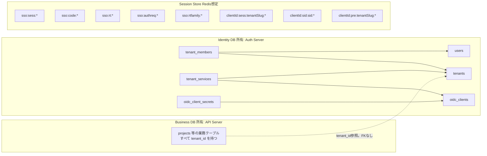

# User / Tenant / Membership DB設計とSession設計

## 結論

永続データは Identity DB と Business DB に分け、揮発データは Session Store に置く。
Identity DB は Auth Server が所有し、API Server は読み取り専用で参照する。判断事項D3。
ユーザーとテナントは別概念とし、tenant_members が多対多を表す。認可は必ず tenant_members を根拠にする。
サービスとテナントも別概念とし、tenant_services が契約を表す。OIDC Client はサービスと1対1で、テナントには紐付かない。判断事項D13。
主キーはすべてサロゲート ID とし、client_id や slug は UNIQUE 制約で守る公開識別子にする。redirect_uri はサービスごとの `redirect_uri_template` で登録し、client_secret は oidc_client_secrets に複数行持てる。判断事項D15。

## 全体像



Identity DB と Business DB は物理的に同一インスタンスでもよいが、スキーマを分け、API Server の Identity スキーマへの権限は SELECT のみにする。サンドボックスでは `identity` スキーマと `business` スキーマに分けている。

外部キーはすべてサロゲート ID を参照する。`oidc_clients.client_id` を参照する外部キーは持たない。`updated_at` を持つ表はトリガー `identity.touch_updated_at()` で更新時刻を自動更新する。

## Identity DB

### users

```sql
CREATE TABLE users (
  id            TEXT PRIMARY KEY,            -- ULID。ID Token の sub として外部へ出す
  cognito_sub   TEXT NOT NULL UNIQUE,        -- 正規識別子。Cognito User Pool の sub
  email         TEXT NOT NULL,
  name          TEXT,
  status        TEXT NOT NULL DEFAULT 'active', -- active / disabled
  created_at    TIMESTAMPTZ NOT NULL DEFAULT now(),
  updated_at    TIMESTAMPTZ NOT NULL DEFAULT now()
);
```

- 正規識別子は cognito_sub。仕様書14章
- id は内部代理キー。Client へ露出するのはこちら。Cognito固有値を境界の外へ出さないため
- email は表示用キャッシュ。突合キーにしない。Cognito 側で変更され得る
- JIT作成。Cognito 認証成功時に cognito_sub で検索し、なければ作成。判断事項D9

### tenants

```sql
CREATE TABLE tenants (
  id            TEXT PRIMARY KEY,            -- ULID
  slug          TEXT NOT NULL UNIQUE,        -- ホストの先頭ラベル。^[a-z0-9](?:[a-z0-9-]{0,61}[a-z0-9])?$
  name          TEXT NOT NULL,
  status        TEXT NOT NULL DEFAULT 'active', -- active / suspended
  created_at    TIMESTAMPTZ NOT NULL DEFAULT now(),
  updated_at    TIMESTAMPTZ NOT NULL DEFAULT now()
);
```

- テナントは顧客企業。サービス横断で共有し、どのサービスにも同じ id と slug で現れる
- slug は予約語を禁止する。auth / api / www / admin 等
- status=suspended のテナントには `/authorize` で access_denied を返す。理由は tenant_suspended

### tenant_members

```sql
CREATE TABLE tenant_members (
  tenant_id     TEXT NOT NULL REFERENCES tenants (id) ON DELETE CASCADE,
  user_id       TEXT NOT NULL REFERENCES users (id) ON DELETE CASCADE,
  role          TEXT NOT NULL CHECK (role IN ('owner', 'admin', 'member', 'viewer')),
  status        TEXT NOT NULL DEFAULT 'active', -- active / invited / disabled
  created_at    TIMESTAMPTZ NOT NULL DEFAULT now(),
  updated_at    TIMESTAMPTZ NOT NULL DEFAULT now(),
  PRIMARY KEY (tenant_id, user_id)
);
CREATE INDEX tenant_members_user_id_idx ON tenant_members (user_id);
```

- 1ユーザーが複数テナントに所属できる。テナントごとに role が異なる
- status=active のみをアクセス可とする。存在しなければ no_membership、存在するが active でなければ membership_inactive
- role は固定enum。判断事項D8。細粒度権限は API Server の Role→Permission 表で解決する
- Membership はサービスに依存しない。tanaka の owner は tanaka が契約するすべてのサービスで owner

### oidc_clients

```sql
CREATE TABLE oidc_clients (
  id                     TEXT PRIMARY KEY,   -- ULID。内部参照と外部キーはこちら
  client_id              TEXT NOT NULL UNIQUE, -- OAuth の公開識別子。サービスID。crm / cms。^[a-z0-9](?:[a-z0-9-]{0,61}[a-z0-9])?$
  name                   TEXT NOT NULL,      -- 表示名。CRM / CMS
  audience               TEXT NOT NULL,      -- サービスの API origin。Access Token の aud
  redirect_uri_template  TEXT NOT NULL CHECK (redirect_uri_template LIKE '%{tenant}%'), -- {tenant} を 1 か所だけ含む
  allowed_scopes         TEXT[] NOT NULL DEFAULT ARRAY['openid','profile','email'],
  backchannel_logout_uri TEXT,               -- サービス単位。テナントに依存しない
  status                 TEXT NOT NULL DEFAULT 'active', -- active / disabled
  created_at             TIMESTAMPTZ NOT NULL DEFAULT now(),
  updated_at             TIMESTAMPTZ NOT NULL DEFAULT now()
);
```

- 1 Client = 1 サービス。テナントには紐付かないため tenant_id 列を持たない
- id はサロゲート主キー。oidc_client_secrets と tenant_services の外部キーは id を参照する。client_id を変更しても外部キーは連鎖しない
- redirect_uri_template はサービスに 1 つ。ローカルは `http://{tenant}.crm.localhost:3001/auth/callback`、本番は `https://{tenant}.crm.example.com/auth/callback`。`{tenant}` をテナント slug で展開した文字列と redirect_uri を完全一致で比較する
- 認可リクエストのテナントは redirect_uri をテンプレートに当てて slug を取り出し、tenants を slug で引いて決める。crm と `http://suzuki.crm.localhost:3001/auth/callback` なら suzuki
- テンプレートに一致しない、または slug が tenants にない redirect_uri は `invalid_redirect_uri` としてリダイレクトせず 400 にする。テナントに紐付かない戻り先は持たない
- audience は API Server が `API_BASE_URL` から導く値と完全一致させる。ローカルは `http://api.crm.localhost:3002`
- backchannel_logout_uri はサービスのベースホスト。ローカルは `http://crm.localhost:3001/auth/backchannel-logout`

### oidc_client_secrets

```sql
CREATE TABLE oidc_client_secrets (
  id              TEXT PRIMARY KEY,          -- ULID
  oidc_client_id  TEXT NOT NULL REFERENCES oidc_clients (id) ON DELETE CASCADE,
  secret_hash     TEXT NOT NULL,             -- sha256$<base64url>
  status          TEXT NOT NULL DEFAULT 'active', -- active / revoked
  created_at      TIMESTAMPTZ NOT NULL DEFAULT now(),
  revoked_at      TIMESTAMPTZ
);
CREATE INDEX oidc_client_secrets_active_idx ON oidc_client_secrets (oidc_client_id)
  WHERE status = 'active';
```

- client_secret はサービスごとに複数持てる。`/token` と `/revoke` は active な行のいずれかに一致すれば認証成功とする
- ローテーションは、新しい secret を active で挿入し、サービスの `CLIENT_SECRET` を差し替えてから、旧行を revoked にする。切替中は新旧どちらでも通るため無停止で進められる
- client_secret は 32 バイト以上の乱数とし、DB にはハッシュのみ保存する。ローカルでは `crm-secret` `cms-secret` の固定値
- ハッシュは SHA-256。client_secret は人が選ぶパスワードではなく十分に長い乱数であるため KDF を使わない。scrypt は `/token` のたびに数十ミリ秒イベントループを止めるため採用しない。`packages/shared/src/secret-hash.ts`

### tenant_services

```sql
CREATE TABLE tenant_services (
  tenant_id       TEXT NOT NULL REFERENCES tenants (id) ON DELETE CASCADE,
  oidc_client_id  TEXT NOT NULL REFERENCES oidc_clients (id) ON DELETE CASCADE,
  status          TEXT NOT NULL DEFAULT 'active', -- active / suspended
  created_at      TIMESTAMPTZ NOT NULL DEFAULT now(),
  updated_at      TIMESTAMPTZ NOT NULL DEFAULT now(),
  PRIMARY KEY (tenant_id, oidc_client_id)
);
CREATE INDEX tenant_services_oidc_client_id_idx ON tenant_services (oidc_client_id);
```

- 契約。テナントがそのサービスを利用できるかを表す
- `/authorize` と refresh_token grant は tenants.status の後、tenant_members の前にこの表を確認する。行がないか status が active でなければ not_contracted。検索キーは oidc_clients.id
- ポータルは所属テナントごとに、この表で active なサービスだけを入口として表示する
- テナント追加は tenants と tenant_services の行を足すだけで完了する。redirect_uri はテンプレートから導くため、テナントごとの登録は不要

### 初期データ

サービス oidc_clients。

| id | client_id | name | audience | redirect_uri_template | backchannel_logout_uri |
| --- | --- | --- | --- | --- | --- |
| 01J00000000000000000000CRM | crm | CRM | http://api.crm.localhost:3002 | http://{tenant}.crm.localhost:3001/auth/callback | http://crm.localhost:3001/auth/backchannel-logout |
| 01J00000000000000000000CMS | cms | CMS | http://api.cms.localhost:3004 | http://{tenant}.cms.localhost:3003/auth/callback | http://cms.localhost:3003/auth/backchannel-logout |

client_secret oidc_client_secrets。

| id | oidc_client_id | 平文 | status |
| --- | --- | --- | --- |
| 01J0000000000000000CRMSEC1 | 01J00000000000000000000CRM | crm-secret | active |
| 01J0000000000000000CMSSEC1 | 01J00000000000000000000CMS | cms-secret | active |

テナント。

| id | slug | name |
| --- | --- | --- |
| 01J00000000000000000TANAKA0 | tanaka | Tanaka Inc. |
| 01J00000000000000000SUZUKI0 | suzuki | Suzuki Ltd. |

契約 tenant_services。

| tenant | oidc_client_id | サービス |
| --- | --- | --- |
| tanaka | 01J00000000000000000000CRM | crm |
| tanaka | 01J00000000000000000000CMS | cms |
| suzuki | 01J00000000000000000000CRM | crm |

suzuki.cms.localhost:3003 の redirect_uri は cms のテンプレートに一致し slug=suzuki も tenants にあるため `/authorize` は受理するが、契約がないため access_denied になる。

Membership tenant_members。

| user | tenant | role |
| --- | --- | --- |
| alice | tanaka | owner |
| alice | suzuki | viewer |
| bob | suzuki | admin |

carol は Cognito 側にのみ存在し、どのテナントにも所属しない。ログインは成功するが `/authorize` で no_membership になる。

## Business DB

API Server が所有する。すべての業務テーブルに tenant_id を持たせる。

```sql
CREATE TABLE projects (
  id          TEXT PRIMARY KEY,
  tenant_id   TEXT NOT NULL,   -- Identity DB の tenants.id。スキーマをまたぐため FK は張らない
  name        TEXT NOT NULL,
  created_by  TEXT NOT NULL,   -- users.id
  created_at  TIMESTAMPTZ NOT NULL DEFAULT now()
);
CREATE INDEX projects_tenant_id_idx ON projects (tenant_id);
```

初期データは tanaka に「Tanaka Project 1」「Tanaka Project 2」、suzuki に「Suzuki Project 1」。

Row Level Security を併用する場合。判断事項D11。

```sql
ALTER TABLE projects ENABLE ROW LEVEL SECURITY;
ALTER TABLE projects FORCE ROW LEVEL SECURITY;
CREATE POLICY projects_tenant_isolation ON projects
  USING (tenant_id = current_setting('app.tenant_id', true))
  WITH CHECK (tenant_id = current_setting('app.tenant_id', true));
```

API Server はトランザクション開始時に `SET LOCAL app.tenant_id = :tenant_id` を Token 由来の値で実行する。詳細は [07-api-auth-design.md](./07-api-auth-design.md)。

## Session Store

Redis 想定。すべて TTL 付き。ローカル検証はインメモリ Map。
ストアは用途ごとにプレフィックスを分けて作る。`packages/shared/src/store-factory.ts` の `createStoreFactory` が `REDIS_URL` の有無で Redis とインメモリを切り替え、auth-api は `adapters/stores.ts` の `createAuthStores`、`*-web` は `startServiceWeb` がプレフィックスを決める。Redis 上の実キーは `<プレフィックス>:<キー>` になる。
寿命はストアの TTL で管理し、値には `createdAt` のような期限計算用の項目を持たせない。アイドル期限と絶対期限を持つ SSO Session と Tenant Session は例外で、`packages/shared/src/session-expiry.ts` の共通判定を使う。

### SSO Session

プレフィックス `sso:sess`、キー `<sso_session_id>`。TTL は絶対期限。

```typescript
type SsoSession = {
  id: string;                 // 256bit random。Cookie値
  sid: string;                // ID Token に載せる公開識別子
  userId: string;             // users.id
  encryptedCognitoTokens: string; // Cognito の Access / ID / Refresh Token を暗号化した文字列
  authTime: number;
  createdAt: number;
  lastSeenAt: number;         // アイドル判定。/authorize ごとに更新。書き込みは 60 秒に 1 回に間引く
  authorizedClients: string[]; // code を発行したサービス。Global Logout の通知先。例 ["crm", "cms"]
};
```

cognito_sub は保持しない。users.id で引けるため必要になった時点で Identity DB から取る。
逆引き `sso:sid` の `<sid> → sso_session_id` を持ち、Back-Channel Logout と Refresh Token 失効に使う。

### 認可リクエスト

プレフィックス `sso:authreq`、キー `<rid>`。TTL 30分。ログイン画面を挟む間の保持用。

```typescript
type AuthorizationRequest = {
  clientId: string;           // サービス
  tenantId: string;           // redirect_uri をテンプレートに当てて解決したテナント
  redirectUri: string;
  scope: string;
  state: string;
  nonce: string;
  codeChallenge: string;
};
```

`/authorize` で検証済みの値だけを保存する。ログイン成功後は `usecases/pending-authorization.ts` が Client がまだ active でテナントが存在することだけを確かめ、パラメータは再検証せずにアクセス判定と code 発行へ進む。

### Authorization Code

プレフィックス `sso:code`、キー `<code>`。TTL 60秒。

```typescript
type AuthorizationCode =
  | {
      used: false;
      code: string;
      clientId: string;
      redirectUri: string;
      scope: string;
      nonce: string;
      codeChallenge: string;
      userId: string;
      tenantId: string;
      sid: string;
      ssoSessionId: string;
      authTime: number;
    }
  | {
      used: true;             // 再利用検知用。交換時に発行した Refresh Token の系列を持つ
      code: string;
      familyId: string;
    };
```

`used` の更新は `GETDEL` または Lua スクリプトで取得と削除を同時に行い、二重交換を排除する。

### Refresh Token

プレフィックス `sso:rt`、キー `<token>`。TTL 12時間。

```typescript
type RefreshToken = {
  token: string;
  familyId: string;           // ローテーション系列。再利用検知時に系列全体を失効
  clientId: string;
  userId: string;
  tenantId: string;
  sid: string;
  ssoSessionId: string;
  scope: string;
  authTime: number;
  status: "active" | "rotated" | "revoked";
};
```

逆引き `sso:rtfamily` の `<familyId> → token[]` と `sso:sidrt` の `<sid> → familyId[]` を持つ。系列の値は token の一覧だけで、失効フラグは持たない。系列の失効は一覧の全 token を並列に revoked へ更新する。refresh_token grant の検証は `validateRefreshContext` にまとめ、どの段階で失敗しても系列を 1 回だけ失効させる。

### Tenant Session

プレフィックス `<clientId>:sess`、キー `<tenantSlug>:<session_id>`。例 プレフィックス `crm:sess`、キー `tanaka:T1`。TTL は絶対期限。

```typescript
type TenantSession = {
  id: string;                 // Cookie値
  tenantSlug: string;         // Host から解決したテナント
  userId: string;             // ID Token の sub
  tenantId: string;
  sid: string;
  email: string | null;
  name: string | null;
  accessToken: string;        // API 呼び出し用
  accessTokenExpiresAt: number;
  refreshToken: string;
  csrfToken: string;          // Tenant Logout 用
  createdAt: number;
  lastSeenAt: number;         // 書き込みは 60 秒に 1 回に間引く
};
```

- 1 プロセスは 1 サービスを担当するため、サービスはストアのプレフィックスで分け、値には clientId を持たない。プロセス内では tenantSlug をキーに含めて空間を分ける。Cookie 値が同じでも別ホストのセッションを引けない
- 逆引きはプレフィックス `<clientId>:sid`、キー `sid:<sid> → sessionKey[]`。Back-Channel Logout はサービス単位で届くため、同じ sid で作られたそのサービスの全テナントのセッションをまとめて削除できる
- role は保存しない。表示用に必要なら API から都度取得する

### pre-auth

プレフィックス `<clientId>:pre`、キー `<tenantSlug>:<id>`。`<id>` は Cookie 値。TTL 30分。`/auth/callback` で `getAndDelete` により取得と同時に消す。

```typescript
type PreAuthState = {
  state: string;
  nonce: string;
  codeVerifier: string;
  returnTo: string;           // 自ドメイン内パスのみ
};
```

## 抽象化インターフェース

```typescript
interface KeyValueStore<T> {
  get(key: string): Promise<T | undefined>;
  set(key: string, value: T, ttlSeconds: number): Promise<void>;
  delete(key: string): Promise<void>;
  getAndDelete(key: string): Promise<T | undefined>; // code の一回限り消費用
}
```

| 環境 | 実装 |
| --- | --- |
| ローカル検証 | インメモリ Map + 期限管理。`REDIS_URL` 未設定時に `createStoreFactory` が選ぶ |
| 本番 | Redis。getAndDelete は GETDEL。`REDIS_URL` 設定時に `createStoreFactory` が選ぶ |

## 障害時の考慮

| 障害 | 影響 | 対処 |
| --- | --- | --- |
| Session Store 停止 | 新規ログインと Refresh が失敗。既存 Tenant Session も参照できない | Redis の冗長化。Auth Code は揮発を許容 |
| Identity DB 停止 | `/authorize` の契約・Membership 判定と API 認可が失敗 | API Server は Membership を短時間キャッシュしてよいが、キャッシュ期間は Access Token 寿命以下 |
| Cognito 停止 | 新規認証のみ失敗。SSO Session 有効中のユーザーは影響なし | Cognito Token の更新失敗は SSO Session 失効として扱う |
