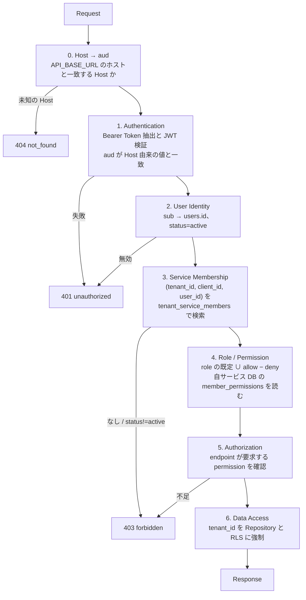

# API認証・認可・Tenant Isolation設計

## 結論

API Server は Resource Server として Auth Server 発行の Access Token のみを受け付ける。
API はサービスごとに `api.<service>.sandbox.com` のホストを持ち、受け付ける aud はリクエストの Host から導く。CRM の Token は api.cms では通らない。
テナントコンテキストは Token の `tenant_id` だけから決め、リクエストのパス・クエリ・ボディに含まれるテナント指定は認可根拠にしない。
認可は毎リクエスト Identity DB の tenant_service_members でこのサービスへの割り当てを再検証し、役割の既定に自サービス DB の member_permissions の上書きを重ねて権限を確定する。役割も権限も Token には載せない。
データアクセスは tenant_id でアプリ層とDB層の二重で分離する。

## 処理順序

仕様書17章の順序をミドルウェア構成に対応させる。



0 から 4 までは `packages/api-core/src/usecases/resolve-tenant-context.ts` の `resolveTenantContext` が担う。Host 確認 → Bearer 抽出 → Access Token 検証 → `IdentityReader.findAccessContext(userId, tenantId, clientId)` で user / tenant / このサービスへの割り当てを 1 回の JOIN で取得 → user → tenant → 割り当ての順に判定 → `PermissionReader.listOverrides({tenantId, userId, clientId})` で上書きを読む → `resolvePermissions(role, overrides)` で権限を確定 → `TenantContext` を返す。ミドルウェア `auth/middleware.ts` はその Result を HTTP ステータスと `WWW-Authenticate` に写像するだけで、判定ロジックを持たない。

処理順序の前に全ルート共通のミドルウェアを通す。body は Hono の `bodyLimit` で 16 KB に制限し、業務 API の JSON はこの範囲で足りる。応答には `Cache-Control: no-store` を付ける。`/healthz` は Host 確認と Token 検証の前に返す。

## 0. Host → aud

API はサービスごとに別プロセスで、1 プロセスは 1 つの Host だけを受ける。環境変数 `API_BASE_URL` の値をそのまま aud とし、リクエストの Host が `API_BASE_URL` のホストと一致することを要求する。`ApiAppOptions.audience` は文字列 1 つで、Host から aud を引く表は持たない。
環境変数は `packages/api-core/src/config.ts` の `loadApiCoreConfig` が `parseEnv` で検証する。`PORT` `API_BASE_URL` `ISSUER` `AUTH_BACKCHANNEL_URL` `DATABASE_URL` のみで、`PUBLIC_SCHEME` は持たない。

| プロセス | API_BASE_URL | aud | 受け付ける Host |
| --- | --- | --- | --- |
| crm-api | http://api.crm.localhost:3002 | http://api.crm.localhost:3002 | api.crm.localhost:3002 |
| cms-api | http://api.cms.localhost:3004 | http://api.cms.localhost:3004 | api.cms.localhost:3004 |
| それ以外の Host | | | 404 not_found。Token 検証に進まない |

aud は oidc_clients.audience と完全一致させる。provision は `SERVICES[].apiBaseUrl` を oidc_clients.audience に書くため、同じ値を `API_BASE_URL` に与えれば一致する。crm-api に届いた cms 向けの Token は aud 不一致で 401 になる。

## 1. Authentication

| 検証項目 | 内容 |
| --- | --- |
| ヘッダ | `Authorization: Bearer <jwt>`。Cookie は受け付けない |
| 署名 | Auth Server の JWKS。RS256 のみ。kid で鍵選択 |
| iss | `https://auth.sandbox.com` |
| aud | `API_BASE_URL` が aud に含まれること。CRM の Token を api.cms に送ると 401。ID Token を誤って送られても拒否 |
| exp / iat | 許容スキュー 30秒 |
| 必須 claims | sub, tenant_id, sid, client_id。sid と client_id は Auth Server 発行の Access Token であることの確認に使う。client_id はこのサービスへの割り当てと権限の上書きの検索キーにもなる。role や permissions の claim は受け取っても無視する |

失敗時は `401` と `WWW-Authenticate: Bearer error="invalid_token"` を返す。期限切れは `error_description="expired"` を付け、Tenant Web Application が Refresh を判断できるようにする。この文字列は `packages/shared/src/oidc-protocol.ts` の `TOKEN_EXPIRED_DESCRIPTION` で両者が共有する。

## 2. User Identity

- `sub` を users.id として扱う
- users.status が active でなければ 401
- ユーザー参照はリクエスト単位でキャッシュしない。ユーザー無効化を即時反映するため

## 3. サービスへの割り当て

2 と 3 は 1 回のクエリで引く。`findAccessContext` は sub、tenant_id、client_id を起点に users / tenants / oidc_clients / tenant_service_members を LEFT JOIN し、存在しない行は undefined として返す。割り当ては Token の client_id に一致するサービスのものだけを見る。

```sql
SELECT u.id, u.email, u.name, u.status AS user_status,
       t.id, t.slug, t.status AS tenant_status,
       m.role, m.status AS membership_status
  FROM (SELECT :token_sub AS user_id, :token_tenant_id AS tenant_id, :token_client_id AS client_id) p
  LEFT JOIN users u ON u.id = p.user_id
  LEFT JOIN tenants t ON t.id = p.tenant_id
  LEFT JOIN oidc_clients c ON c.client_id = p.client_id
  LEFT JOIN tenant_service_members m
    ON m.user_id = p.user_id AND m.tenant_id = p.tenant_id AND m.oidc_client_id = c.id;
```

- user が存在しないか active でなければ 401。tenant が存在しないか active でなければ 403
- このサービスへの割り当てが見つからないか active でなければ 403。別サービスの割り当てがあってもこのサービスは開かない
- Token の tenant_id と client_id は Auth Server が発行時に契約と割り当てを検証済みだが、発行後の割り当て削除を反映するため毎回再検証する
- 契約 tenant_services は API では再検証しない。契約解除は Refresh 時に Auth Server が拒否し、最大 15 分で Token が失効する
- tenant_members は参照しない。会社横断の役割はサービスへのログイン可否と無関係
- 短時間キャッシュを入れる場合は Access Token 寿命以下にする。推奨は 60 秒以内

## 4. Role / Permission

role は tenant_service_members から取得した値のみ使う。Token に role があっても無視する。

| role | permissions |
| --- | --- |
| owner | すべて。tenant:delete を含む |
| admin | tenant:read, tenant:update, members:*, projects:* |
| member | tenant:read, projects:read, projects:write |
| viewer | tenant:read, projects:read |

permission の定義は API Server 内の単一の表 `packages/api-core/src/permissions.ts` で管理し、Identity DB には role のみ保存する。判断事項D8。

### 権限の上書き

役割の既定に対して、サービス固有の個別の許可 / 拒否を重ねる。判断事項D16。

- 上書きは自サービスの DB の `member_permissions(tenant_id, user_id, client_id, permission, effect)` に持つ。effect は allow / deny
- `PermissionReader.listOverrides({tenantId, userId, clientId})` が `app.tenant_id` を設定したトランザクションで読む。projects と同じ RLS ポリシーがかかる
- `resolvePermissions(role, overrides)` は 役割の既定 ∪ allow − deny を返す。deny が allow より優先し、API Server が知らない permission 名の行は無視する
- 例。alice は tanaka の cms で owner だが、cms の DB に `projects:write` の deny があるため `POST /v1/projects` は 403 になる。`GET /v1/projects` は通る
- 例。suzuki の crm で viewer のユーザーに `projects:write` の allow を足すと、役割を変えずに Project を作れる

### 権限を Token に載せない理由

- 権限の変更を次のリクエストから反映する。Token に載せると寿命の 15 分間は古い権限で通る
- 発行後の割り当て削除を確実に拒否する。割り当ても毎回 DB で確認する
- Auth Server がサービスごとの権限語彙を知らなくてよい。permission 名はサービスが自分の表で決め、Auth Server は client_id と role だけを扱う
- Token がサービス数と権限数に比例して肥大化しない

### TenantContext と /v1/me

```typescript
type TenantContext = {
  tenantId: string;                       // Access Token の tenant_id
  userId: string;                         // Access Token の sub
  clientId: string;                       // Access Token の client_id。このサービスの識別子
  role: Role;                             // tenant_service_members の役割。表示用
  permissions: ReadonlySet<Permission>;   // 役割の既定に上書きを重ねた結果。認可はこれで判定する
};
```

`GET /v1/me` は `tenant:read` を要求し、確定した権限をソート済み配列で返す。Tenant Web Application は role を表示にだけ使い、操作可否は API の応答で決める。

```json
{
  "user": { "id": "01J0000000000000000000ALICE", "email": "alice@example.com", "name": "Alice" },
  "tenant": { "id": "01J00000000000000000SUZUKI0", "slug": "suzuki" },
  "role": "viewer",
  "permissions": ["projects:read", "tenant:read"]
}
```

## 5. Authorization

各エンドポイントは要求 permission を宣言する。

```typescript
app.get('/v1/projects', requirePermission('projects:read'), handler);
app.post('/v1/projects', requirePermission('projects:write'), handler);
app.delete('/v1/projects/:id', requirePermission('projects:write'), handler);
```

- `requirePermission` は `TenantContext.permissions` の集合に要求 permission が含まれるかで判定する。role を直接見ない
- permission 未宣言のエンドポイントは起動時にエラーにする。デフォルト拒否
- オブジェクト単位の所有者チェックが必要な場合は handler 内で追加し、tenant_id 一致の後に評価する

## 6. Data Access と Tenant Isolation

### アプリ層

- Repository は tenant_id を必須引数に取る。省略可能な引数にしない
- tenant_id はリクエストコンテキストの Token 由来値のみ。ハンドラがリクエストパラメータから tenant_id を組み立てることを禁止する
- 単一リソース取得は `WHERE id = :id AND tenant_id = :tenant_id`。見つからなければ 404。他テナントのIDを指定しても存在の有無を区別しない
- 一括更新・削除も必ず tenant_id 条件を含める

```typescript
class ProjectRepository {
  findById(ctx: TenantContext, id: string) {
    return db.query('SELECT * FROM projects WHERE id = $1 AND tenant_id = $2', [id, ctx.tenantId]);
  }
}
```

### DB層。PostgreSQL の場合

判断事項D11。アプリ層のバグに対する二重防御として Row Level Security を使う。

```sql
BEGIN;
SET LOCAL app.tenant_id = '<token_tenant_id>';
-- 以降のクエリは RLS により tenant_id が一致する行のみ見える
COMMIT;
```

- API Server の DB ロールは BYPASSRLS を持たない
- `FORCE ROW LEVEL SECURITY` でテーブル所有者にも適用する
- マイグレーション用ロールと実行時ロールを分ける

### 禁止パターン

| パターン | 理由 |
| --- | --- |
| `GET /v1/tenants/:tenantId/projects` の tenantId で認可 | 仕様書16章。Tenant ID 改ざん |
| `X-Tenant-Id` ヘッダで認可 | 同上 |
| `WHERE id = :id` のみでの単一取得 | IDOR / BOLA |
| Token の role claim で認可 | 割り当て変更が反映されない |
| Token に permissions claim を載せて認可 | 権限変更が Token 寿命まで反映されない。Auth Server がサービスの権限語彙を持つことになる |
| 別サービスの割り当てで認可 | 割り当てはテナント × サービスの単位。Token の client_id に一致する行だけを見る |
| 管理ロールでの RLS バイパス | 二重防御が無効化される |
| 全サービス共通の aud | CRM の Token で CMS の API が呼べてしまう |

## テナント切替

1 Access Token は 1 テナント、1 サービスに限定する。alice が suzuki を操作するには suzuki.crm.sandbox.com で別の Tenant Session と Token を持つ。同じ tanaka でも CMS を操作するには tanaka.cms.sandbox.com で cms 向けの Token を持つ。API Server 側にテナント切替 API は作らない。

## 管理 API。フェーズ2

複数テナントをまたぐ操作は、tenant_id を持たない管理用 Client の Access Token と `admin` scope を要求する。処理順序は同じだが、3の割り当て判定の代わりに管理者テーブルを参照する。RLS は `app.tenant_id` を操作対象テナントに設定して1テナントずつ処理する。

## API 変更案

グリーンフィールドのため新規規約として定義する。既存 API がある適用先では以下を移行対象にする。

| 変更 | 内容 |
| --- | --- |
| 認証 | Cognito JWT の直接検証を廃止し、Auth Server JWKS による検証へ置換 |
| aud | サービスごとの API origin を aud とし、Host から導いた値と照合 |
| パス | tenant slug / id を含むパスを廃止。Token の tenant_id に統一 |
| ミドルウェア | Authentication → サービスへの割り当て → Permission の順に必ず通す共通チェーンを導入 |
| Repository | tenant_id 必須引数化 |
| DB | RLS ポリシー追加。実行時ロールの権限縮小。個別の許可 / 拒否が要るなら自サービスの DB に member_permissions を追加 |
| CORS | ブラウザ直接呼び出しを廃止するため許可オリジンを空にする |

## ログ

- 認可判定の結果を user_id / tenant_id / permission / 結果 で構造化ログに出す
- Token 値、Cookie 値、client_secret は出さない
- 403 の発生をテナント単位で監視し、異常な増加を IDOR 試行として検知する
