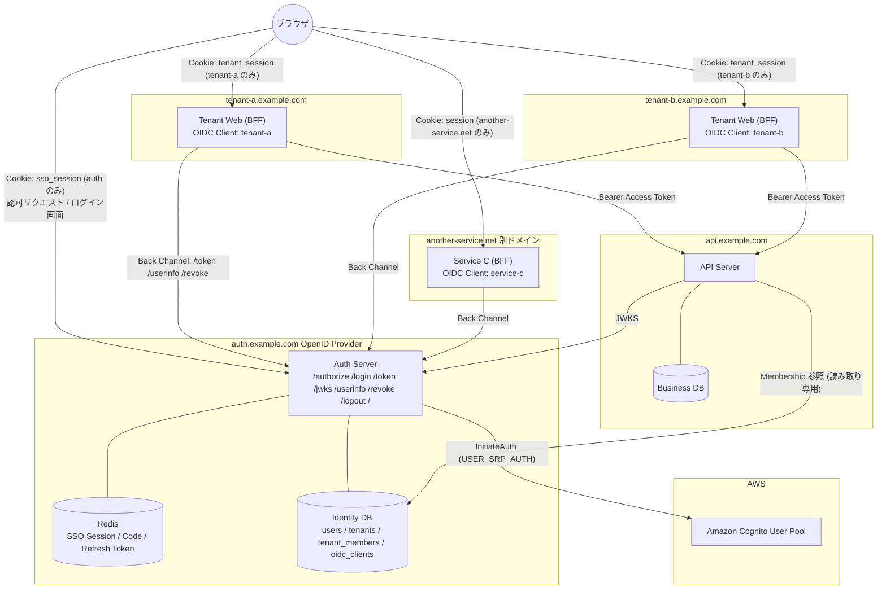
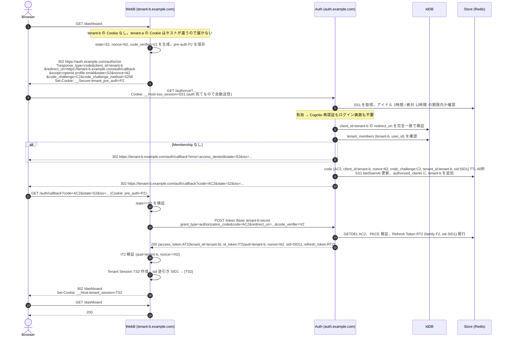
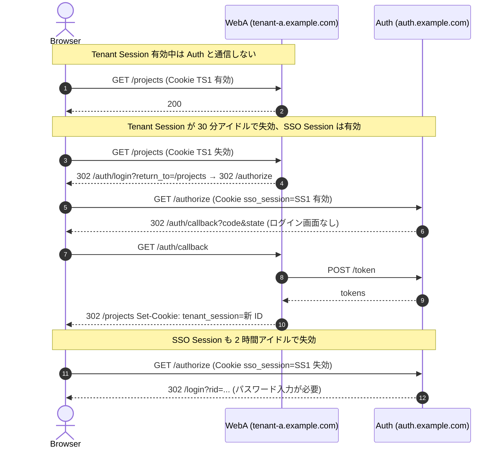
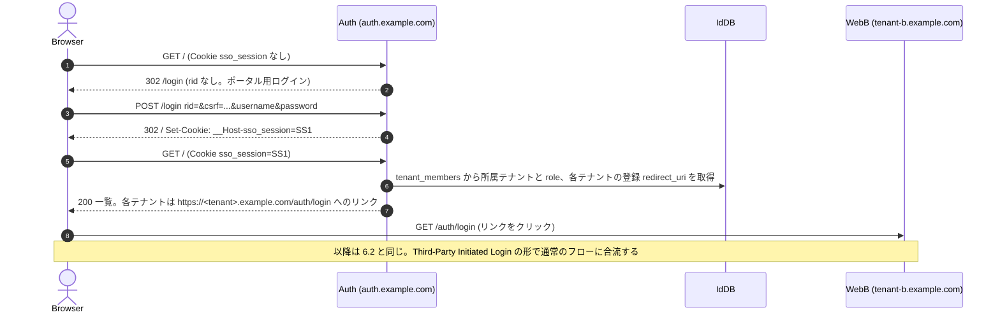
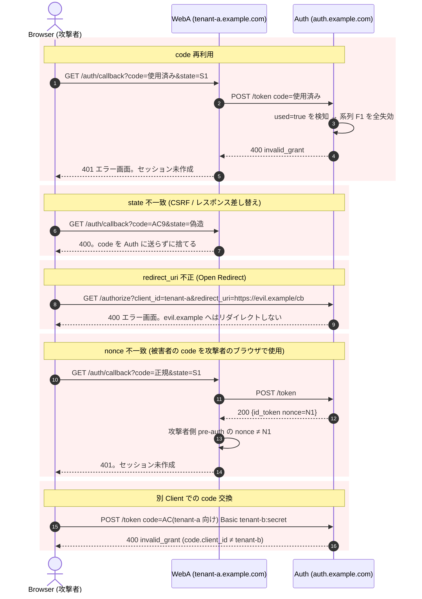

# Cognito ベース マルチドメイン SSO 導入ガイド

他リポジトリへ同じ仕組みを導入するための自己完結ドキュメント。仕様、詳細設計、シーケンス図、異なるドメインで動く理由、Next.js と埋め込み型サービスへの読み替え、参考資料をまとめる。
実装の参照先は `multi-domain-sandbox` リポジトリ。AWS 上の動作確認済み構成は `https://auth.sandbox.daisuke-tanabe.dev/`。

## 目次

1. [結論](#1-結論)
2. [仕様](#2-仕様)
3. [全体構成](#3-全体構成)
4. [異なるドメインでも動く理由](#4-異なるドメインでも動く理由)
5. [詳細設計](#5-詳細設計)
6. [シーケンス図](#6-シーケンス図)
7. [Next.js の BFF への導入](#7-nextjs-の-bff-への導入)
8. [埋め込み型サービスへの導入](#8-埋め込み型サービスへの導入)
9. [導入チェックリスト](#9-導入チェックリスト)
10. [参考資料](#10-参考資料)
11. [用語](#11-用語)

## 1. 結論

- 認証は Cognito、SSO は独立した Auth Server、アプリのセッションは各サービス、と責務を 3 層に分ける
- Auth Server は OpenID Connect の Authorization Code Flow + PKCE を提供する OpenID Provider として振る舞い、各サービスはその Confidential Client になる
- サービス間で共有するのは Cookie でも JWT でもなく「ブラウザのリダイレクト」と「一回限りの Authorization Code」だけ。だからサブドメインでも別ドメインでも同じ手順で SSO が成立する
- Cognito の Token は Auth Server の内部に閉じ、各サービスは Auth Server が署名した ID Token と Access Token だけを受け取る
- サービス追加は Auth Server に Client を 1 件登録し、サービス側に 3 つのエンドポイントを置くだけで完了する

## 2. 仕様

### 2.1 目的

複数のドメインで提供するサービスについて、ユーザーが一度ログインすれば他のサービスでも再ログインなしで利用できる SSO を実現する。マルチテナント SaaS を前提とし、テナントはサブドメインで分かれる。将来、別ドメインのサービスを追加しても同じ仕組みで SSO できる。

### 2.2 絶対条件

| 条件 | 内容 |
| --- | --- |
| Hosted UI を使わない | Cognito Hosted UI / Managed Login へリダイレクトしない。ログイン画面は自前で持つ |
| Cookie 共有で SSO しない | `Domain=.example.com` のような親ドメイン Cookie を使わない。サービス間で認証 Cookie を直接共有しない |
| Cognito Token を渡さない | Cognito の Access / ID / Refresh Token をサービス間や URL で受け渡さない |

### 2.3 責務分離

| レイヤー | 担当 | 持つ状態 |
| --- | --- | --- |
| 認証 | Cognito User Pool | ユーザー、パスワード、MFA |
| SSO と認可 | Auth Server。`auth.<domain>` | SSO Session、Authorization Code、Refresh Token、Client 登録、テナント所属 |
| アプリ | 各サービス。`tenant-a.<domain>` など | 自サービスのセッション、Access Token のサーバー側保持 |
| API | Resource Server。`api.<domain>` | Token 検証、Membership 認可、テナント分離されたデータ |

これらを 1 つの Cookie や Token にまとめない。

### 2.4 セキュリティ要件

HTTPS、Secure / HttpOnly Cookie、SameSite=Lax、Authorization Code は 60 秒で一回限り、redirect_uri は完全一致、state と nonce の検証、PKCE S256、Open Redirect 対策、ログイン成功時のセッション ID 再発行、Token と Cookie 値をログに出さない、リクエストの tenant_id だけで認可しない、Membership による認可、IDOR / BOLA 対策。

## 3. 全体構成



Front Channel を通る認証関連の値は Authorization Code と state のみ。JWT と Cognito Token は Front Channel に載せない。

## 4. 異なるドメインでも動く理由

サンドボックスでは `tenant-a.sandbox.daisuke-tanabe.dev` と `tenant-b.sandbox.daisuke-tanabe.dev` のようにサブドメインで分けているため、Cookie を共有して SSO しているように見える。実際は共有していない。

### 4.1 Cookie は 3 種類とも別ホストに閉じている

| Cookie | 発行ホスト | 届く先 |
| --- | --- | --- |
| `sso_session` | `auth.example.com` | `auth.example.com` だけ |
| `tenant_session` | `tenant-a.example.com` | `tenant-a.example.com` だけ |
| `tenant_session` | `tenant-b.example.com` | `tenant-b.example.com` だけ |

Domain 属性を付けないため、ブラウザは Cookie を発行ホストにしか送らない。本番では `__Host-` プレフィックスを付け、Domain 属性を付けること自体をブラウザが拒否するようにしている。tenant-a の Cookie が tenant-b や auth に届くことはない。

### 4.2 SSO を成立させているのはリダイレクトと Code

tenant-b を初めて開いたとき、tenant-b は自分の Cookie を持っていないので「未ログイン」と判断する。ここで tenant-b はブラウザを `auth.example.com/authorize` へリダイレクトする。ブラウザは auth のホストに対しては `sso_session` Cookie を持っているので、auth は「このブラウザは既にログイン済み」と分かる。auth は tenant-b 宛ての Authorization Code を発行し、ブラウザを `tenant-b.example.com/auth/callback?code=...` へ戻す。tenant-b はその code をサーバー間通信で auth に渡し、代わりに Token を受け取って自分の Cookie を発行する。

```text
tenant-b の Cookie なし
      │
      ▼ 302
auth.example.com/authorize   ← ここでだけ sso_session Cookie が使われる
      │
      ▼ 302 + code
tenant-b.example.com/auth/callback?code=...
      │
      ▼ サーバー間で code を Token に交換
tenant-b の Cookie 発行
```

この過程で tenant-b と auth の間を移動したのは、URL に載った短命の code と、サーバー間通信だけ。ホストの親子関係は一切使っていない。したがって tenant-b が `another-service.net` であってもまったく同じ手順で動く。

### 4.3 サブドメインだからこそ注意すること

`*.example.com` は Public Suffix List 上で同一サイトとみなされる。そのため SameSite 属性はサブドメイン間の Cookie 送信を制限しない。ホスト分離を担保しているのは Domain 属性の省略と `__Host-` プレフィックスであり、SameSite ではない。逆に別ドメインへ広げるときは、`/authorize` と `/auth/callback` がトップレベルの GET ナビゲーションであることが重要になる。SameSite=Lax はトップレベル GET では Cookie を送るので、この設計は別ドメインでもそのまま動く。iframe や fetch でクロスサイトに Cookie を送ろうとする設計にすると、ここが壊れる。

### 4.4 別ドメインのサービスを足すときにやること

1. Auth Server の Client Registry に `client_id` `client_secret` `redirect_uri = https://another-service.net/auth/callback` を登録する
2. サービス側に `/auth/login` `/auth/callback` `/auth/logout` を置く
3. サービス側に `external_user_id` を保存する列を用意する

Auth Server と既存サービスのコード変更は発生しない。

## 5. 詳細設計

### 5.1 ホストとエンドポイント

#### Auth Server。`https://auth.<domain>`

| メソッド | パス | 呼び出し元 | 用途 |
| --- | --- | --- | --- |
| GET | `/.well-known/openid-configuration` | Client、API | OIDC Discovery |
| GET | `/jwks` | Client、API | Token 検証用の公開鍵 |
| GET | `/` | ブラウザ | ポータル。SSO Session があれば所属テナント一覧、なければ `/login` へ |
| GET | `/authorize` | ブラウザ | 認可エンドポイント |
| GET | `/login` | ブラウザ | ログインフォーム。`rid` 付きは認可フローの途中、なしはポータル用 |
| POST | `/login` | ブラウザ | 認証。Cognito InitiateAuth を呼ぶ |
| POST | `/token` | Client のサーバー | code 交換、refresh_token grant |
| GET | `/userinfo` | Client のサーバー | claims 取得 |
| POST | `/revoke` | Client のサーバー | Refresh Token 失効。RFC 7009 |
| GET | `/logout` | ブラウザ | Global Logout の確認画面 |
| POST | `/logout` | ブラウザ | Global Logout の実行 |
| GET | `/healthz` | 監視 | 死活監視 |

#### Tenant Web Application。`https://<tenant>.<domain>`

| メソッド | パス | 用途 |
| --- | --- | --- |
| GET | `/auth/login` | 認可リクエストを組み立てて `/authorize` へ 302 |
| GET | `/auth/callback` | code を受け取り、サーバー間で Token に交換し、自セッションを作る |
| POST | `/auth/logout` | Tenant Logout |
| POST | `/auth/backchannel-logout` | Auth Server からの Back-Channel Logout を受ける |

#### API Server。`https://api.<domain>`

| 規約 | 内容 |
| --- | --- |
| 認証 | `Authorization: Bearer <access_token>` 必須。Cookie は受け付けない |
| テナント指定 | パス、クエリ、ヘッダに tenant を含めない。Token の `tenant_id` が唯一の根拠 |
| 認可 | Token 検証 → users.status → tenant_members → Role → Permission → データアクセス |

### 5.2 パラメータ詳細

#### GET `/authorize`

| パラメータ | 必須 | 値 | 検証 |
| --- | --- | --- | --- |
| `response_type` | 必須 | `code` | それ以外は `unsupported_response_type` |
| `client_id` | 必須 | 登録済み Client ID。テナント用は slug と同値 | 未登録ならリダイレクトせず 400 |
| `redirect_uri` | 必須 | 登録値と文字列完全一致 | 不一致ならリダイレクトせず 400 |
| `scope` | 必須 | `openid` を含む。`profile` `email` 任意 | 許可外は `invalid_scope` |
| `state` | 必須 | Client が生成した 256bit 乱数 | ないと `invalid_request` |
| `nonce` | 必須 | Client が生成した 256bit 乱数 | ないと `invalid_request` |
| `code_challenge` | 必須 | `BASE64URL(SHA256(code_verifier))` 43 文字 | 形式不正は `invalid_request` |
| `code_challenge_method` | 必須 | `S256` | `plain` は拒否 |

成功時の応答。

```text
302 Location: <redirect_uri>?code=<code>&state=<state>&iss=https://auth.<domain>
Set-Cookie: __Host-sso_session=<id>; Path=/; Secure; HttpOnly; SameSite=Lax   (初回ログイン時のみ)
```

失敗時の応答は 2 通りに分かれる。

| 条件 | 応答 |
| --- | --- |
| `client_id` か `redirect_uri` が不正 | Auth Server 上でエラー画面。絶対にリダイレクトしない |
| それ以外 | `302 <redirect_uri>?error=<code>&error_description=<text>&state=<state>&iss=...` |

`error` の値。`invalid_request` `unsupported_response_type` `invalid_scope` `access_denied` `server_error`。

#### GET `/login?rid=<rid>`

`rid` は `/authorize` が発行する認可リクエストの預かり番号。256bit 乱数、30 分で失効。ログイン画面を挟む間、`client_id` `redirect_uri` `scope` `state` `nonce` `code_challenge` をサーバー側に保持するためのキーで、OIDC 仕様のパラメータではない。Keycloak の `session_code`、Auth0 の `/u/login?state=` に相当する。`rid` なしで開いた場合はポータル用ログインになり、成功後に `/` へ戻る。

#### POST `/login`

`application/x-www-form-urlencoded`。

| フィールド | 内容 |
| --- | --- |
| `rid` | 認可リクエスト ID。ポータル用は空文字 |
| `csrf` | フォームに埋め込まれた同期トークン。Cookie `auth_csrf` の参照 ID と対で検証 |
| `username` | Cognito のユーザー名 |
| `password` | パスワード。Auth Server から Cognito へは SRP で送るため Cognito にも平文は渡らない |

| 結果 | 応答 |
| --- | --- |
| 成功、Membership あり | `302 <redirect_uri>?code&state&iss` + `Set-Cookie: sso_session` |
| 成功、Membership なし | `302 <redirect_uri>?error=access_denied&state` + `Set-Cookie: sso_session`。認証自体は成功しているため SSO Session は作る |
| 認証失敗 | 200 でフォーム再表示。パスワード誤り、ユーザー不在、ロック中は同一文言 |
| CSRF 不一致 | 403 |
| `rid` 期限切れ | 400 |

#### POST `/token`

`Authorization: Basic base64(client_id:client_secret)`、`application/x-www-form-urlencoded`。

grant_type=authorization_code。

| フィールド | 内容 |
| --- | --- |
| `grant_type` | `authorization_code` |
| `code` | callback で受け取った code |
| `redirect_uri` | 認可リクエストと同じ値。code に紐付いた値と完全一致 |
| `code_verifier` | 認可リクエスト時に生成した元の乱数。43〜128 文字 |

grant_type=refresh_token。

| フィールド | 内容 |
| --- | --- |
| `grant_type` | `refresh_token` |
| `refresh_token` | 前回の応答で受け取った値 |

応答。

```json
{
  "access_token": "<JWT RS256, aud=https://api.<domain>>",
  "token_type": "Bearer",
  "expires_in": 900,
  "id_token": "<JWT RS256, aud=client_id>",
  "refresh_token": "<不透明文字列。使うたびに新しい値に置き換わる>",
  "scope": "openid profile email"
}
```

| エラー | 状態 | 条件 |
| --- | --- | --- |
| `invalid_client` | 401 | Basic 認証失敗。`WWW-Authenticate: Basic` |
| `invalid_grant` | 400 | code 不在、期限切れ、再利用、client 不一致、redirect_uri 不一致、PKCE 不一致、SSO Session 失効、Refresh Token 再利用、Membership 消失 |
| `unsupported_grant_type` | 400 | 上記以外の grant_type |

code 再利用や Refresh Token 再利用を検知した場合、同じ系列の Refresh Token をすべて失効させる。

#### POST `/revoke`

`Authorization: Basic`、`token=<refresh_token>&token_type_hint=refresh_token`。存在しない token でも 200。

#### GET `/userinfo`

`Authorization: Bearer <access_token>`。`{ sub, email, email_verified, name, tenant_id }` を scope に応じて返す。

#### GET `/logout?client_id=<client_id>` と POST `/logout`

GET は確認画面。POST は `csrf` と任意の `client_id` を受け取り、SSO Session を破棄して各 Client に Back-Channel Logout を送る。完了画面には `client_id` に対応する登録 redirect_uri の origin へのリンクとポータルへのリンクを出す。戻り先を登録済み Client からしか導出しないため Open Redirect にならない。

#### POST `/auth/backchannel-logout`。Tenant 側

`application/x-www-form-urlencoded`、`logout_token=<JWT>`。Host ヘッダに依存せず、`aud` で Client を解決する。

### 5.3 Token

| Token | 発行者 | 形式 | 寿命 | 受け取り手 | 経路 |
| --- | --- | --- | --- | --- | --- |
| Authorization Code | Auth | 256bit 乱数 | 60 秒、一回限り | Tenant | Front Channel の URL |
| ID Token | Auth | JWT RS256 | 5 分 | Tenant | Back Channel |
| Access Token | Auth | JWT RS256 | 15 分 | Tenant → API | Back Channel、Bearer |
| Refresh Token | Auth | 256bit 乱数 | 12 時間、ローテーション | Tenant | Back Channel |
| logout_token | Auth | JWT RS256 | 2 分 | Tenant | Back Channel |
| Cognito の各 Token | Cognito | JWT | Cognito 設定 | Auth のみ | Auth 内部。AES-256-GCM で暗号化保存 |

ID Token の claims。

```json
{
  "iss": "https://auth.<domain>",
  "sub": "<Sandbox 内部の users.id。Cognito の sub ではない>",
  "aud": "<client_id>",
  "exp": 1700000300,
  "iat": 1700000000,
  "auth_time": 1699999000,
  "nonce": "<認可リクエストの nonce>",
  "sid": "<SSO Session の公開識別子。Back-Channel Logout 用>",
  "tenant_id": "<テナント ID>",
  "email": "user@example.com",
  "email_verified": true,
  "name": "表示名"
}
```

Access Token の claims。

```json
{
  "iss": "https://auth.<domain>",
  "sub": "<users.id>",
  "aud": ["https://api.<domain>", "https://auth.<domain>"],
  "client_id": "<client_id>",
  "tenant_id": "<テナント ID>",
  "sid": "<sid>",
  "scope": "openid profile email",
  "jti": "<一意な ID>",
  "exp": 1700000900,
  "iat": 1700000000
}
```

role は Token に載せない。API Server が毎リクエスト `tenant_members` から取る。Token 発行後に権限が変わっても即時反映され、所属を外されたユーザーは有効な Token を持っていても 403 になる。

### 5.4 Cookie

| Cookie | ホスト | 属性 | 寿命 | 値 |
| --- | --- | --- | --- | --- |
| `__Host-sso_session` | auth | Path=/; Secure; HttpOnly; SameSite=Lax | サーバー側でアイドル 2 時間、絶対 12 時間 | SSO Session ID |
| `__Host-auth_csrf` | auth | Path=/; Secure; HttpOnly; SameSite=Lax | 30 分 | CSRF トークンの参照 ID |
| `__Host-tenant_session` | 各テナント | Path=/; Secure; HttpOnly; SameSite=Lax | アイドル 30 分、絶対 12 時間 | Tenant Session ID |
| `__Secure-tenant_pre_auth` | 各テナント | Path=/auth; Secure; HttpOnly; SameSite=Lax | 30 分 | state / nonce / code_verifier を保持するレコードの参照 ID |

Cookie の値はすべてサーバー側ストアを指す乱数で、JWT やユーザー情報を含まない。ローカル HTTP ではプレフィックスなしの名前に切り替える。

### 5.5 サーバー側ストア

| ストア | キー | 内容 | TTL |
| --- | --- | --- | --- |
| SSO Session | `sso:sess:<id>` | sid、user_id、cognito_sub、暗号化した Cognito Token、auth_time、lastSeenAt、code を発行した client 一覧 | 12 時間 |
| 認可リクエスト | `sso:authreq:<rid>` | client_id、redirect_uri、scope、state、nonce、code_challenge | 30 分 |
| Authorization Code | `sso:code:<code>` | client_id、redirect_uri、nonce、code_challenge、user_id、tenant_id、sid、used | 60 秒。使用済みは再利用検知のため 10 分保持 |
| Refresh Token | `sso:rt:<token>` | family_id、client_id、user_id、tenant_id、sid、status | 12 時間 |
| Tenant Session | `tenant:<slug>:sess:<id>` | user_id、tenant_id、sid、access_token、refresh_token、csrf_token | 12 時間 |
| pre-auth | `tenant:<slug>:pre:<id>` | state、nonce、code_verifier、return_to | 30 分 |
| sid 逆引き | `tenant:<slug>:sid:<sid>` | Tenant Session ID の一覧 | 12 時間 |

Redis の `GETDEL` で Authorization Code を取得と同時に削除し、二重交換を排除する。

### 5.6 Identity DB

```sql
users          (id, cognito_sub UNIQUE, email, name, status)
tenants        (id, slug UNIQUE, name, status)
tenant_members (tenant_id, user_id, role, status)     -- role: owner / admin / member / viewer
oidc_clients   (client_id, client_secret_hash, tenant_id NULL可, allowed_scopes, backchannel_logout_uri, status)
oidc_client_redirect_uris (client_id, redirect_uri)   -- 完全一致比較
```

`users.cognito_sub` が正規のユーザー識別子。`users.id` は境界の外へ出す代理キーで、Client にはこちらを `sub` として渡す。テナントごとに `oidc_clients` を 1 件持ち、`tenant_id` が NULL の Client は別ドメインのサービスや管理画面用として扱う。

### 5.7 API Server の認可順序

```text
Bearer 抽出
 → JWT 検証 (署名 / iss / aud / exp。alg は RS256 固定)
 → users.status = active
 → tenant_members (token.tenant_id, token.sub) が active
 → role → permission
 → endpoint が要求する permission を確認
 → Repository は tenant_id を必須引数に取り、PostgreSQL では RLS で二重に絞る
```

他テナントのリソース ID を指定された場合は 403 ではなく 404 を返し、存在の有無を漏らさない。

## 6. シーケンス図

登場人物。Browser はユーザーのブラウザ、WebA / WebB は各テナントの BFF、Auth は Auth Server、Cognito は User Pool、IdDB は Identity DB、Store は Redis、SessA は tenant-a のセッションストア、Api は API Server。

### 6.1 初回ログイン。tenant-a に未ログインでアクセス

```mermaid
sequenceDiagram
    autonumber
    actor Browser
    participant WebA as WebA (tenant-a.example.com)
    participant Auth as Auth (auth.example.com)
    participant Cognito
    participant IdDB
    participant Store as Store (Redis)
    participant SessA as SessA (tenant-a store)

    Browser->>WebA: GET /projects
    Note over WebA: Cookie tenant_session なし → 未ログイン
    WebA->>WebA: state=S1, nonce=N1, code_verifier=V1 を生成<br/>code_challenge=C1=BASE64URL(SHA256(V1))
    WebA->>SessA: pre-auth 保存 {id:P1, state:S1, nonce:N1, code_verifier:V1, return_to:"/projects"} TTL 30分
    WebA-->>Browser: 302 https://auth.example.com/authorize<br/>?response_type=code&client_id=tenant-a<br/>&redirect_uri=https://tenant-a.example.com/auth/callback<br/>&scope=openid profile email&state=S1&nonce=N1<br/>&code_challenge=C1&code_challenge_method=S256<br/>Set-Cookie: __Secure-tenant_pre_auth=P1; Path=/auth; Secure; HttpOnly; SameSite=Lax

    Browser->>Auth: GET /authorize?... (Cookie sso_session なし)
    Auth->>IdDB: oidc_clients から client_id=tenant-a と redirect_uri 一覧を取得
    Auth->>Auth: redirect_uri 完全一致、response_type、scope、PKCE を検証
    Auth->>Store: 認可リクエスト保存 {rid:R1, client_id, redirect_uri, scope, state:S1, nonce:N1, code_challenge:C1} TTL 30分
    Auth-->>Browser: 302 /login?rid=R1

    Browser->>Auth: GET /login?rid=R1
    Auth->>Store: R1 の存在確認
    Auth->>Store: CSRF トークン保存 {id:X1, token:T1} TTL 30分
    Auth-->>Browser: 200 ログインフォーム (hidden: rid=R1, csrf=T1)<br/>Set-Cookie: __Host-auth_csrf=X1

    Browser->>Auth: POST /login  rid=R1&csrf=T1&username=alice&password=***<br/>Cookie: __Host-auth_csrf=X1
    Auth->>Store: X1 の token と T1 を比較
    Auth->>Store: R1 から認可リクエストを取得
    Auth->>Cognito: InitiateAuth AuthFlow=USER_SRP_AUTH<br/>{USERNAME, SRP_A, SECRET_HASH}
    Cognito-->>Auth: ChallengeName=PASSWORD_VERIFIER {SRP_B, SALT, SECRET_BLOCK}
    Auth->>Cognito: RespondToAuthChallenge<br/>{PASSWORD_CLAIM_SIGNATURE, PASSWORD_CLAIM_SECRET_BLOCK, TIMESTAMP}
    Cognito-->>Auth: AuthenticationResult {AccessToken, IdToken, RefreshToken}
    Auth->>Auth: Cognito IdToken を Cognito JWKS で検証<br/>iss / aud / exp / token_use=id
    Auth->>IdDB: users を cognito_sub で検索。なければ JIT 作成
    Auth->>Store: SSO Session 作成 {id:SS1, sid:SID1, user_id, 暗号化 Cognito Token, auth_time} TTL 12時間
    Auth->>IdDB: tenant_members (tenant-a, user_id) を確認
    alt Membership なし
        Auth-->>Browser: 302 https://tenant-a.example.com/auth/callback?error=access_denied&state=S1&iss=...<br/>Set-Cookie: __Host-sso_session=SS1
        Note over WebA: 「アクセス権がありません」を表示。SSO Session は残る
    end
    Auth->>Store: Authorization Code 保存 {code:AC1, client_id:tenant-a, redirect_uri, nonce:N1,<br/>code_challenge:C1, user_id, tenant_id, sid:SID1, auth_time} TTL 60秒
    Auth->>Store: R1 を削除。SSO Session の authorized_clients に tenant-a を追加
    Auth-->>Browser: 302 https://tenant-a.example.com/auth/callback?code=AC1&state=S1&iss=https://auth.example.com<br/>Set-Cookie: __Host-sso_session=SS1; Path=/; Secure; HttpOnly; SameSite=Lax

    Browser->>WebA: GET /auth/callback?code=AC1&state=S1&iss=...<br/>Cookie: __Secure-tenant_pre_auth=P1
    WebA->>SessA: P1 から pre-auth を取得して削除
    WebA->>WebA: state == S1、iss == 期待する issuer を検証
    WebA->>Auth: POST /token (サーバー間)<br/>Authorization: Basic base64(tenant-a:secret)<br/>grant_type=authorization_code&code=AC1<br/>&redirect_uri=https://tenant-a.example.com/auth/callback&code_verifier=V1
    Auth->>IdDB: client_secret のハッシュ照合
    Auth->>Store: GETDEL sso:code:AC1
    Auth->>Auth: used=false、client_id 一致、redirect_uri 一致、SHA256(V1)==C1
    Auth->>Store: SSO Session SS1 が有効か確認
    Auth->>Store: Refresh Token 発行 {token:RT1, family:F1, sid:SID1} TTL 12時間<br/>使用済み code {AC1, used:true, family:F1} を 10分保持
    Auth-->>WebA: 200 {access_token:AT1(aud=api), id_token:IT1(aud=tenant-a, nonce=N1, sid=SID1),<br/>refresh_token:RT1, expires_in:900}

    WebA->>Auth: GET /jwks (初回のみ。kid でキャッシュ)
    Auth-->>WebA: 200 {keys:[...]}
    WebA->>WebA: IT1 を検証。署名 / iss / aud=tenant-a / exp / nonce==N1
    WebA->>SessA: Tenant Session 作成 {id:TS1, user_id:IT1.sub, tenant_id, sid:SID1,<br/>access_token:AT1, refresh_token:RT1, csrf_token} TTL 12時間<br/>sid 逆引き SID1 → [TS1]
    WebA-->>Browser: 302 /projects<br/>Set-Cookie: __Host-tenant_session=TS1; Path=/; Secure; HttpOnly; SameSite=Lax<br/>Set-Cookie: __Secure-tenant_pre_auth=; Max-Age=0
    Browser->>WebA: GET /projects (Cookie: __Host-tenant_session=TS1)
    WebA-->>Browser: 200
```

### 6.2 別テナントへの SSO。tenant-b を初めて開く



結果。tenant-a と tenant-b はそれぞれ独立した Cookie とセッションを持ち、auth には SSO Session が 1 つある。同じユーザーがテナントごとに異なる role を持てる。tenant-b が別ドメインでも、この図は 1 文字も変わらない。

### 6.3 API 呼び出しと Access Token の更新

```mermaid
sequenceDiagram
    autonumber
    actor Browser
    participant WebA as WebA (tenant-a.example.com)
    participant SessA as SessA (tenant-a store)
    participant Auth as Auth (auth.example.com)
    participant Api as Api (api.example.com)
    participant IdDB
    participant BizDB

    Browser->>WebA: GET /projects (Cookie: __Host-tenant_session=TS1)
    WebA->>SessA: TS1 を取得。lastSeenAt 更新
    WebA->>WebA: access_token の残り寿命を確認
    opt 残り 60 秒未満
        WebA->>Auth: POST /token  Basic tenant-a:secret<br/>grant_type=refresh_token&refresh_token=RT1
        Auth->>Auth: RT1 が active か。rotated / revoked なら系列 F1 を全失効して invalid_grant
        Auth->>Auth: SSO Session SS1 が有効か。tenant_members を再確認
        Auth-->>WebA: 200 {access_token:AT1', refresh_token:RT1', expires_in:900}
        WebA->>SessA: TS1 の access_token / refresh_token を更新
    end
    WebA->>Api: GET /v1/projects<br/>Authorization: Bearer AT1
    Api->>Api: JWT 検証。署名 (Auth JWKS, kid) / iss / aud=https://api.example.com / exp / alg=RS256
    Api->>IdDB: users.status、tenant_members (AT1.tenant_id, AT1.sub) → role
    alt Membership なし
        Api-->>WebA: 403 {error:"forbidden"}
    end
    Api->>Api: role → permission。projects:read を確認
    Api->>BizDB: BEGIN; set_config('app.tenant_id', AT1.tenant_id)<br/>SELECT ... WHERE tenant_id = $1
    BizDB-->>Api: rows (RLS でも tenant_id が絞られる)
    Api-->>WebA: 200 {projects:[...]}
    alt Api が 401 error="invalid_token" description="expired"
        WebA->>Auth: POST /token grant_type=refresh_token (1回だけ再試行)
        WebA->>Api: GET /v1/projects Bearer 新 AT
    end
    WebA-->>Browser: 200 HTML
```

ブラウザは api.example.com と直接通信しない。CORS 設定は不要になる。

### 6.4 ログイン済みテナントの再訪とセッション期限切れ



### 6.5 Tenant Logout

```mermaid
sequenceDiagram
    autonumber
    actor Browser
    participant WebA as WebA (tenant-a.example.com)
    participant SessA as SessA (tenant-a store)
    participant Auth as Auth (auth.example.com)

    Browser->>WebA: POST /auth/logout  csrf=<TS1.csrf_token><br/>Cookie: __Host-tenant_session=TS1
    WebA->>SessA: TS1 を取得し csrf を照合
    WebA->>Auth: POST /revoke  Basic tenant-a:secret<br/>token=RT1&token_type_hint=refresh_token
    Auth-->>WebA: 200 (系列 F1 を失効)
    WebA->>SessA: TS1 を削除
    WebA-->>Browser: 302 /?logged_out=1<br/>Set-Cookie: __Host-tenant_session=; Max-Age=0
    Note over Browser: sso_session と tenant-b の Cookie は残る<br/>tenant-a → ログアウト、tenant-b → ログイン済み<br/>tenant-a の保護ページを開き直すと 6.4 の流れで無画面再ログインされる
```

### 6.6 Global Logout と Back-Channel Logout

```mermaid
sequenceDiagram
    autonumber
    actor Browser
    participant Auth as Auth (auth.example.com)
    participant Store as Store (Redis)
    participant Cognito
    participant WebA as WebA (tenant-a.example.com)
    participant WebB as WebB (tenant-b.example.com)

    Browser->>Auth: GET /logout?client_id=tenant-a (Cookie sso_session=SS1)
    Auth-->>Browser: 200 確認画面 (hidden csrf)  Set-Cookie: __Host-auth_csrf
    Browser->>Auth: POST /logout  csrf=...&client_id=tenant-a
    Auth->>Store: SS1 を取得。sid=SID1、authorized_clients=[tenant-a, tenant-b]
    Auth->>Store: SID1 に紐付く Refresh Token 系列 F1, F2 を全失効
    Auth->>Cognito: RevokeToken {Token: Cognito RefreshToken, ClientId, ClientSecret}
    Auth->>Store: SS1 と sid 逆引きを削除
    par 並列送信
        Auth->>WebA: POST /auth/backchannel-logout<br/>logout_token=<JWT: iss, aud=tenant-a, sid=SID1, jti, events:{backchannel-logout:{}}>
        WebA->>WebA: JWKS で検証。events あり、nonce なし、aud で Client を解決
        WebA->>WebA: sid 逆引き SID1 → [TS1] をすべて削除
        WebA-->>Auth: 200
    and
        Auth->>WebB: POST /auth/backchannel-logout logout_token (aud=tenant-b)
        WebB->>WebB: SID1 → [TS2] を削除
        WebB-->>Auth: 200
    end
    Auth-->>Browser: 200 完了画面 (tenant-a へ戻る / ポータルへ)<br/>Set-Cookie: __Host-sso_session=; Max-Age=0
    Note over Browser: 以降、tenant-a も tenant-b もパスワード入力が必要<br/>通知に失敗したテナントは Refresh 失敗により最大 15 分で失効
```

### 6.7 ポータル。auth を直接開いた場合



### 6.8 異常系



## 7. Next.js の BFF への導入

App Router を使う Next.js を Tenant Web Application にする場合の配置。フレームワークが違っても対応は同じ。

### 7.1 よくある現状と問題点

| よくある現状 | 抵触する条件 |
| --- | --- |
| バックエンドが返した Cognito の ID Token と Refresh Token を、そのままブラウザの httpOnly Cookie に入れている | 2.3 Cognito Token をサービス外へ出さない |
| 本番で Cookie に `domain` 属性を付け、サブドメイン間で共有している | 2.2 Cookie 共有で SSO しない。別ドメインへ広げられない |
| middleware が毎リクエスト Token を検証し、Cognito Token の寿命がそのままアプリのセッション寿命になっている | 責務分離。アプリセッションと認証 Token が同一 |
| サインイン、MFA、パスワード再設定の画面をアプリ側が持っている | これらは Auth Server の責務 |

### 7.2 対応表

| 現在 | 変更後 |
| --- | --- |
| サインイン / MFA / パスワード再設定の画面 | 廃止。Auth Server に移す。アプリは `/auth/login` へ 302 するだけ |
| Token 検証 / 更新 / 失効の Route Handler | 廃止。`/auth/login` `/auth/callback` `/auth/logout` `/auth/backchannel-logout` に置き換える |
| ID / Refresh Token の Cookie | 廃止。`__Host-tenant_session` 1 つに置き換え、値はセッション ID のみ。`domain` 属性は付けない |
| middleware の Token 検証 | セッション Cookie の有無だけで判定する。なければ `/auth/login?return_to=<pathname>` へ 302 |
| バックエンド呼び出し時の Cookie 転送 | セッションに保存した Access Token を `Authorization: Bearer` で送る。残り 60 秒未満なら先に refresh_token grant で更新 |
| テナント名の環境変数 | Client 設定に置き換える。`client_id` `client_secret` `redirect_uri` を Secret Store から読む。テナントごとに 1 Client |
| バックエンドの Cognito JWT 検証 | Auth Server の JWKS による検証に置き換える。`aud=https://api.<domain>` を確認し、`tenant_id` と `sub` で tenant_members を再検証する |

### 7.3 配置

```text
src/
  app/
    auth/
      login/route.ts               GET: pre-auth 保存 → /authorize へ redirect
      callback/route.ts            GET: state / iss 検証 → /token → ID Token 検証 → セッション作成
      logout/route.ts              POST: csrf 検証 → /revoke → セッション削除
      backchannel-logout/route.ts  POST: logout_token 検証 → sid のセッション削除
  middleware.ts (または proxy.ts)  セッション Cookie の有無だけで判定。なければ /auth/login へ
  lib/
    oidc/                          multi-domain-sandbox の packages/oidc-client を移植
    session-store.ts               Redis。KeyValueStore インターフェース
```

Route Handler は Node ランタイムで動かす。`export const runtime = "nodejs"` を明示する。Edge ランタイムでは `node:crypto` の scrypt や ioredis が動かない。middleware は Edge で動くため、そこではセッションストアに触らず Cookie の有無だけを見る。セッションの実体は Server Component や Route Handler 側で読む。

Server Component から API を呼ぶ場合は `cookies()` でセッション ID を取り、セッションストアから Access Token を取り出して `fetch` に付ける。ブラウザから API へ直接呼んでいる箇所は BFF 経由に戻す。ブラウザに Token を持たせないため。

### 7.4 移行順序

1. Auth Server を用意し、サービス用の Client を登録する
2. `/auth/*` の Route Handler とセッションストアを追加する。既存のログインと並行して動かす
3. middleware を新セッション判定に切り替える。ここで既存のサインイン画面が使われなくなる
4. バックエンドの Token 検証を Auth Server JWKS に切り替える
5. 旧ログイン画面と旧 Token 系 Route Handler を削除する
6. `domain` 属性付き Cookie が残っていないことを確認する。残っていると別ドメイン展開時に `__Host-` と共存できない

## 8. 埋め込み型サービスへの導入

顧客サイトなど別オリジンのページに iframe や script で埋め込まれるサービスは、「別ドメインのサービスと SSO する」ケースそのものになる。このようなサービスは、一回限りのトークンを `postMessage` で親ページへ渡してログインを引き継ぐ独自実装を持っていることが多い。発想は Authorization Code と同じで、標準化されていない点だけが異なる。

### 8.1 読み替え

| 独自実装でよくある形 | 本設計 |
| --- | --- |
| 独自の一回限りトークン | Auth Server の Authorization Code。寿命 60 秒、一回限り、redirect_uri と PKCE に紐付く |
| `postMessage` で親ページへ通知 | 親ページが自身の `/auth/login` へトップレベルナビゲーションする。親ページのサーバーを Auth Server の Client として登録する |
| iframe 内での Token 検証 | 不要。親ページは自分のセッション Cookie を持つ。iframe 内で第三者 Cookie に依存しないため、ブラウザの第三者 Cookie 制限の影響を受けない |
| 呼び出し先 URL の設定値 | Client 登録の `redirect_uri` に置き換える。ワイルドカード禁止、完全一致 |

親ページが SPA でサーバーを持たない場合は BFF 構成にできない。その場合は薄い BFF を用意するか、親ページのバックエンドを Client にする。ブラウザに Token を置く構成は本設計では採用しない。

### 8.2 埋め込みからログイン状態を知りたい場合

iframe 内から親ページのログイン状態を推測する仕組みは持たない。親ページが自分のセッションを持ち、必要なら親ページから埋め込みサービスの API を BFF 経由で呼ぶ。どうしても iframe から判定したい場合は、OIDC の `prompt=none` による無画面認可を親ページ経由で行い、結果を親ページが iframe に渡す。iframe が直接 auth のホストへ Cookie 付きリクエストを送る構成は、第三者 Cookie 制限で動かなくなるので避ける。

## 9. 導入チェックリスト

適用先で最初に確認する項目。仕様書 22 章に対応する。

| # | 確認事項 | 影響 |
| --- | --- | --- |
| 1 | Cognito User Pool の構成 | Pool 分割の要否、App Client の secret と認証フロー設定 |
| 2 | Cognito の認証方式 | USER_SRP_AUTH が有効か。MFA の有無でログインシーケンスが変わる |
| 3 | 現在のログイン処理 | Auth Server のログインへ移す範囲 |
| 4 | Cognito Token の利用箇所 | ブラウザや別サービスに Cognito JWT を渡している箇所は全廃対象 |
| 5 | Cookie 設計 | `domain` 属性付き Cookie の廃止、Cookie 名の衝突 |
| 6 | Session Store | Redis があれば流用。なければ新設 |
| 7 | User / Tenant / Membership のデータモデル | `users.cognito_sub` と `tenant_members` の有無 |
| 8 | Tenant Web Application の構成 | BFF か SPA か。SPA なら BFF を足す |
| 9 | API Server の構成 | Token 検証の差し替え、tenant_id をパスから外す |
| 10 | Auth Server の配置 | 独立したホストとインフラ |
| 11 | DB 構成 | RLS を使えるか |
| 12 | CORS | BFF 化で不要になる箇所 |
| 13 | CSRF | ログインと Logout の POST に同期トークンがあるか |
| 14 | redirect_uri の管理 | Client Registry への一元化 |

実装の完了条件として次を通す。

- 初回ログイン、別テナント SSO、Tenant Logout、Global Logout、ポータルのシナリオ
- code 再利用、state 不一致、redirect_uri 不正、nonce 不一致、別 Client での交換が拒否されること
- URL、Cookie、HTML、ログのいずれにも JWT が現れないこと
- 他テナントのリソース ID を指定して 404 になること

## 10. 参考資料

### 標準仕様

| 資料 | 本設計での使いどころ |
| --- | --- |
| RFC 6749 The OAuth 2.0 Authorization Framework | Authorization Code Flow、`/authorize` と `/token` のパラメータとエラーコード |
| RFC 6750 Bearer Token Usage | API への `Authorization: Bearer` と `WWW-Authenticate` の形式 |
| RFC 7636 PKCE | `code_challenge` / `code_verifier`。Confidential Client でも必須にしている |
| RFC 7009 Token Revocation | `/revoke` |
| RFC 9207 Authorization Server Issuer Identification | 認可レスポンスの `iss` パラメータ。mix-up 攻撃対策 |
| RFC 9700 Best Current Practice for OAuth 2.0 Security | 本設計の脅威モデルの根拠。code 再利用時の系列失効、redirect_uri 完全一致、Refresh Token ローテーション |
| OpenID Connect Core 1.0 | ID Token の claims、`nonce`、`auth_time`、`sid` |
| OpenID Connect Discovery 1.0 | `/.well-known/openid-configuration` |
| OpenID Connect Back-Channel Logout 1.0 | `logout_token` の形式と検証手順 |
| OpenID Connect RP-Initiated Logout 1.0 | 採用しなかった方式。Tenant Logout で SSO Session を維持する要件と合わないため |
| OAuth 2.0 for Browser-Based Apps (IETF draft-ietf-oauth-browser-based-apps) | BFF 構成を推奨する根拠。ブラウザに Token を置かない理由 |
| RFC 6265bis Cookies | `__Host-` と `__Secure-` プレフィックス、SameSite の意味 |
| Public Suffix List | サブドメイン間が同一サイト扱いになる理由。SameSite に頼れない根拠 |

### AWS

| 資料 | 内容 |
| --- | --- |
| Amazon Cognito Developer Guide の「Authentication flows」 | USER_SRP_AUTH と SRP_A / PASSWORD_VERIFIER チャレンジ、SECRET_HASH の計算 |
| Cognito の「Verifying a JSON web token」 | `https://cognito-idp.<region>.amazonaws.com/<pool>/.well-known/jwks.json` での検証、`token_use` の確認 |
| Cognito RevokeToken API | Global Logout での Cognito Refresh Token 失効 |
| RDS PostgreSQL の `rds.force_ssl` | PostgreSQL 16 では既定で TLS 必須。接続文字列に `sslmode` が必要 |

### 比較対象になる実装

| 製品 | 本設計と対応する概念 |
| --- | --- |
| Keycloak | `session_code` が本設計の `rid`。login timeout の既定 30 分。Back-Channel Logout の実装例 |
| Auth0 | `/u/login?state=` が `rid` 相当。Refresh Token Rotation と Reuse Detection の挙動 |
| Google アカウント | Gmail からログアウトしてもアカウントは残る、という Tenant Logout と Global Logout の関係の例 |

### ブラウザの制約

| 話題 | 影響 |
| --- | --- |
| 第三者 Cookie の段階的廃止と CHIPS | iframe 内で auth のホストに Cookie を送る設計は動かなくなる。埋め込み型サービスはトップレベルナビゲーションで解く |
| CSP の `form-action` | Chrome はフォーム送信後のリダイレクト先にも適用する。Auth Server のログイン画面に `form-action 'self'` を付けると callback への 302 が止まる。サンドボックスで実際に踏んだ |
| Chrome の `*.localhost` 解決 | ローカルでホスト分離を再現できる。Node の `fetch` は `::1` に解決するため、サーバー間通信は `127.0.0.1` を別途指定する |

### サンドボックスの成果物

| パス | 内容 |
| --- | --- |
| `docs/requirements.md` | 仕様書全文 |
| `docs/design/00` 〜 `11` | 判断事項、構成、シーケンス、Cookie、Token、DB、Client、API 認可、セキュリティ、エラー一覧、Logout、テスト計画 |
| `docs/deploy.md` | AWS 構成と手順 |
| `packages/oidc-client` | Tenant 側に移植する OIDC Client 実装 |
| `apps/auth-server/src/usecases` | Auth Server の判定ロジック。フレームワーク非依存 |
| `apps/api-server/src/auth` | API 側の Token 検証と Membership 認可 |
| `scripts/chrome-check.ts` | 実 Chrome での受け入れ確認。CSP のような fetch では見えない問題を検出する |

## 11. 用語

| 用語 | 意味 |
| --- | --- |
| OpenID Provider (OP) | ID Token を発行する認証サーバー。本設計では Auth Server |
| Relying Party (RP) / Client | OP に認証を委ねるサービス。本設計では各テナントの Web Application |
| Confidential Client | `client_secret` を安全に保持できる Client。サーバーを持つ BFF が該当する |
| Resource Server | Access Token を検証して API を提供するサーバー。本設計では API Server |
| BFF | Backend for Frontend。ブラウザの代わりに Token を保持し、API を呼ぶサーバー |
| Front Channel | ブラウザのリダイレクトを通る経路。URL に載る値は漏えいしやすい |
| Back Channel | サーバー間の直接通信。TLS と Client 認証で保護する |
| Authorization Code | 認可の結果を Front Channel で運ぶための短命で一回限りの引換券 |
| PKCE | code の横取りを防ぐ仕組み。`code_verifier` の持ち主だけが交換できる |
| state | Client が発行し callback で照合する乱数。CSRF とレスポンス差し替えを防ぐ |
| nonce | Client が発行し ID Token に埋め込まれる乱数。code 注入を防ぐ |
| sid | SSO Session を表す公開識別子。Back-Channel Logout で対象を特定する |
| rid | Auth Server がログイン画面を挟む間、認可リクエストを保持するための内部キー |
| SSO Session | Auth Server が持つ「このブラウザは認証済み」という状態。auth のホストにだけ Cookie を置く |
| Tenant Session | 各サービスが持つアプリケーションセッション。そのサービスのホストにだけ Cookie を置く |
| Tenant Logout | 自サービスのセッションだけを消す。SSO Session は残る |
| Global Logout | SSO Session を消し、Back-Channel Logout で全サービスのセッションも消す |
| Membership | ユーザーとテナントの所属関係と role。認可の唯一の根拠 |
| RLS | PostgreSQL の Row Level Security。tenant_id によるデータ分離をDB 層でも強制する |
