# Cognito ベース マルチドメイン SSO 導入ガイド

自分のサービスを Auth Server に接続するための自己完結ドキュメント。仕様、詳細設計、シーケンス図、異なるドメインで動く理由、Next.js と埋め込み型サービスへの読み替え、参考資料をまとめる。
実装の参照先は `multi-domain-sandbox` リポジトリ。AWS 上の構成は `https://auth.sandbox.daisuke-tanabe.dev/`。

## 目次

1. [結論](#1-結論)
2. [仕様](#2-仕様)
3. [全体構成](#3-全体構成)
4. [異なるドメインでも動く理由](#4-異なるドメインでも動く理由)
5. [詳細設計](#5-詳細設計)
6. [シーケンス図](#6-シーケンス図)
7. [Next.js の BFF への導入](#7-nextjs-の-bff-への導入)
8. [埋め込み型サービスへの導入](#8-埋め込み型サービスへの導入)
9. [導入チェックリスト](#9-導入チェックリスト)
10. [参考資料](#10-参考資料)
11. [用語](#11-用語)

## 1. 結論

- 認証は Cognito、SSO は独立した Auth Server、アプリのセッションは各サービス、と責務を 3 層に分ける
- Auth Server は OpenID Connect の Authorization Code Flow + PKCE を提供する OpenID Provider として振る舞い、各サービスはその Confidential Client になる
- 導入する単位はサービス。サービスは `client_id` を 1 つ、`client_secret` を 1 つ以上、`redirect_uri_template` を 1 つ、`backchannel_logout_uri` を 1 つ、API の `audience` を 1 つ持つ
- テナントは顧客企業で、サービスをまたいで共有される。サービスは `https://{tenant}.<service>.<domain>/auth/callback` の形の `redirect_uri_template` を 1 つ登録し、Auth Server は `redirect_uri` をテンプレートに当てて取り出した slug でテナントを決める。テナントごとの redirect_uri 登録はない
- テナントがそのサービスを使えるかは契約テーブル `tenant_services` で決まる。契約は会社単位で、購買、請求、席数、解約はこの単位で行う。契約がなければ割り当てがあっても `access_denied` になる
- 招待はサービス単位。`tenant_service_members` がテナント × サービス × ユーザーごとに「入れるか」を持ち、Auth Server はこの表でログイン可否を決める。役割は持たない。会社の管理者はサービスごとに人を招待し、サービスごとに外せる。`tenant_members` は管理者や請求担当のような会社横断の役割にだけ使う
- 役割と権限は Token に載せず、各サービスが自分の DB の `members` と `permission_overrides` に持ち、リクエストごとに読む。役割の語彙はサービスごとに自由で、変更が即時に反映され、Auth Server はサービスの語彙を知らなくてよい。API は Identity DB に接続しない
- 招待はサービスの画面から行う。サービスの API が Auth Server の管理 API `/admin/service-members` を `client_secret_basic` で呼んで「入れる」を登録し、返った user_id で自分の DB に役割付きの行を作る。Identity DB にいない人はメールで事前作成され、初回ログイン時に Cognito の sub が紐付く
- サービス間で共有するのは Cookie でも JWT でもなく「ブラウザのリダイレクト」と「一回限りの Authorization Code」だけ。だからサブドメインでも別ドメインでも同じ手順で SSO が成立する
- Cognito の Token は Auth Server の内部に閉じ、各サービスは Auth Server が署名した ID Token と Access Token だけを受け取る

### 導入手順の全体

サービス側の作業を順番に並べる。詳細は各節に書く。

1. Auth Server に Client を 1 件登録する。`client_id`、`name`、`audience`、`redirect_uri_template`、`backchannel_logout_uri`。`redirect_uri_template` は `https://{tenant}.<service>.<domain>/auth/callback` の形で `{tenant}` を 1 か所だけ含む。5.6 節
2. `client_secret` を 32 バイト以上の乱数で生成し、`oidc_client_secrets` に active で 1 行入れる。base64url で 43 文字以上になり、サービス側の設定もこの長さを検証する。5.6 節
3. テナントとサービスの契約を `tenant_services` に入れる。テナントごとの redirect_uri 登録はない。5.6 節
4. サービスの役割と権限の語彙を決める。自サービスの DB に `members` と `permission_overrides` を置き、RLS を掛ける。5.6 節、5.7 節
5. 最初の管理者を `tenant_service_members` と自サービスの `members` に入れる。以降の人はサービスの画面から招待し、サービスの API が Auth Server の管理 API を呼ぶ。5.6 節、5.8 節
6. サービス側に `/auth/login` `/auth/callback` `/auth/logout` `/auth/backchannel-logout` の 4 エンドポイントを置く。5.1 節
7. サービスの API で Access Token を検証し、`tenant_id` `sub` で自サービスの `members` から役割を取り、`permission_overrides` を重ねて権限を確定する。`aud` は自サービスの `audience` と一致させる。Identity DB には接続しない。5.7 節
8. 6 章のシーケンスをすべて通す。9 章の完了条件で確認する

## 2. 仕様

### 2.1 目的

複数のサービスを複数のテナントに提供する構成で、ユーザーが一度ログインすれば他のテナント、他のサービスでも再ログインなしで利用できる SSO を実現する。ホストは `<tenant>.<service>.<domain>` で分かれる。サンドボックスでは `tanaka.crm` `suzuki.crm` `tanaka.cms` の 3 ホストを使う。将来、別ドメインのサービスを追加しても同じ仕組みで SSO できる。

### 2.2 絶対条件

| 条件 | 内容 |
| --- | --- |
| Hosted UI を使わない | Cognito Hosted UI / Managed Login へリダイレクトしない。ログイン画面は自前で持つ |
| Cookie 共有で SSO しない | `Domain=.example.com` のような親ドメイン Cookie を使わない。サービス間で認証 Cookie を直接共有しない |
| Cognito Token を渡さない | Cognito の Access / ID / Refresh Token をサービス間や URL で受け渡さない |

### 2.3 責務分離

| レイヤー | 担当 | 持つ状態 |
| --- | --- | --- |
| 認証 | Cognito User Pool | ユーザー、パスワード、MFA |
| SSO と認可 | Auth Server。`auth.<domain>` | SSO Session、Authorization Code、Refresh Token、Client 登録、テナント、契約、サービスごとの割り当て。Identity DB は Auth Server だけが接続する |
| アプリ | 各サービス。`<tenant>.<service>.<domain>` など | 自サービスのセッション、Access Token のサーバー側保持 |
| API | 各サービスの Resource Server。`api.<service>.<domain>` | Token 検証、自サービスの役割と権限による認可、管理アカウントの招待と権限編集、テナント分離されたデータ。自サービスの DB だけを持つ |

これらを 1 つの Cookie や Token にまとめない。

### 2.4 セキュリティ要件

HTTPS、Secure / HttpOnly Cookie、SameSite=Lax、Authorization Code は 60 秒で一回限り、redirect_uri は完全一致、state と nonce の検証、PKCE S256、Open Redirect 対策、ログイン成功時のセッション ID 再発行と旧 SSO Session の破棄、Refresh Token の一回限り消費と系列失効、ブラウザから受けるエンドポイントのレート制限と body 上限、Token と Cookie 値をログに出さない、リクエストの tenant_id だけで認可しない、契約とサービスごとの割り当てによる認可、役割と権限を Token に載せない、管理 API の Client 認証と自サービスへの限定、IDOR / BOLA 対策。

## 3. 全体構成

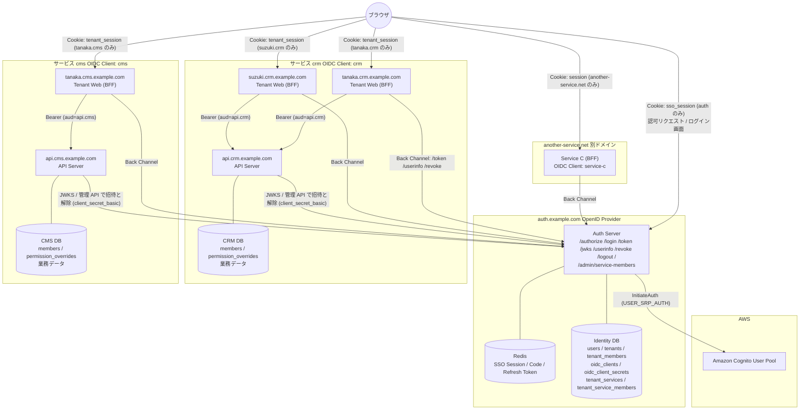

Front Channel を通る認証関連の値は Authorization Code と state のみ。JWT と Cognito Token は Front Channel に載せない。

サンドボックスではサービスごとに web と api のプロセスを分けている。crm-web が `<tenant>.crm` の全テナント、crm-api が `api.crm`、cms-web が `<tenant>.cms` の全テナント、cms-api が `api.cms` を受ける。web は React Router の SPA と薄い BFF で、BFF の実装は `packages/web-core`、共通の React コードは `packages/web-ui` で共有する。BFF は `/auth/*` に加えて、SPA にログイン状態と CSRF トークンを渡す `/session` と、サーバー側の Access Token で API へ中継する `/api/*` を持つ。api は `packages/api-core` をフレームワークとして使い、各サービスが役割と権限の語彙と業務の routes を持つ。DB もサービスごとに分かれ、API は Identity DB に接続しない。本番でサービスごとにリポジトリを分けても、Auth Server から見た構成は変わらない。

## 4. 異なるドメインでも動く理由

サンドボックスでは `tanaka.crm.sandbox.daisuke-tanabe.dev` と `tanaka.cms.sandbox.daisuke-tanabe.dev` のようにサブドメインで分けているため、Cookie を共有して SSO しているように見える。実際は共有していない。

### 4.1 Cookie は 3 種類とも別ホストに閉じている

| Cookie | 発行ホスト | 届く先 |
| --- | --- | --- |
| `sso_session` | `auth.example.com` | `auth.example.com` だけ |
| `tenant_session` | `tanaka.crm.example.com` | `tanaka.crm.example.com` だけ |
| `tenant_session` | `suzuki.crm.example.com` | `suzuki.crm.example.com` だけ |
| `tenant_session` | `tanaka.cms.example.com` | `tanaka.cms.example.com` だけ |

Domain 属性を付けないため、ブラウザは Cookie を発行ホストにしか送らない。本番では `__Host-` プレフィックスを付け、Domain 属性を付けること自体をブラウザが拒否するようにしている。tanaka.crm の Cookie が suzuki.crm、tanaka.cms、auth に届くことはない。同じサービスの別テナントでも、別サービスの同じテナントでも、Cookie は独立している。

### 4.2 SSO を成立させているのはリダイレクトと Code

tanaka.cms を初めて開いたとき、tanaka.cms は自分の Cookie を持っていないので「未ログイン」と判断する。ここで tanaka.cms はブラウザを `auth.example.com/authorize` へリダイレクトする。ブラウザは auth のホストに対しては `sso_session` Cookie を持っているので、auth は「このブラウザは既にログイン済み」と分かる。auth は `client_id=cms` の `redirect_uri_template` に `redirect_uri` を当てて tenant を tanaka と特定し、契約と cms への割り当てを確認したうえで cms 宛ての Authorization Code を発行し、ブラウザを `tanaka.cms.example.com/auth/callback?code=...` へ戻す。tanaka.cms はその code をサーバー間通信で auth に渡し、代わりに Token を受け取って自分の Cookie を発行する。

```text
tanaka.cms の Cookie なし
      │
      ▼ 302
auth.example.com/authorize   ← ここでだけ sso_session Cookie が使われる
      │
      ▼ 302 + code
tanaka.cms.example.com/auth/callback?code=...
      │
      ▼ サーバー間で code を Token に交換
tanaka.cms の Cookie 発行
```

この過程で tanaka.cms と auth の間を移動したのは、URL に載った短命の code と、サーバー間通信だけ。ホストの親子関係は一切使っていない。したがって cms が `another-service.net` であってもまったく同じ手順で動く。

### 4.3 サブドメインだからこそ注意すること

`*.example.com` は Public Suffix List 上で同一サイトとみなされる。そのため SameSite 属性はサブドメイン間の Cookie 送信を制限しない。ホスト分離を担保しているのは Domain 属性の省略と `__Host-` プレフィックスであり、SameSite ではない。逆に別ドメインへ広げるときは、`/authorize` と `/auth/callback` がトップレベルの GET ナビゲーションであることが重要になる。SameSite=Lax はトップレベル GET では Cookie を送るので、この設計は別ドメインでもそのまま動く。iframe や fetch でクロスサイトに Cookie を送ろうとする設計にすると、ここが壊れる。

### 4.4 別ドメインのサービスを足すときにやること

1. Auth Server の Client Registry に `client_id = service-c` `audience = https://api.another-service.net` `redirect_uri_template = https://{tenant}.another-service.net/auth/callback` `backchannel_logout_uri = https://another-service.net/auth/backchannel-logout` を登録する。テンプレートはテナントごとにホストを分ける前提で、`{tenant}` の位置はパスでもよい。`https://another-service.net/t/{tenant}/auth/callback` のように、展開結果がサービスのホストに閉じていればよい
2. `client_secret` を `oidc_client_secrets` に active で 1 行入れる
3. `tenant_services` に契約を入れる。テナントごとの redirect_uri 登録はない
4. `tenant_service_members` に service-c の最初の管理者をテナントごとに入れる。以降の人は service-c の画面から招待する
5. サービス側に `/auth/login` `/auth/callback` `/auth/logout` `/auth/backchannel-logout` を置く
6. サービス側の DB に `members` と `permission_overrides` を置き、役割と権限の語彙を決める。`members.user_id` に Auth Server の `sub` を保存する
7. サービスの API から Auth Server の `/admin/service-members` を `client_secret_basic` で呼べるようにする

Auth Server と既存サービスのコード変更は発生しない。

## 5. 詳細設計

### 5.1 ホストとエンドポイント

#### Auth Server。`https://auth.<domain>`

| メソッド | パス | 呼び出し元 | 用途 |
| --- | --- | --- | --- |
| GET | `/.well-known/openid-configuration` | Client、API | OIDC Discovery |
| GET | `/jwks` | Client、API | Token 検証用の公開鍵 |
| GET | `/` | ブラウザ | ポータル。SSO Session があればテナントごとに割り当てのあるサービス、なければ `/login` へ。役割は出さない |
| GET | `/authorize` | ブラウザ | 認可エンドポイント |
| GET | `/login` | ブラウザ | ログインフォーム。`rid` 付きは認可フローの途中、なしはポータル用 |
| POST | `/login` | ブラウザ | 認証。Cognito InitiateAuth を呼ぶ |
| POST | `/token` | Client のサーバー | code 交換、refresh_token grant |
| GET | `/userinfo` | Client のサーバー | claims 取得 |
| POST | `/revoke` | Client のサーバー | Refresh Token 失効。RFC 7009 |
| GET | `/logout` | ブラウザ | Global Logout の確認画面 |
| POST | `/logout` | ブラウザ | Global Logout の実行 |
| GET | `/admin/service-members` | サービスの API | `tenant_id` で、そのテナントで呼び出し元のサービスに入れる人の一覧。`client_secret_basic` |
| POST | `/admin/service-members` | サービスの API | 招待。`{tenant_id, email, name?}`。users にいなければメールで事前作成し、割り当てを upsert |
| DELETE | `/admin/service-members` | サービスの API | 割り当ての解除。`{tenant_id, user_id}` |
| GET | `/healthz` | 監視 | 死活監視 |

#### Tenant Web Application。`https://<tenant>.<service>.<domain>`

| メソッド | パス | 用途 |
| --- | --- | --- |
| GET | `/auth/login` | Host からサービスとテナントを決め、認可リクエストを組み立てて `/authorize` へ 302 |
| GET | `/auth/callback` | code を受け取り、サーバー間で Token に交換し、自セッションを作る |
| POST | `/auth/logout` | Tenant Logout。`/?logged_out=1` へ 302 |
| POST | `/auth/backchannel-logout` | Auth Server からの Back-Channel Logout を受ける。サービスごとに 1 つ |
| GET | `/session` | SPA に渡すログイン状態。`service` `tenant` `urls` `authenticated` と、ログイン済みなら `user` `csrfToken`。Token は返さない |
| ALL | `/api/*` | サービスの API への中継。サーバー側の Access Token を Bearer で付ける。セッションがなければ 401、GET / HEAD / OPTIONS 以外は `X-CSRF-Token` 必須で不一致は 403、JSON 以外の body は 415 |
| GET | `/*` | SPA の配信。ビルド成果物の `index.html` と `/assets/*` |

画面はサーバーで描かず、React Router の SPA が `/session` と `/api/*` だけを使って描く。Token はブラウザに届かない。サーバー側で描く画面を持つ構成なら、`/session` と `/api/*` の代わりにサーバー側でセッションを読めばよく、`/auth/*` は変わらない。
Host の先頭ラベルがテナント slug、残りがサービスの `baseHost` になる。`tanaka.crm.example.com` なら tenant = tanaka、service = crm。redirect_uri は `https://<host>/auth/callback` で組み立てる。

#### API Server。`https://api.<service>.<domain>`

| 規約 | 内容 |
| --- | --- |
| 認証 | `Authorization: Bearer <access_token>` 必須。Cookie は受け付けない |
| aud | 自 API の公開 URL 1 つを `aud` とし、Token の `aud` と照合する。リクエストの Host がその URL のホストと異なれば 404、別サービス向けの Token は 401 |
| テナント指定 | パス、クエリ、ヘッダに tenant を含めない。Token の `tenant_id` が唯一の根拠 |
| 認可 | Token 検証 → 自サービス DB の members から Role → Role の既定に permission_overrides を重ねて Permission → データアクセス。Identity DB は見ない |
| 共通ルート | `/v1/me` が自分の役割と権限、`/v1/members` が管理アカウントの一覧、招待、役割変更、権限の上書き、削除。サンドボックスでは `packages/api-core` がどのサービスにも付ける |

### 5.2 パラメータ詳細

#### GET `/authorize`

| パラメータ | 必須 | 値 | 検証 |
| --- | --- | --- | --- |
| `response_type` | 必須 | `code` | それ以外は `unsupported_response_type` |
| `client_id` | 必須 | 登録済み Client ID。サービス ID と同値。`crm` など | 未登録ならリダイレクトせず 400 |
| `redirect_uri` | 必須 | Client の `redirect_uri_template` を slug で展開した文字列と完全一致。取り出した slug で `tenants` を引いた行がこのリクエストのテナントになる | テンプレート不一致、または slug が `tenants` にない場合は `invalid_redirect_uri` でリダイレクトせず 400 |
| `scope` | 必須 | `openid` を含む。`profile` `email` 任意 | 許可外は `invalid_scope` |
| `state` | 必須 | Client が生成した 256bit 乱数 | ないと `invalid_request` |
| `nonce` | 必須 | Client が生成した 256bit 乱数 | ないと `invalid_request` |
| `code_challenge` | 必須 | `BASE64URL(SHA256(code_verifier))` 43 文字 | 形式不正は `invalid_request` |
| `code_challenge_method` | 必須 | `S256` | `plain` は拒否 |

リクエスト例。

```text
GET https://auth.example.com/authorize
  ?response_type=code
  &client_id=crm
  &redirect_uri=https://tanaka.crm.example.com/auth/callback
  &scope=openid%20profile%20email
  &state=<256bit>
  &nonce=<256bit>
  &code_challenge=<43文字>
  &code_challenge_method=S256
```

成功時の応答。

```text
302 Location: <redirect_uri>?code=<code>&state=<state>&iss=https://auth.<domain>
Set-Cookie: __Host-sso_session=<id>; Path=/; Secure; HttpOnly; SameSite=Lax   (初回ログイン時のみ)
```

アクセス可否は次の順に確認する。認証済みであることが前提で、ログイン直後と SSO Session による無画面認可の両方で同じ順序を通る。

| 順 | 確認 | 失敗時の `error_description` |
| --- | --- | --- |
| 1 | `users.status = active` | `user_disabled` |
| 2 | `tenants.status = active` | `tenant_suspended` |
| 3 | `tenant_services (tenant_id, oidc_client_id)` が active | `not_contracted` |
| 4 | `tenant_service_members (tenant_id, oidc_client_id, user_id)` が存在。このサービスへの割り当てで、別サービスの割り当てや `tenant_members` の会社横断の役割は見ない | `no_membership` |
| 5 | `tenant_service_members.status = active` | `membership_inactive` |

失敗時の応答は 2 通りに分かれる。

| 条件 | 応答 |
| --- | --- |
| `client_id` か `redirect_uri` が不正 | Auth Server 上でエラー画面。絶対にリダイレクトしない |
| それ以外 | `302 <redirect_uri>?error=<code>&error_description=<text>&state=<state>&iss=...` |

`error` の値。`invalid_request` `unsupported_response_type` `invalid_scope` `access_denied` `server_error`。`access_denied` のときは `error_description` に上表の理由が入る。

```text
302 Location: https://suzuki.cms.example.com/auth/callback?error=access_denied&error_description=not_contracted&state=<state>&iss=https://auth.example.com
```

`access_denied` でも SSO Session は残す。認証自体は成功しており、契約と割り当てのある別のテナント、別のサービスにはそのまま入れる。

#### GET `/login?rid=<rid>`

`rid` は `/authorize` が発行する認可リクエストの預かり番号。256bit 乱数、30 分で失効。ログイン画面を挟む間、`client_id` `redirect_uri` `scope` `state` `nonce` `code_challenge` をサーバー側に保持するためのキーで、OIDC 仕様のパラメータではない。Keycloak の `session_code`、Auth0 の `/u/login?state=` に相当する。`rid` なしで開いた場合はポータル用ログインになり、成功後に `/` へ戻る。

#### POST `/login`

`application/x-www-form-urlencoded`。

| フィールド | 内容 |
| --- | --- |
| `rid` | 認可リクエスト ID。ポータル用は空文字 |
| `csrf` | フォームに埋め込まれた同期トークン。Cookie `auth_csrf` の参照 ID と対で検証 |
| `username` | Cognito のユーザー名 |
| `password` | パスワード。Auth Server から Cognito へは SRP で送るため Cognito にも平文は渡らない |

| 結果 | 応答 |
| --- | --- |
| 成功、契約と割り当てあり | `302 <redirect_uri>?code&state&iss` + `Set-Cookie: sso_session`。Cookie が指す旧 SSO Session があれば破棄してから新しい ID を書く |
| 成功、契約か割り当てなし | `302 <redirect_uri>?error=access_denied&error_description=<reason>&state` + `Set-Cookie: sso_session`。認証自体は成功しているため SSO Session は作る |
| 認証失敗 | 200 でフォーム再表示。パスワード誤り、ユーザー不在、ロック中は同一文言 |
| CSRF 不一致 | 403 |
| `rid` 期限切れ | 400 |
| レート制限超過 | 429 と `Retry-After`。`/login` は IP あたり 60 回/分、`POST /login` は IP × ユーザー名あたり 10 回/分 |

Auth Server は全ルートで body を 16 KB に制限する。`/authorize` は IP あたり 120 回/分、`/token` と `/admin/*` は IP あたり 300 回/分、`/logout` は IP あたり 60 回/分に制限する。

#### POST `/token`

`Authorization: Basic base64(client_id:client_secret)`、`application/x-www-form-urlencoded`。`client_id` はサービス ID。`client_secret` は `oidc_client_secrets` の active な行のいずれかに一致すればよく、ローテーション中は新旧どちらでも通る。テナントは code に紐付いているため、`/token` にテナントを渡す必要はない。

grant_type=authorization_code。

| フィールド | 内容 |
| --- | --- |
| `grant_type` | `authorization_code` |
| `code` | callback で受け取った code |
| `redirect_uri` | 認可リクエストと同じ値。code に紐付いた値と完全一致 |
| `code_verifier` | 認可リクエスト時に生成した元の乱数。43〜128 文字 |

grant_type=refresh_token。

| フィールド | 内容 |
| --- | --- |
| `grant_type` | `refresh_token` |
| `refresh_token` | 前回の応答で受け取った値 |

応答。

```json
{
  "access_token": "<JWT RS256, aud=oidc_clients.audience。例 https://api.crm.<domain>>",
  "token_type": "Bearer",
  "expires_in": 900,
  "id_token": "<JWT RS256, aud=client_id>",
  "refresh_token": "<不透明文字列。使うたびに新しい値に置き換わる>",
  "scope": "openid profile email"
}
```

| エラー | 状態 | 条件 |
| --- | --- | --- |
| `invalid_client` | 401 | Basic 認証失敗。active な secret のいずれにも一致しない。revoked 済みの secret を含む。パーセントエンコードが壊れた資格情報も同じ。`WWW-Authenticate: Basic` |
| `invalid_grant` | 400 | code 不在、期限切れ、再利用、client 不一致、redirect_uri 不一致、PKCE 不一致、SSO Session 失効、Refresh Token 不在、Refresh Token 再利用、別 Client からの Refresh Token 提示、契約解除、サービスへの割り当て消失 |
| `unsupported_grant_type` | 400 | 上記以外の grant_type |

refresh_token grant では `/authorize` と同じ順序で user、tenant、契約、サービスへの割り当てを再確認する。Refresh Token は先に一回限りで消費する。GETDEL で取り出した直後に rotated として書き戻すため、同じ値を同時に 2 回提示しても成功は 1 つで、もう一方は不在として `invalid_grant` になる。このとき系列は失効しない。code 再利用、rotated / revoked の Refresh Token の提示、別 Client からの Refresh Token 提示を検知した場合は、同じ系列の Refresh Token をすべて失効させる。サービス側は同じセッションで Refresh を同時に走らせないようロックで直列化する。6.4 節

#### POST `/revoke`

`Authorization: Basic`、`token=<refresh_token>&token_type_hint=refresh_token`。存在しない token でも 200。

#### GET `/userinfo`

`Authorization: Bearer <access_token>`。`{ sub, email, email_verified, name, tenant_id }` を scope に応じて返す。

#### GET `/logout?client_id=<client_id>&tenant=<slug>` と POST `/logout`

GET は確認画面で、`client_id` と `tenant` を hidden に持つ。POST は `csrf` と任意の `client_id` `tenant` を受け取り、SSO Session を破棄して、その SSO Session に code を発行した Client のうち active で `backchannel_logout_uri` を持つものに Back-Channel Logout を送る。送信は 1 件あたり 5 秒でタイムアウトする。完了画面には `client_id` の `redirect_uri_template` を `tenant` で展開した URL の origin へのリンクを「CRM (tanaka) に戻る」の形で出し、ポータルへのリンクも出す。戻り先を登録済みテンプレートの展開からしか導出しないため Open Redirect にならない。

#### POST `/auth/backchannel-logout`。サービス側

`application/x-www-form-urlencoded`、`logout_token=<JWT>`。URI はサービスごとに 1 つで、`https://crm.<domain>/auth/backchannel-logout` のようにテナントを含まない。Host ヘッダに依存せず、`aud` でサービスを解決し、`sid` に紐付くそのサービスのセッションをテナントをまたいですべて破棄する。無認証で受けるため、IP あたり 60 回/分のレート制限と 16 KB の body 上限を付ける。サービスの `/auth/*` も同じ制限を持つ。

#### `/admin/service-members`。Auth Server の管理 API

`Authorization: Basic base64(client_id:client_secret)`、JSON。呼び出し元はサービスの API で、認証した Client 自身のサービスへの割り当てだけを操作できる。`oidc_client_id` はリクエストで指定させない。

| メソッド | 入力 | 応答 |
| --- | --- | --- |
| GET | `?tenant_id=<tenants.id>` | 200 `{members: [{id, email, name, linked, status}]}`。`linked` は初回ログイン済みで `cognito_sub` が入っているか |
| POST | `{tenant_id, email, name?}` | 201 `{user: {id, email, name, linked}}`。users にメールの行がなければ `cognito_sub` を NULL にして作り、`tenant_service_members` に upsert する。冪等 |
| DELETE | `{tenant_id, user_id}` | 204。`tenant_service_members` の行を消す |

| エラー | 状態 | 条件 |
| --- | --- | --- |
| `invalid_client` | 401 | Basic 認証失敗。`WWW-Authenticate: Basic realm="admin"` |
| `invalid_request` | 400 | `tenant_id` や body の形式が不正 |
| `tenant_not_found` | 404 | `tenant_id` が tenants にない |
| `not_contracted` | 403 | テナントが呼び出し元のサービスを契約していない |
| `user_not_found` | 404 | DELETE の `user_id` が users にない |

サービスの API は自分の役割と権限を Auth Server に渡さない。Auth Server が持つのは「入れるか」まで。

### 5.3 Token

| Token | 発行者 | 形式 | 寿命 | 受け取り手 | 経路 |
| --- | --- | --- | --- | --- | --- |
| Authorization Code | Auth | 256bit 乱数 | 60 秒、一回限り | サービス | Front Channel の URL |
| ID Token | Auth | JWT RS256 | 5 分 | サービス | Back Channel |
| Access Token | Auth | JWT RS256 | 15 分 | サービス → API | Back Channel、Bearer |
| Refresh Token | Auth | 256bit 乱数 | 12 時間、ローテーション | サービス | Back Channel |
| logout_token | Auth | JWT RS256 | 2 分 | サービス | Back Channel |
| Cognito の各 Token | Cognito | JWT | Cognito 設定 | Auth のみ | Auth 内部。AES-256-GCM で暗号化保存 |

ID Token の claims。

```json
{
  "iss": "https://auth.<domain>",
  "sub": "<Sandbox 内部の users.id。Cognito の sub ではない>",
  "aud": "crm",
  "exp": 1700000300,
  "iat": 1700000000,
  "auth_time": 1699999000,
  "nonce": "<認可リクエストの nonce>",
  "sid": "<SSO Session の公開識別子。Back-Channel Logout 用>",
  "tenant_id": "<テナント ID>",
  "tenant_slug": "tanaka",
  "email": "user@example.com",
  "email_verified": true,
  "name": "表示名"
}
```

サービスは `aud` が自分の `client_id` であること、`nonce` が pre-auth の値と一致すること、`tenant_slug` が Host から決めたテナントと一致することを検証する。tenant_slug の照合により、tanaka 向けの code を suzuki のホストで使う攻撃を防ぐ。

Access Token の claims。

```json
{
  "iss": "https://auth.<domain>",
  "sub": "<users.id>",
  "aud": ["https://api.crm.<domain>", "https://auth.<domain>"],
  "client_id": "crm",
  "tenant_id": "<テナント ID>",
  "sid": "<sid>",
  "scope": "openid profile email",
  "jti": "<一意な ID>",
  "exp": 1700000900,
  "iat": 1700000000
}
```

`aud` の先頭は `oidc_clients.audience` で、サービスの API origin。crm 向けの Access Token を `api.cms.<domain>` に送ると aud 不一致で 401 になる。

role も permission も Token に載せない。role は API Server が毎リクエスト自サービス DB の `members` から Token の `tenant_id` `sub` で取り、permission は役割の既定に `permission_overrides` の allow / deny を重ねて確定する。deny が優先する。Token 発行後に役割や権限が変わっても次のリクエストから反映される。サービスの割り当てを外されたユーザーは Refresh で `invalid_grant` になり、Access Token 寿命の 15 分以内に API を呼べなくなる。Auth Server はサービスごとの role や permission の名前を知らず、`client_id` と割り当てだけを扱う。

### 5.4 Cookie

| Cookie | ホスト | 属性 | 寿命 | 値 |
| --- | --- | --- | --- | --- |
| `__Host-sso_session` | auth | Path=/; Secure; HttpOnly; SameSite=Lax | サーバー側でアイドル 2 時間、絶対 12 時間 | SSO Session ID |
| `__Host-auth_csrf` | auth | Path=/; Secure; HttpOnly; SameSite=Lax | 30 分 | CSRF トークンの参照 ID |
| `__Host-tenant_session` | 各テナント×サービスのホスト | Path=/; Secure; HttpOnly; SameSite=Lax | アイドル 30 分、絶対 12 時間 | Tenant Session ID |
| `__Secure-tenant_pre_auth` | 各テナント×サービスのホスト | Path=/auth; Secure; HttpOnly; SameSite=Lax | 30 分 | state / nonce / code_verifier を保持するレコードの参照 ID |

Cookie の値はすべてサーバー側ストアを指す乱数で、JWT やユーザー情報を含まない。ローカル HTTP ではプレフィックスなしの名前に切り替える。切り替えは専用の設定値ではなく公開 scheme から導き、Auth Server は issuer が https のとき、サービスは自ホストの公開 scheme が https のときに Secure とプレフィックスを付ける。Cookie 名は全ホストで同じだが、ホストが違えば別の Cookie になる。

### 5.5 サーバー側ストア

| ストア | キー | 内容 | TTL |
| --- | --- | --- | --- |
| SSO Session | `sso:sess:<id>` | sid、user_id、暗号化した Cognito Token、auth_time、lastSeenAt | 12 時間 |
| code を発行した Client | `sso:clients:<id>` | その SSO Session に code を発行した client_id の集合。Global Logout の通知先 | 12 時間 |
| 認可リクエスト | `sso:authreq:<rid>` | client_id、redirect_uri、scope、state、nonce、code_challenge | 30 分 |
| Authorization Code | `sso:code:<code>` | client_id、redirect_uri、nonce、code_challenge、user_id、tenant_id、sid、used | 60 秒。使用済みは再利用検知のため 10 分保持 |
| Refresh Token | `sso:rt:<token>` | family_id、client_id、user_id、tenant_id、sid、status | 12 時間 |
| Refresh Token 系列 | `sso:rtfamily:<family_id>` | 系列に属する Refresh Token の集合。一括失効に使う | 12 時間 |
| Tenant Session | `<client_id>:sess:<tenant_slug>:<id>` | tenant_slug、user_id、tenant_id、sid、access_token、refresh_token、csrf_token | 12 時間 |
| pre-auth | `<client_id>:pre:<tenant_slug>:<id>` | state、nonce、code_verifier、return_to | 30 分 |
| sid 逆引き | `<client_id>:sid:sid:<sid>` | そのサービスの Tenant Session キーの集合。テナントをまたぐ | 12 時間 |
| Refresh ロック | `<client_id>:lock:<tenant_slug>:<id>` | 同じセッションで Refresh を 1 回にまとめるロック。SET NX で取る | 10 秒 |

Tenant Session はサービスごとのストア `<client_id>:sess` に `<tenant_slug>:<id>` のキーで置くため、1 プロセスで複数テナントのホストを受けてもセッションが混ざらない。サービスの区別はストアのプレフィックスで行い、値には client_id を持たせない。sid 逆引きはサービス単位で、Back-Channel Logout がテナントをまたいで全セッションを消せるようにしている。
一覧は Redis の Set に置き、SADD / SREM で更新する。値を読んで配列を書き戻す形にすると、並行する追加で片方が消える。一回限りの消費は Authorization Code も Refresh Token も `GETDEL` で行い、二重交換と二重 Refresh を排除する。ロックは SET NX で取る。

### 5.6 Identity DB

```sql
users                  (id, cognito_sub UNIQUE NULL 可, email UNIQUE, name, status)
tenants                (id, slug UNIQUE, name, status)
oidc_clients           (id, client_id UNIQUE, name, audience, redirect_uri_template, allowed_scopes, backchannel_logout_uri, status)
oidc_client_secrets    (id, oidc_client_id, secret_hash, status, created_at, revoked_at)  -- status: active / revoked
tenant_services        (tenant_id, oidc_client_id, status)                    -- 契約。会社単位
tenant_service_members (tenant_id, oidc_client_id, user_id, status)           -- サービスごとの割り当て。役割は持たない
tenant_members         (tenant_id, user_id, role, status)                     -- 会社横断の役割。ログイン可否には使わない
```

主キーはすべて ULID のサロゲート ID。`client_id` と `slug` は外部に見せる識別子で UNIQUE 制約で守り、外部キーは `oidc_clients.id` と `tenants.id` だけを参照する。`tenant_service_members` は `(tenant_id, oidc_client_id)` で `tenant_services` を参照する複合外部キーを持ち、契約のないサービスに人を割り当てられない。`users.cognito_sub` が正規のユーザー識別子で、招待で事前作成した行は初回ログインまで NULL。`users.email` は UNIQUE で、招待と初回ログインの突合キーになる。`users.id` は境界の外へ出す代理キーで、Client にはこちらを `sub` として渡す。

サービス側の DB には、役割と権限の上書きを置く。Identity DB とは別のデータベースで、識別子は `user_id` と `tenant_id` の値だけを共有し外部キーは張らない。

```sql
members              (tenant_id, user_id, email, name, role, status)   -- このサービスでの役割。語彙はサービスごと。RLS で tenant_id を絞る
permission_overrides (tenant_id, user_id, permission, effect)          -- effect: allow / deny。RLS で tenant_id を絞る
```

役割の語彙はサービスごとに決める。サンドボックスの CRM は owner / admin / member / viewer、CMS は owner / editor / viewer。`members` の行は招待時に作り、Auth Server を通れるのに行がない人は最初の API 呼び出しで最下位の役割で作る。`members.email` と `name` は招待時に控えた表示用の写しで、Identity DB が正。

サービス、テナント、契約の関係。

| テーブル | 単位 | 内容 |
| --- | --- | --- |
| `oidc_clients` | サービスごとに 1 行 | `client_id` はサービス ID。`audience` はそのサービスの API origin。`redirect_uri_template` は `{tenant}` を 1 か所だけ含む。`backchannel_logout_uri` はサービスに 1 つ |
| `oidc_client_secrets` | サービスごとに 1 行以上 | `client_secret` の `sha256$<base64url>` ハッシュ。`/token` は active な行のいずれかに一致すれば通す。ローテーションは新行を active で追加 → サービスの secret を差し替え → 旧行を revoked |
| `tenant_services` | サービス×テナントごとに 1 行 | 契約。この行がなければ redirect_uri がテンプレートに一致しても `not_contracted` |
| `tenant_service_members` | サービス×テナント×ユーザーごとに 1 行 | 「入れるか」。この行がなければ契約があっても `no_membership`。招待はこの単位で行い、サービスの API が管理 API 経由で作る。外すときは管理 API で消す |
| `tenant_members` | テナント×ユーザーごとに 0 または 1 行 | 会社横断の役割。管理者や請求担当。ログインには使わない |
| `members` | サービス側 DB。サービス×テナント×ユーザーごとに 1 行 | そのサービスでの役割。招待時に作り、API がリクエストごとに読む |
| `permission_overrides` | サービス側 DB。必要な人と permission ごとに 1 行 | 役割の既定に対する allow / deny。Token には載せず API がリクエストごとに読む |

`redirect_uri` の検証とテナント解決は 1 つの処理で行う。`redirect_uri_template` の `{tenant}` より前と後ろが `redirect_uri` と文字列完全一致し、中間が slug の形式 `^[a-z0-9](?:[a-z0-9-]{0,61}[a-z0-9])?$` であれば、その slug で `tenants` を引く。テンプレートを slug で展開した文字列と `redirect_uri` が 1 バイトでも違えば不一致で、末尾スラッシュ、クエリ、大文字、多段ラベルはすべて拒否する。slug が `tenants` になければ同じく不一致として扱う。したがってテナントを追加するときは `tenants` と `tenant_services`、最初の管理者の `tenant_service_members` とサービス側の `members` に行を足すだけでよい。CRM だけ契約する会社なら `tenants` 1 行、`tenant_services` 1 行、最初の管理者の割り当てで、後から CMS を足すときは `tenant_services` 1 行と CMS の最初の管理者の割り当てを足す。以降の人はサービスの画面から招待する。

`client_secret` は 32 バイト以上の乱数にする。ハッシュは KDF ではなく SHA-256 で、人が選ぶパスワードではなく十分に長い乱数である前提に立つ。scrypt のような KDF は `/token` のたびに数十ミリ秒イベントループを止めるため使わない。前提を崩さないため、サービス側の `CLIENT_SECRET` と登録ツールの入力は 43 文字以上をスキーマで要求し、短い値では起動しない。

サンドボックスのシード。

```text
oidc_clients:         crm (id 01J00000000000000000000CRM, audience https://api.crm.<domain>, template https://{tenant}.crm.<domain>/auth/callback)
                      cms (id 01J00000000000000000000CMS, audience https://api.cms.<domain>, template https://{tenant}.cms.<domain>/auth/callback)
oidc_client_secrets:  01J0000000000000000CRMSEC1 → crm (active), 01J0000000000000000CMSSEC1 → cms (active)
tenants:              tanaka (Tanaka Inc.), suzuki (Suzuki Ltd.)
tenant_services:        tanaka→crm, tanaka→cms, suzuki→crm
tenant_service_members: alice = tanaka×crm / tanaka×cms / suzuki×crm, bob = suzuki×crm, carol = 割り当てなし  (役割なし)
tenant_members:         alice = tanaka owner, bob = suzuki owner  (会社横断の役割。ログインには使わない)

crm DB members:              alice = tanaka owner / suzuki viewer, bob = suzuki admin
crm DB permission_overrides: alice × suzuki → end_users:unmask allow  (viewer でもマスクなしで読める)
cms DB members:              alice = tanaka owner
cms DB permission_overrides: alice × tanaka → posts:create deny      (owner でも投稿を作れない)
```

suzuki.cms は redirect_uri が cms のテンプレートに一致し suzuki も既知のテナントだが契約がない例で、`error=access_denied&error_description=not_contracted` になる。dave はモック Cognito にだけ存在し、サービスからの招待と初回ログインでの紐付けの確認に使う。

### 5.7 API Server の認可順序

```text
Host が自 API の公開 URL のホストと一致するか (違えば 404)
 → Bearer 抽出
 → JWT 検証 (署名 / iss / aud / exp。alg は RS256 固定。aud 不一致は 401)
 → 自サービス DB の members (token.tenant_id, token.sub) を読む。なければ最下位の役割で作る
 → members.status = active (違えば 403)
 → 自サービス DB の permission_overrides (tenant_id, sub) を読む
 → role の既定 ∪ allow − deny で permission を確定。deny が優先
 → endpoint が要求する permission を確認
 → Repository は tenant_id を必須引数に取り、PostgreSQL では RLS で二重に絞る
```

「入れるか」は Auth Server が Token 発行時と Refresh 時に判定済みで、API は Identity DB を見ない。割り当てを外された人は Refresh で `invalid_grant` になり、Access Token 寿命の 15 分以内に API を呼べなくなる。即時に止めたければサービス側で `members.status` を disabled にする。
他テナントのリソース ID を指定された場合は 403 ではなく 404 を返し、存在の有無を漏らさない。

サンドボックスの `packages/api-core` はこの順序を `ServiceDefinition` の宣言だけで提供する。サービスは役割の順序、既定の役割、権限、役割ごとの既定を宣言し、`members:read` `members:invite` `members:manage` は自動で足される。導入先で独自に実装する場合も同じ順序にする。

### 5.8 サービスからの招待

```text
管理者がサービスの画面で email と role を入力
 → サービスの API: members:invite を確認。role が自サービスの語彙にあるか検証
 → Auth Server: POST /admin/service-members {tenant_id: token.tenant_id, email, name}  Basic client_id:client_secret
 → Auth Server: 契約を確認。users にメールの行がなければ cognito_sub NULL で作成。tenant_service_members を upsert。201 {user: {id, ..., linked}}
 → サービスの API: 返った user.id で自サービス DB の members に役割付きで upsert。201
 → 後日、招待された人がログイン
 → Auth Server: users を cognito_sub で検索 → なし → 同じメールで cognito_sub が NULL の行に紐付け → 割り当てあり → code 発行
 → サービスの API: members に行があるため、招待時の役割で権限を確定
```

削除は逆順で、Auth Server の割り当てを消してから自サービスの `members` の行を消す。自分自身は消せない。Auth Server が到達できないときは 503 を返し、サービスの DB には書かない。招待は upsert のため再試行で二重にならない。
同じメールの `users` 行が既に別の Cognito ユーザーに紐付いている場合、初回ログインは拒否され既存行は書き換えない。

## 6. シーケンス図

登場人物。Browser はユーザーのブラウザ、CrmA は tanaka.crm の BFF、CrmB は suzuki.crm の BFF、CmsA は tanaka.cms の BFF、CmsB は suzuki.cms の BFF、Auth は Auth Server、Cognito は User Pool、IdDB は Identity DB、Store は Redis、SessCrm は crm のセッションストア、ApiCrm は crm の API Server、CrmDB は crm 自身の DB。図中の `crm:tanaka:TS1` や `crm:sid:SID1` は、サービスごとのストアのプレフィックスとキーを続けて書いた略記。

### 6.1 初回ログイン。tanaka.crm に未ログインでアクセス

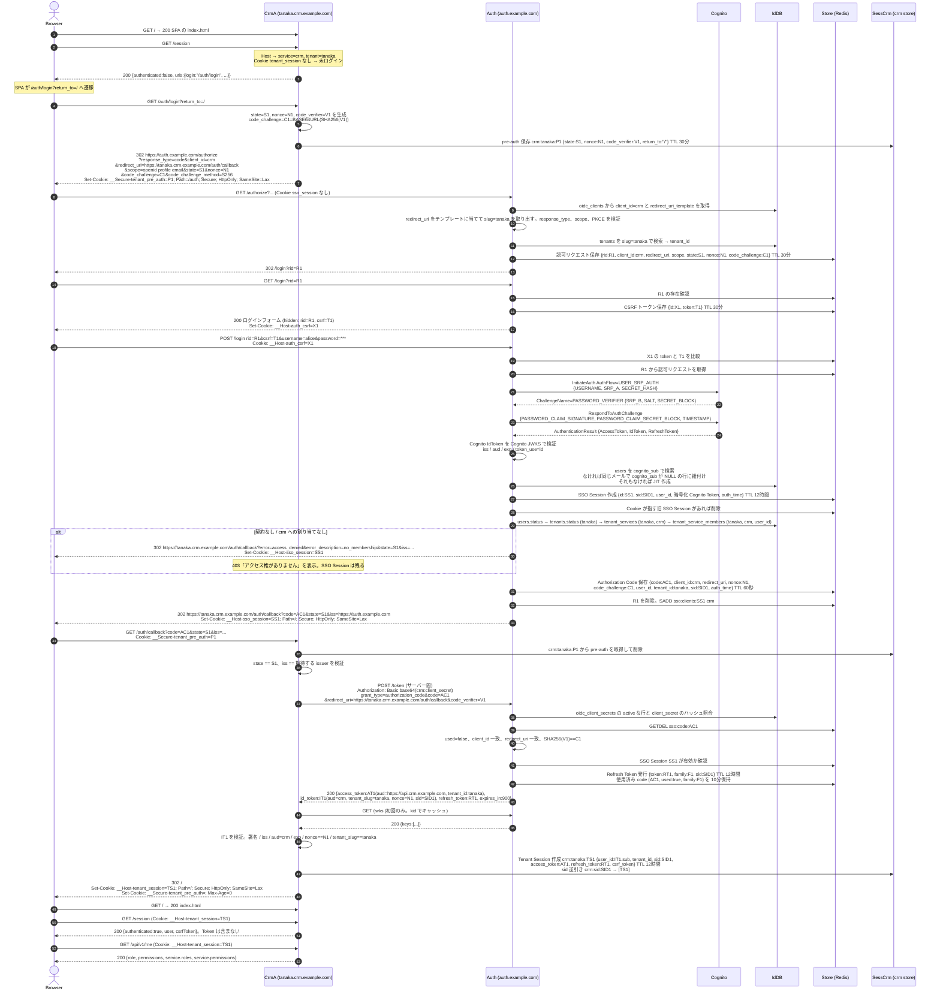

### 6.2 別テナントへの SSO。suzuki.crm を初めて開く

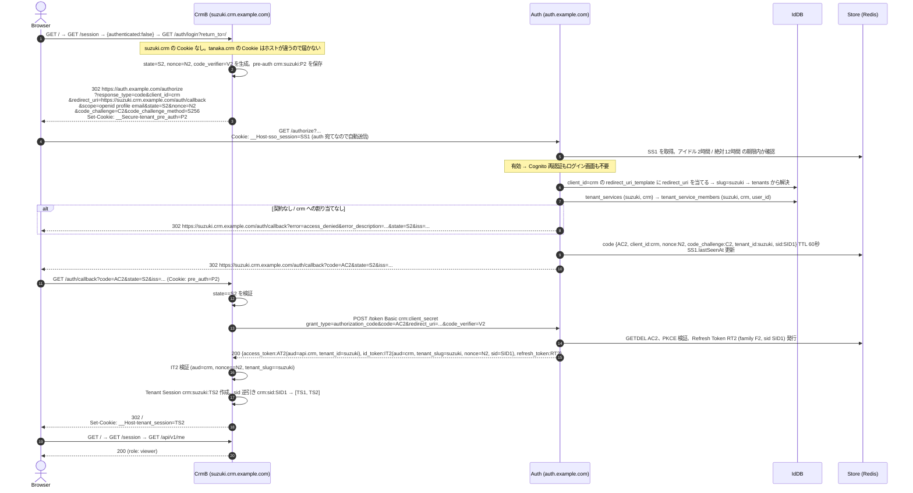

結果。tanaka.crm と suzuki.crm はそれぞれ独立した Cookie とセッションを持ち、auth には SSO Session が 1 つある。同じユーザーがテナント × サービスごとに異なる role を持てる。同じサービスなので client_id と client_secret と redirect_uri_template は同じで、redirect_uri の slug 部分だけが違う。

### 6.3 別サービスへの SSO と未契約サービスの拒否。tanaka.cms と suzuki.cms

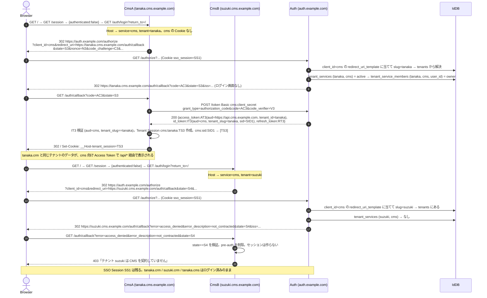

結果。同じテナントでもサービスごとにセッションと Access Token が分かれ、`aud` はそのサービスの API になる。契約のないサービスは割り当てに関係なく拒否される。契約があっても cms への割り当てがない人は `no_membership` になる。tanaka.cms の alice は cms の DB で owner だが、`posts:create` の deny があるため投稿は作れない。cms が別ドメインでも、この図は 1 文字も変わらない。

### 6.4 API 呼び出しと Access Token の更新

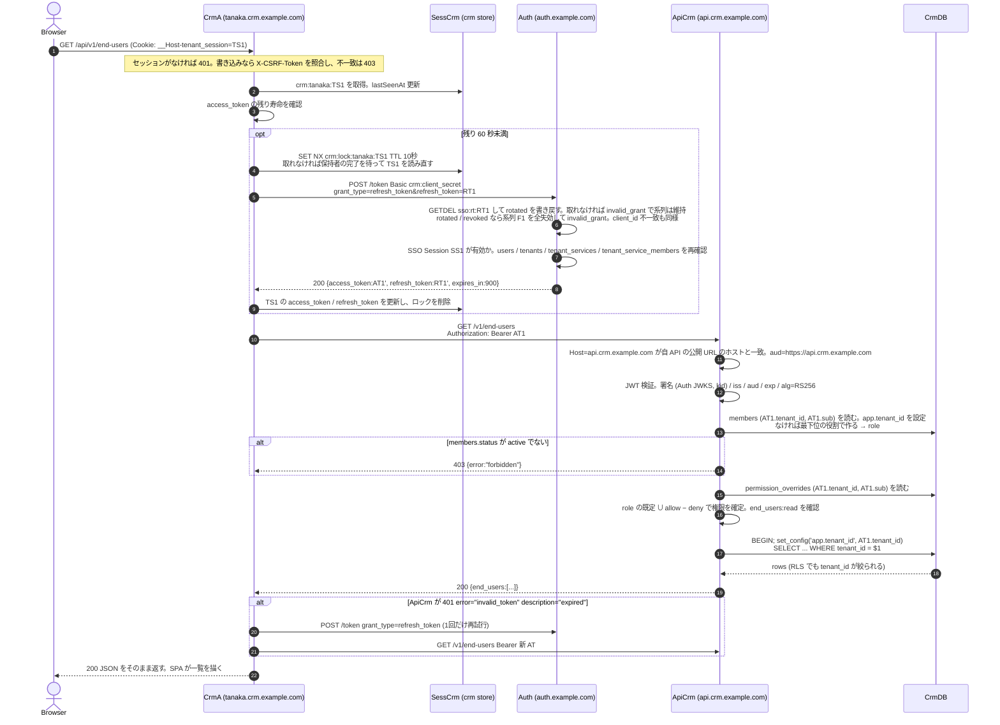

ブラウザは api.crm.example.com と直接通信しない。BFF の `/api/*` が同一オリジンで中継するため CORS 設定は不要になる。API がセッション切れを返したら BFF は 401 にし、SPA が `/auth/login?return_to=<現在のパス>` へ遷移する。AT1 を api.cms.example.com に送ると aud 不一致で 401 になる。API は Identity DB に接続せず、自分の DB だけで認可する。
同じセッションで画面と API 中継が同時に Refresh に入ると Refresh Token を二重に送ることになり、Auth Server は 2 回目を再利用として扱う。サービス側はセッション単位のロックで Refresh を 1 回にまとめ、待った側は更新後のセッションを読み直して続行する。API Server は全ルートで body を 64 KB に制限し、応答に `Cache-Control: no-store` を付ける。

### 6.5 ログイン済みホストの再訪とセッション期限切れ

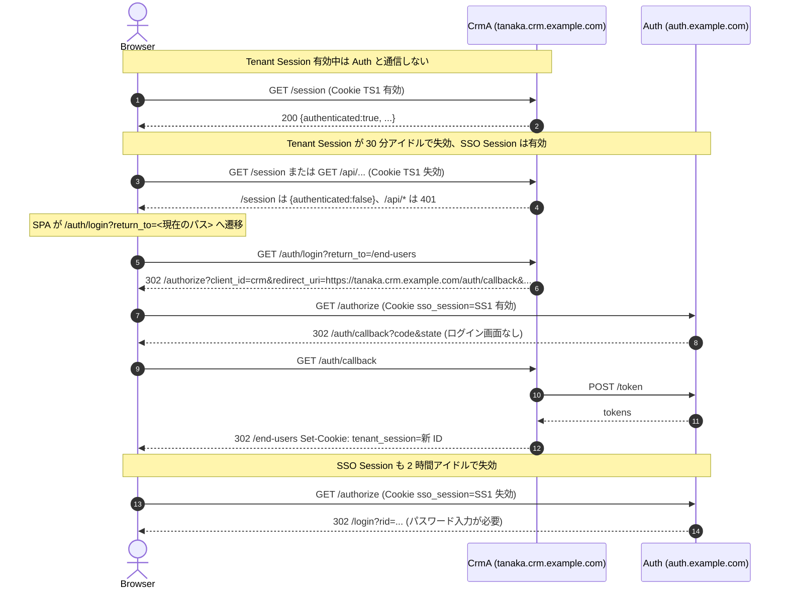

### 6.6 Tenant Logout

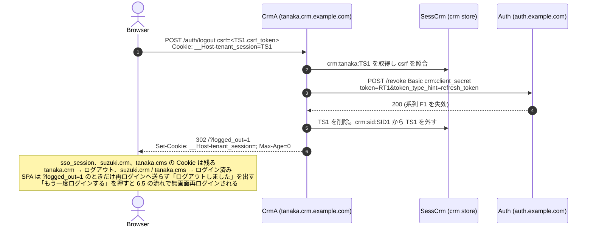

ログイン中の画面のヘッダには「全体からログアウト」のリンクがあり、`/session` の `urls.globalLogout` で渡す `https://auth.example.com/logout?client_id=crm&tenant=tanaka` を指す。

### 6.7 Global Logout と Back-Channel Logout

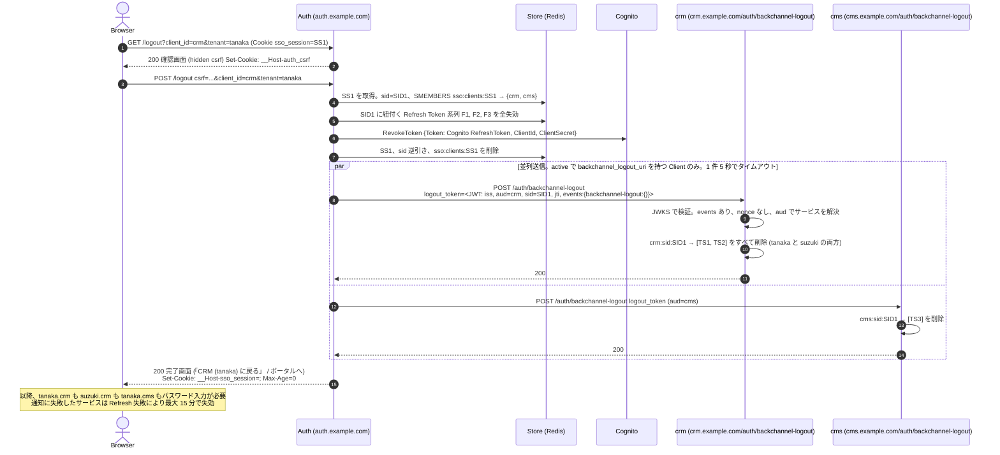

Back-Channel Logout URI はサービスに 1 つで、テナントごとには持たない。1 通の logout_token でそのサービスの全テナントのセッションを消す。

### 6.8 ポータル。auth を直接開いた場合

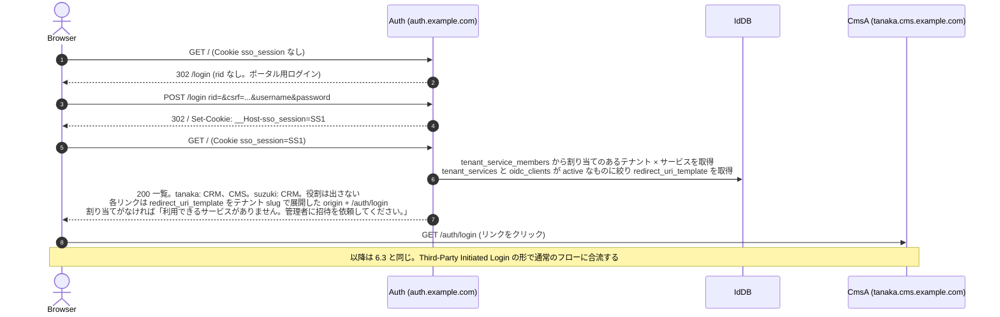

### 6.9 サービスからの招待と初回ログイン

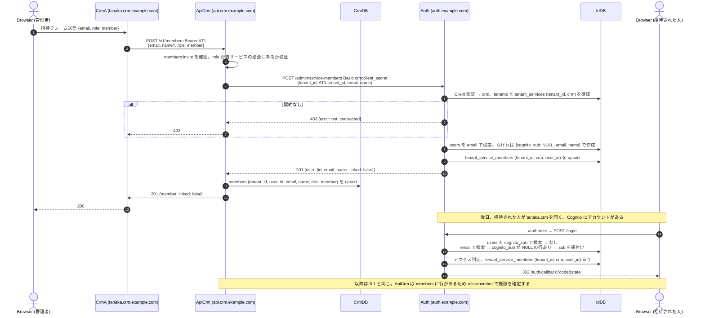

「入れるか」は Auth Server、役割はサービスの DB。招待は Auth Server を先に呼び、拒否されればサービスの DB には書かない。削除は `DELETE /v1/members/:userId` が Auth Server の割り当てを消してからサービスの DB の行を消す。

### 6.10 異常系

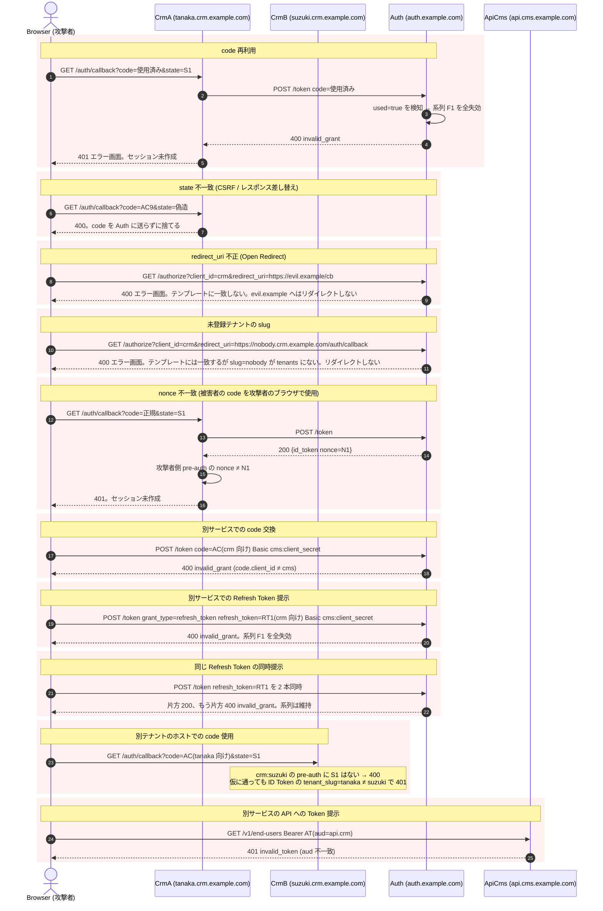

## 7. Next.js の BFF への導入

App Router を使う Next.js を Tenant Web Application にする場合の配置。フレームワークが違っても対応は同じ。

### 7.1 よくある現状と問題点

| よくある現状 | 抵触する条件 |
| --- | --- |
| バックエンドが返した Cognito の ID Token と Refresh Token を、そのままブラウザの httpOnly Cookie に入れている | 2.3 Cognito Token をサービス外へ出さない |
| 本番で Cookie に `domain` 属性を付け、サブドメイン間で共有している | 2.2 Cookie 共有で SSO しない。別ドメインへ広げられない |
| middleware が毎リクエスト Token を検証し、Cognito Token の寿命がそのままアプリのセッション寿命になっている | 責務分離。アプリセッションと認証 Token が同一 |
| サインイン、MFA、パスワード再設定の画面をアプリ側が持っている | これらは Auth Server の責務 |
| テナントごとに別の Client ID を持ち、テナント追加のたびに Secret を増やしている | サービスに 1 Client と 1 つの redirect_uri_template。テナント追加は tenants と契約の登録だけ |

### 7.2 対応表

| 現在 | 変更後 |
| --- | --- |
| サインイン / MFA / パスワード再設定の画面 | 廃止。Auth Server に移す。アプリは `/auth/login` へ 302 するだけ |
| Token 検証 / 更新 / 失効の Route Handler | 廃止。`/auth/login` `/auth/callback` `/auth/logout` `/auth/backchannel-logout` に置き換える |
| ID / Refresh Token の Cookie | 廃止。`__Host-tenant_session` 1 つに置き換え、値はセッション ID のみ。`domain` 属性は付けない |
| middleware の Token 検証 | セッション Cookie の有無だけで判定する。なければ `/auth/login?return_to=<pathname>` へ 302 |
| バックエンド呼び出し時の Cookie 転送 | セッションに保存した Access Token を `Authorization: Bearer` で送る。残り 60 秒未満なら先に refresh_token grant で更新。同じセッションの同時リクエストは Redis の SET NX でロックし、Refresh を 1 回にまとめる |
| テナント名の環境変数 | サービス設定に置き換える。`client_id` `client_secret` `baseHost` `apiBaseUrl` を Secret Store から読む。`client_secret` は 43 文字以上を起動時に検証する。テナントは Host の先頭ラベルから決め、redirect_uri は `https://<host>/auth/callback` で組み立てる |
| バックエンドの Cognito JWT 検証 | Auth Server の JWKS による検証に置き換える。`aud=https://api.<service>.<domain>` を確認し、`tenant_id` `sub` で自サービス DB の members から役割を取る。権限は permission_overrides を重ねて確定し、Token の claim には頼らない。Identity DB には接続しない |
| ユーザー招待の画面と処理 | サービスの API に `POST /v1/members` を置き、Auth Server の `/admin/service-members` を `client_secret_basic` で呼んでから自サービスの members に役割付きの行を作る。招待メールの送信は別途 |

### 7.3 配置

```text
src/
  app/
    auth/
      login/route.ts               GET: Host → tenant、pre-auth 保存 → /authorize へ redirect
      callback/route.ts            GET: state / iss 検証 → /token → ID Token 検証 (aud, nonce, tenant_slug) → セッション作成
      logout/route.ts              POST: csrf 検証 → /revoke → セッション削除
      backchannel-logout/route.ts  POST: logout_token 検証 → sid のセッションを全テナント分削除
  middleware.ts (または proxy.ts)  セッション Cookie の有無だけで判定。なければ /auth/login へ
  lib/
    oidc/                          multi-domain-sandbox の packages/oidc-client を移植
    session-store.ts               Redis。KeyValueStore / SetStore / CounterStore インターフェース。GETDEL、SET NX、SADD、INCR
```

Route Handler は Node ランタイムで動かす。`export const runtime = "nodejs"` を明示する。Edge ランタイムでは `node:crypto` や ioredis が動かない。middleware は Edge で動くため、そこではセッションストアに触らず Cookie の有無だけを見る。セッションの実体は Server Component や Route Handler 側で読む。

Server Component から API を呼ぶ場合は `cookies()` でセッション ID を取り、セッションストアから Access Token を取り出して `fetch` に付ける。ブラウザから API へ直接呼んでいる箇所は BFF 経由に戻す。ブラウザに Token を持たせないため。

### 7.4 移行順序

既存サービスが 1 つだけの段階でも、どの時点でも旧ログインを生かしたまま進められる順序にする。

| 段階 | 内容 | ログインできる経路 |
| --- | --- | --- |
| 1 | Auth Server を建て、Auth Server 用の画面を新規に作る。ログイン、MFA、MFA セットアップ、パスワード変更、パスワード再設定。既存の User Pool を使い、既存サービスには触らない | 旧のみ |
| 2 | Auth Server にサービスを Client として登録し、redirect_uri_template と client_secret、提供中のテナントぶんの契約と利用者の割り当てを入れる。役割は自サービスの DB の members に移す | 旧のみ |
| 3 | 既存サービスに `/auth/login` `/auth/callback` `/auth/logout` `/auth/backchannel-logout` と新セッション Cookie を追加する。middleware は「新セッション Cookie があれば通す、なければ従来どおり判定する」の二重判定にする。画面のリンクと旧サインインはそのまま | 旧と新 |
| 4 | バックエンドの Token 検証を「従来の Cognito JWT でも Auth Server の JWT でも通す」にする。BFF は新セッションなら Bearer、旧なら従来の方式でバックエンドを呼ぶ | 旧と新 |
| 5 | 旧サインインの入口を `/auth/login` への 302 に置き換える。新規ログインは全員 Auth Server 経由になり、旧 Cookie を持つユーザーは期限まで旧経路で動く。問題があればこの 1 行を戻せば旧に復帰する | 旧と新。新規は新のみ |
| 6 | 旧 Cookie の寿命が過ぎたら、middleware の旧判定、旧 Token 系 Route Handler、旧ログイン画面、`domain` 属性付き Cookie を削除する | 新のみ |

段階 1 で MFA とパスワード再設定まで揃えておくこと。揃わないまま段階 5 に進むと、MFA が必要なユーザーがログインできなくなる。段階 1、2、5 だけが順序に依存し、それ以外の各段階は単独で戻せる。

## 8. 埋め込み型サービスへの導入

顧客サイトなど別オリジンのページに iframe や script で埋め込まれるサービスは、「別ドメインのサービスと SSO する」ケースそのものになる。このようなサービスは、一回限りのトークンを `postMessage` で親ページへ渡してログインを引き継ぐ独自実装を持っていることが多い。発想は Authorization Code と同じで、標準化されていない点だけが異なる。

### 8.1 読み替え

| 独自実装でよくある形 | 本設計 |
| --- | --- |
| 独自の一回限りトークン | Auth Server の Authorization Code。寿命 60 秒、一回限り、redirect_uri と PKCE に紐付く |
| `postMessage` で親ページへ通知 | 親ページが自身の `/auth/login` へトップレベルナビゲーションする。親ページのサーバーを Auth Server の Client として登録する |
| iframe 内での Token 検証 | 不要。親ページは自分のセッション Cookie を持つ。iframe 内で第三者 Cookie に依存しないため、ブラウザの第三者 Cookie 制限の影響を受けない |
| 呼び出し先 URL の設定値 | Client 登録の `redirect_uri_template` に置き換える。ワイルドカード禁止、展開結果との完全一致。顧客ごとにホストが違うなら顧客をテナントとして `tenants` に登録し、テンプレートの `{tenant}` で表す |

親ページが SPA でサーバーを持たない場合は BFF 構成にできない。その場合は薄い BFF を用意するか、親ページのバックエンドを Client にする。ブラウザに Token を置く構成は本設計では採用しない。

### 8.2 埋め込みからログイン状態を知りたい場合

iframe 内から親ページのログイン状態を推測する仕組みは持たない。親ページが自分のセッションを持ち、必要なら親ページから埋め込みサービスの API を BFF 経由で呼ぶ。どうしても iframe から判定したい場合は、OIDC の `prompt=none` による無画面認可を親ページ経由で行い、結果を親ページが iframe に渡す。iframe が直接 auth のホストへ Cookie 付きリクエストを送る構成は、第三者 Cookie 制限で動かなくなるので避ける。

## 9. 導入チェックリスト

適用先で最初に確認する項目。仕様書 22 章に対応する。

| # | 確認事項 | 影響 |
| --- | --- | --- |
| 1 | Cognito User Pool の構成 | Pool 分割の要否、App Client の secret と認証フロー設定 |
| 2 | Cognito の認証方式 | USER_SRP_AUTH が有効か。MFA の有無でログインシーケンスが変わる |
| 3 | 現在のログイン処理 | Auth Server のログインへ移す範囲 |
| 4 | Cognito Token の利用箇所 | ブラウザや別サービスに Cognito JWT を渡している箇所は全廃対象 |
| 5 | Cookie 設計 | `domain` 属性付き Cookie の廃止、Cookie 名の衝突 |
| 6 | Session Store | Redis があれば流用。なければ新設 |
| 7 | User / Tenant / Membership のデータモデル | `users.cognito_sub` の有無。所属がテナント単位かサービス単位か。「入れるか」を `tenant_service_members` へ、役割を自サービスの `members` へ移せるか。会社横断の役割があれば `tenant_members` に残す |
| 8 | サービスとテナントの対応 | サービスが提供するテナントの一覧。`tenants` と `tenant_services` の投入元。ホストの形が `redirect_uri_template` 1 つで表せるか |
| 9 | Tenant Web Application の構成 | BFF か SPA か。SPA なら BFF を足す。Host からテナントを決められるか |
| 10 | API Server の構成 | Token 検証の差し替え、`aud` を自サービスの origin にする、tenant_id をパスから外す |
| 11 | Auth Server の配置 | 独立したホストとインフラ |
| 12 | DB 構成 | サービスごとに DB を分けられるか。RLS を使えるか。表の所有者とアプリのロールを分けられるか |
| 13 | CORS | BFF 化で不要になる箇所 |
| 14 | CSRF | ログインと Logout の POST に同期トークンがあるか |
| 15 | redirect_uri の管理 | Client Registry の `redirect_uri_template` への一元化。テナント追加時に redirect_uri の登録が要らないこと。client_secret のローテーション手順 |
| 16 | 役割と権限 | 役割の語彙を自サービスで決められるか。自サービスの DB に `members` と `permission_overrides` を置く。Token に role や permission を載せていないか |
| 17 | 招待の経路 | 誰がどこから人を招待するか。サービスの API から Auth Server の管理 API を `client_secret_basic` で呼べるか。招待メールを誰が送るか |

実装の完了条件として次を通す。

- 初回ログイン、別テナント SSO、別サービス SSO、未契約サービスの拒否、Tenant Logout、Global Logout、ポータルのシナリオ
- 別サービスの割り当てでは自サービスに入れないこと。自サービス側の deny で役割の既定から権限が外れ、allow で加わること。役割の語彙がサービスごとに分かれ、別サービスの役割名が拒否されること
- サービスの画面からの招待で Auth Server と自サービスの DB の両方に行ができ、招待された人の初回ログインで users の行に sub が紐付くこと。削除で両方から消えること。契約のないテナントへの招待が拒否されること
- code 再利用、state 不一致、redirect_uri 不正、nonce 不一致、別サービスでの交換、別テナントのホストでの code 使用、別サービスの API への Token 提示、別サービスからの Refresh Token 提示が拒否されること
- 同じ Refresh Token の同時提示で成功が 1 つだけになり、系列が失効しないこと。同じセッションの同時リクエストで Refresh が 1 回にまとまること
- ログインのレート制限で 429 が返り、再ログインで旧 SSO Session が消えること
- URL、Cookie、HTML、ログのいずれにも JWT が現れないこと
- 他テナントのリソース ID を指定して 404 になること

## 10. 参考資料

### 標準仕様

| 資料 | 本設計での使いどころ |
| --- | --- |
| RFC 6749 The OAuth 2.0 Authorization Framework | Authorization Code Flow、`/authorize` と `/token` のパラメータとエラーコード |
| RFC 6750 Bearer Token Usage | API への `Authorization: Bearer` と `WWW-Authenticate` の形式 |
| RFC 7636 PKCE | `code_challenge` / `code_verifier`。Confidential Client でも必須にしている |
| RFC 7009 Token Revocation | `/revoke` |
| RFC 9207 Authorization Server Issuer Identification | 認可レスポンスの `iss` パラメータ。mix-up 攻撃対策 |
| RFC 9700 Best Current Practice for OAuth 2.0 Security | 本設計の脅威モデルの根拠。code 再利用時の系列失効、redirect_uri 完全一致、Refresh Token ローテーション |
| OpenID Connect Core 1.0 | ID Token の claims、`nonce`、`auth_time`、`sid` |
| OpenID Connect Discovery 1.0 | `/.well-known/openid-configuration` |
| OpenID Connect Back-Channel Logout 1.0 | `logout_token` の形式と検証手順 |
| OpenID Connect RP-Initiated Logout 1.0 | 採用しなかった方式。Tenant Logout で SSO Session を維持する要件と合わないため |
| OAuth 2.0 for Browser-Based Apps (IETF draft-ietf-oauth-browser-based-apps) | BFF 構成を推奨する根拠。ブラウザに Token を置かない理由 |
| RFC 6265bis Cookies | `__Host-` と `__Secure-` プレフィックス、SameSite の意味 |
| Public Suffix List | サブドメイン間が同一サイト扱いになる理由。SameSite に頼れない根拠 |

### AWS

| 資料 | 内容 |
| --- | --- |
| Amazon Cognito Developer Guide の「Authentication flows」 | USER_SRP_AUTH と SRP_A / PASSWORD_VERIFIER チャレンジ、SECRET_HASH の計算 |
| Cognito の「Verifying a JSON web token」 | `https://cognito-idp.<region>.amazonaws.com/<pool>/.well-known/jwks.json` での検証、`token_use` の確認 |
| Cognito RevokeToken API | Global Logout での Cognito Refresh Token 失効 |
| RDS PostgreSQL の `rds.force_ssl` | PostgreSQL 16 では既定で TLS 必須。接続文字列に `sslmode` が必要 |

### 比較対象になる実装

| 製品 | 本設計と対応する概念 |
| --- | --- |
| Keycloak | `session_code` が本設計の `rid`。login timeout の既定 30 分。Back-Channel Logout の実装例 |
| Auth0 | `/u/login?state=` が `rid` 相当。Refresh Token Rotation と Reuse Detection の挙動 |
| Google アカウント | Gmail からログアウトしてもアカウントは残る、という Tenant Logout と Global Logout の関係の例 |

### ブラウザの制約

| 話題 | 影響 |
| --- | --- |
| 第三者 Cookie の段階的廃止と CHIPS | iframe 内で auth のホストに Cookie を送る設計は動かなくなる。埋め込み型サービスはトップレベルナビゲーションで解く |
| CSP の `form-action` | Chrome はフォーム送信後のリダイレクト先にも適用する。Auth Server のログイン画面に `form-action 'self'` を付けると callback への 302 が止まる。サンドボックスで実際に踏んだ |
| `*.localhost` の解決 | Chrome も Node.js 24 も `*.localhost` をループバックに解決するため、`tanaka.crm.localhost` や `api.crm.localhost` のような多段ホストも hosts の編集なしで動く。auth への Back Channel は `AUTH_BACKCHANNEL_URL` で `127.0.0.1` を明示している |

### サンドボックスの成果物

| パス | 内容 |
| --- | --- |
| `docs/requirements.md` | 仕様書全文 |
| `docs/design/00` 〜 `11` | 判断事項、構成、シーケンス、Cookie、Token、DB、Client、API 認可、セキュリティ、エラー一覧、Logout、テスト計画 |
| `docs/deploy.md` | AWS 構成と手順 |
| `db/identity/init/002_identity.sql` `003_seed.sql` | Identity DB。サービス、client_secret、テナント、契約、サービスごとの割り当て、会社横断の役割のスキーマとシード。redirect_uri はサービスの `redirect_uri_template` 列。割り当てに役割はない |
| `db/crm/init/001_schema.sql` `db/cms/init/001_schema.sql` | サービスごとの DB。`members` と `permission_overrides` と業務テーブル、FORCE ROW LEVEL SECURITY、所有者と分けた NOBYPASSRLS のアプリロール |
| `apps/auth-api/src/routes/admin.ts` `apps/auth-api/src/usecases/service-members.ts` | サービス向けの管理 API。client_secret_basic で認証し、自サービスへの割り当てだけを操作させる。メールでの事前作成 |
| `apps/auth-api/src/usecases/login.ts` | ログイン時の users の解決。cognito_sub → メールでの紐付け → JIT 作成 |
| `packages/shared/src/redirect-template.ts` `packages/shared/src/secret-hash.ts` | redirect_uri テンプレートの照合と展開、client_secret の SHA-256 ハッシュと複数 secret の照合 |
| `packages/shared/src/kv-store.ts` `packages/shared/src/rate-limit.ts` | `KeyValueStore` の `getAndDelete` / `setIfAbsent`、`SetStore`、`CounterStore` と、固定窓のレート制限ミドルウェア。Redis 実装は `redis-store.ts` |
| `packages/shared/src/jwks.ts` | JWKS の取得と JWT 検証。10 分キャッシュ、未知の kid での 1 回再取得、60 秒の再取得制限、同時要求の集約、失敗時のキャッシュ利用。Auth Server の Cognito 検証、OIDC Client、API Server が共有する |
| `packages/shared/src/oidc-protocol.ts` | Auth Server と OIDC Client の間のワイヤ契約。access_denied の理由一覧、期限切れを表す `error_description`、Bearer ヘッダの読み書き |
| `packages/oidc-client` | サービス側に移植する OIDC Client 実装。Host からのサービス / テナント解決、tenant_slug 照合を含む |
| `apps/auth-api/src/usecases` | Auth Server の判定ロジック。契約とサービスへの割り当ての確認順序はここ |
| `packages/web-core` | crm-web / cms-web が共有する BFF 実装。Host からのテナント解決、`/session`、`/api/*` の中継と CSRF 検証、SPA の配信と CSP、エラー画面。`src/spa.ts` に静的配信と開発時の中継 |
| `packages/web-ui` | crm-web / cms-web が共有する React コード。`api.ts` の `/session` `/api/*` の呼び出しと 401 での再ログイン、`shell.tsx` のルート clientLoader と共通の枠、`members-page.tsx` の管理アカウント画面 |
| `apps/crm-web/app` `apps/cms-web/app` | React Router v8 の SPA。`root.tsx` `routes.ts` と、CRM はエンドユーザー、CMS は投稿の画面。`react-router.config.ts` は `ssr: false` |
| `packages/api-core/src/usecases/resolve-tenant-context.ts` `packages/api-core/src/service-definition.ts` | API 側の Host → aud 確認、Token 検証、自サービス DB の members の取得と既定の役割での作成、役割の既定に `permission_overrides` を重ねる権限の確定。`ServiceDefinition` で役割と権限の語彙を宣言する。`auth/middleware.ts` は結果を HTTP に写像するだけ |
| `packages/api-core/src/routes/members.ts` `packages/api-core/src/adapters/auth-admin-client.ts` | 管理アカウントの一覧、招待、役割変更、権限の上書き、削除。招待と削除は Auth Server の管理 API を client_secret_basic で呼ぶ |
| `apps/crm-api/src/definition.ts` `apps/cms-api/src/definition.ts` | サービスごとの役割と権限の宣言。CRM は owner / admin / member / viewer と `end_users:*`、CMS は owner / editor / viewer と `posts:*` |
| `scripts/smoke.ts` | 実 HTTP での受け入れ確認。SPA が使う `/session` と `/api/v1/me` の JSON を直接叩き、別サービス SSO と未契約サービスの拒否まで通す |
| `scripts/chrome-check.ts` | 実 Chrome での受け入れ確認。SPA を描画し、画面の文字列が出るまで待って判定する。CSP のような fetch では見えない問題を検出する |

## 11. 用語

| 用語 | 意味 |
| --- | --- |
| サービス | Auth Server を利用するプロダクト。OIDC Client 1 件に対応し、`client_id` はサービス ID。本設計では `crm` `cms` |
| テナント | 顧客企業。サービスをまたいで共有され、ホストの先頭ラベルで表す。本設計では `tanaka` `suzuki` |
| 契約 | テナントがサービスを利用できる関係。`tenant_services` で表し、なければ `not_contracted` |
| OpenID Provider (OP) | ID Token を発行する認証サーバー。本設計では Auth Server |
| Relying Party (RP) / Client | OP に認証を委ねるサービス。本設計では各サービスの Web Application |
| Confidential Client | `client_secret` を安全に保持できる Client。サーバーを持つ BFF が該当する |
| Resource Server | Access Token を検証して API を提供するサーバー。本設計では各サービスの API Server |
| BFF | Backend for Frontend。ブラウザの代わりに Token を保持し、API を呼ぶサーバー |
| Front Channel | ブラウザのリダイレクトを通る経路。URL に載る値は漏えいしやすい |
| Back Channel | サーバー間の直接通信。TLS と Client 認証で保護する |
| Authorization Code | 認可の結果を Front Channel で運ぶための短命で一回限りの引換券 |
| PKCE | code の横取りを防ぐ仕組み。`code_verifier` の持ち主だけが交換できる |
| state | Client が発行し callback で照合する乱数。CSRF とレスポンス差し替えを防ぐ |
| nonce | Client が発行し ID Token に埋め込まれる乱数。code 注入を防ぐ |
| sid | SSO Session を表す公開識別子。Back-Channel Logout で対象を特定する |
| rid | Auth Server がログイン画面を挟む間、認可リクエストを保持するための内部キー |
| audience | サービスの API origin。Access Token の `aud` に入り、API Server は自身の公開 URL と照合する |
| SSO Session | Auth Server が持つ「このブラウザは認証済み」という状態。auth のホストにだけ Cookie を置く |
| Tenant Session | 各サービスがテナントごとに持つアプリケーションセッション。そのホストにだけ Cookie を置く |
| Tenant Logout | 自サービス × テナントのセッションだけを消す。SSO Session は残る |
| Global Logout | SSO Session を消し、Back-Channel Logout で全サービスのセッションも消す |
| 割り当て | ユーザーがテナント × サービスに入れる関係。`tenant_service_members`。招待はこの単位で、契約と並ぶ Auth Server の認可の根拠。役割は持たない |
| 会社横断の役割 | 管理者や請求担当のような、サービスに依らない立場。`tenant_members`。ログイン可否には使わない |
| サービスでの役割 | そのサービスでの役割。自サービス DB の `members`。語彙はサービスごとに決め、Token には載せない |
| 権限の上書き | 役割の既定に対する個別の allow / deny。自サービス DB の `permission_overrides`。deny が優先し、Token には載せない |
| 管理 API | Auth Server の `/admin/service-members`。サービスの API が client_secret_basic で呼び、自サービスへの割り当てを作る / 消す |
| RLS | PostgreSQL の Row Level Security。tenant_id によるデータ分離をDB 層でも強制する |
